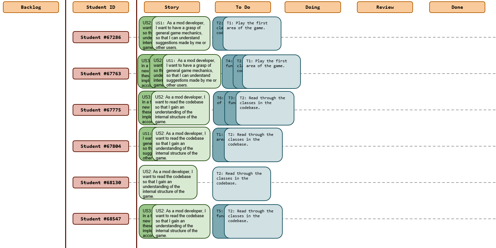
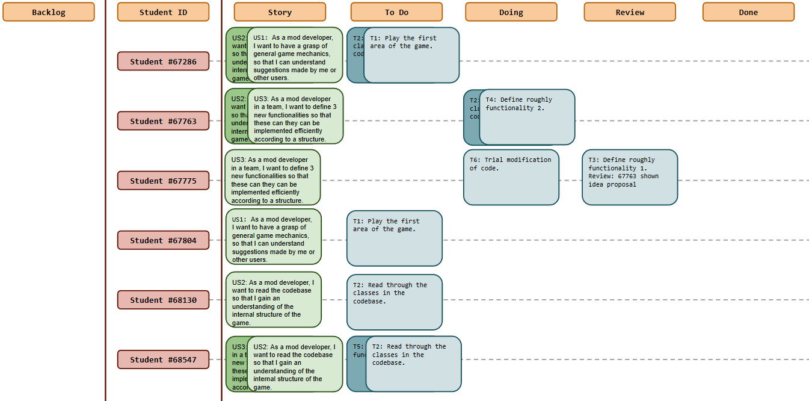
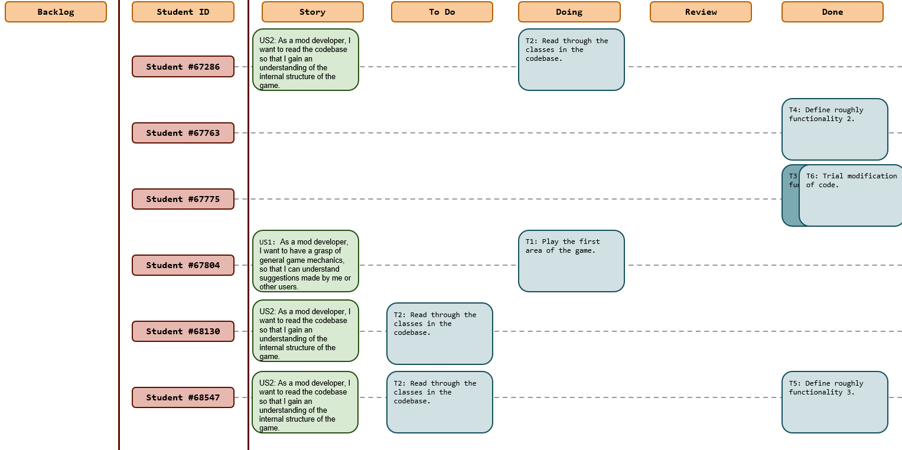
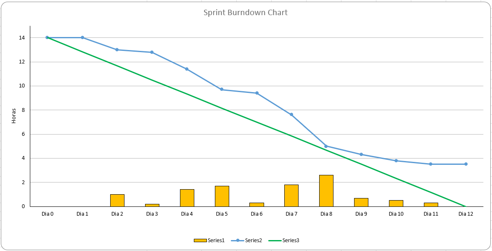
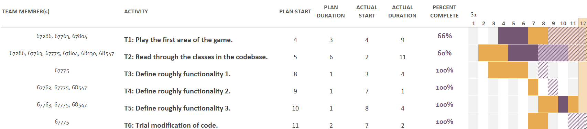

# Sprint 1

## Dates

2025-10-08 - 2025-10-19

## Scrum master

Diogo Antunes 67763

## Management info
### Sprint Planning Meeting:
- Ensure everyone gets a basic grasp of the game features (by attempting the game's first map)
- Check potential sources of information (trello board, reddit threads) for quick reading
- General code read-through if possible, not too thorough.
- Potentially brainstorm rough ideas for additional functionalities (may not end up feasible to implement)
- Attempt to modify code for one such functionality as a test

### Sprint Review Meeting: 
- Not all tasks have been completed however:
  - Tasks left behind can be quickly achieved
  - Still on track for milestone 1, but need better understanding of feasibility of new functionalities.
- Many existing suggestions on forums are gameplay-tuning related, or creating new content.

### Sprint Retrospective Meeting:
- Came up with 3-4 potential ideas.
- Varying in complexity, but 3 seem more reliably achieved within the timeframe, and another  that depends on existing code which needs to be looked at.
- Time is short for the following week due to different projects.
- With the replacement idea, there should be 3 features that are more likely to be reasonably implemented in the given timeframe (needs confirmation via the code study for next week).
- Little to say for now regarding work efficiency due to lack of structured practical tasks for this week and conflicting constraints.

## Relevant resources

### Scrum Board at the beginning of the sprint

### Scrum Board in the middle of the sprint

### Scrum Board at the end of the sprint

### Burndown Chart for the sprint

### Gantt Chart

