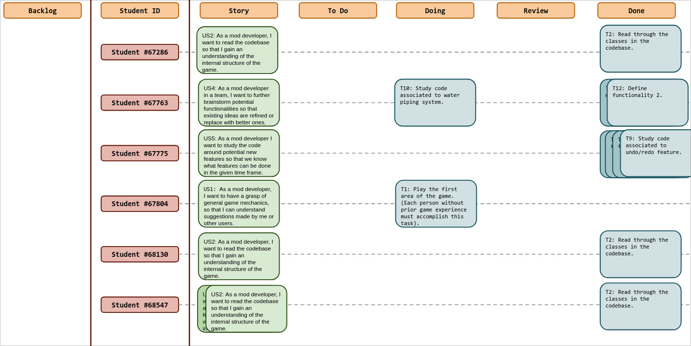
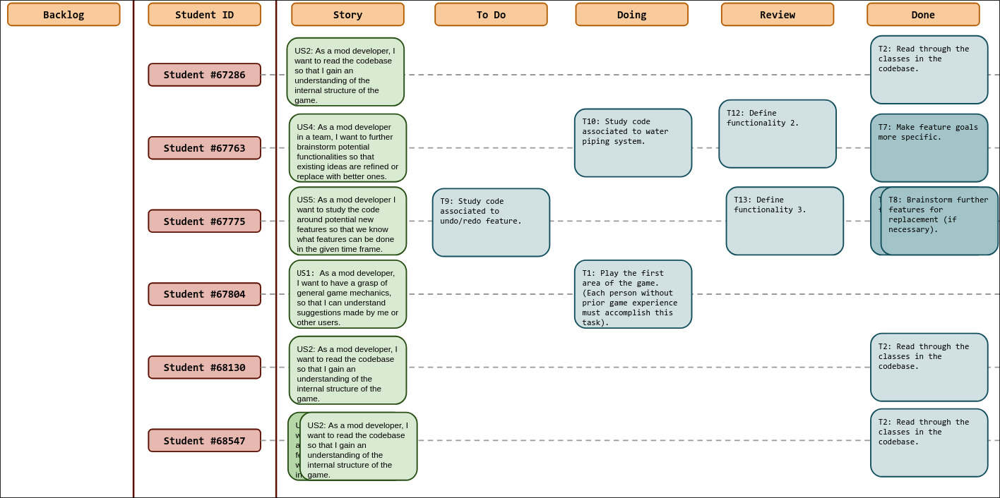
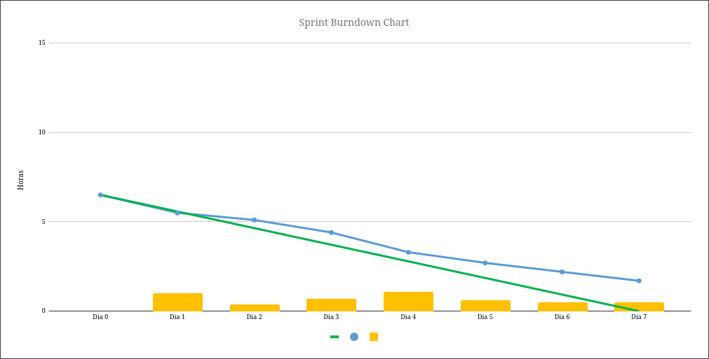
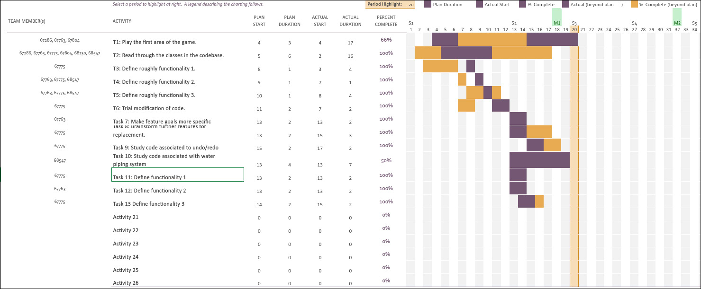

# Sprint 2

## Dates

2025-10-20 - 2025-10-26

## Scrum master

Carolina Ferreira - 67804

## Management info
### Sprint Planning Meeting: 
- Choose the current Scrum Master
- Define what to do during the following week
- Brainstorm on ways to improve team work

### Sprint Review Meeting: 
- Talk about ways to implement the wanted features

### Sprint Retrospective Meeting:
- Due to the lack of time, there were undone tasks 
- Comunnication needs to improve and so do the means

## Relevant resources

### Scrum Board at the beginning of the sprint

### Scrum Board in the middle of the sprint

### Scrum Board at the end of the sprint

### Burndown Chart for the sprint

### Gantt Chart

