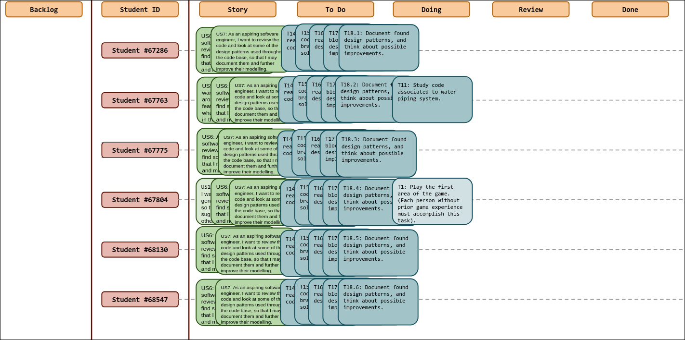
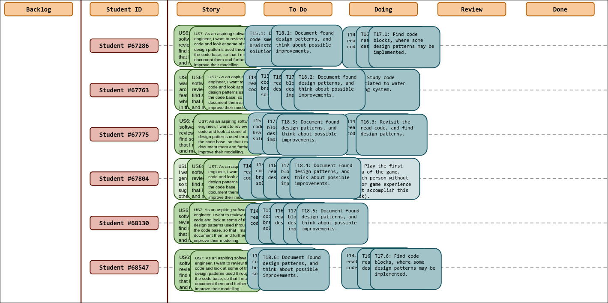
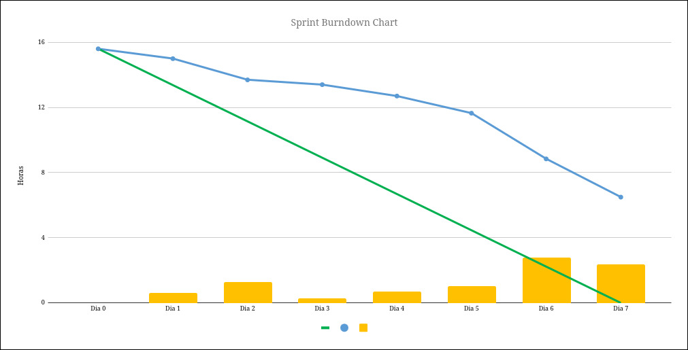
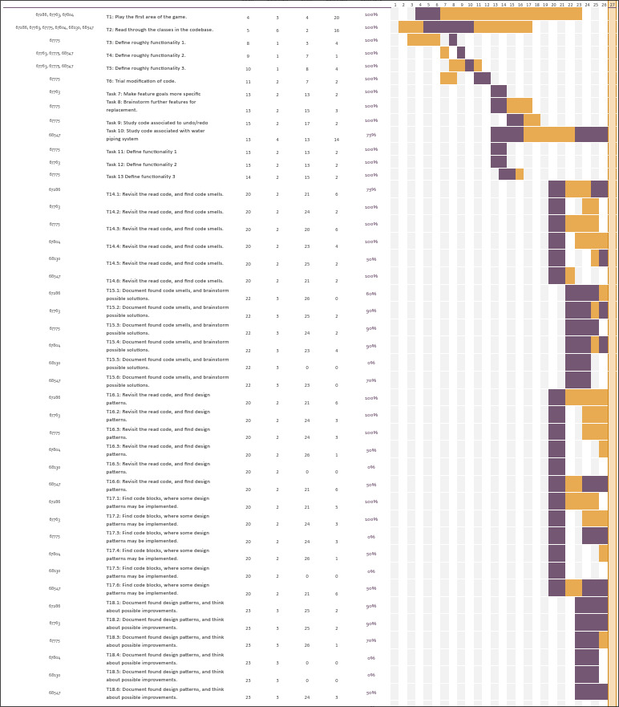

# Sprint 3

## Dates

2025-10-27 - 2025-11-02

## Scrum master

Gabriel Falcão - 67775

## Management info
### Sprint Planning Meeting: 
- Complete tasks left undone from previous sprint
- Start Milestone2
  - Document Code Smells
  - Document Design Patterns

### Sprint Review Meeting:
- A lof of tasks left undone
- The code seems to have quite a lot of code smells
  - Long Methods
  - Data Clumps
  - Data Classes
- Most design patterns are not obvious
  - Visitor has a strange implementation

### Sprint Retrospective Meeting: 
- Drastic change of methodology
- Created user stories for the next sprint
  - UseCases
- Group is unhappy with this sprint
  - A lot was left undone or unreviewed

## Relevant resources

### Scrum Board at the beginning of the sprint

### Scrum Board in the middle of the sprint

### Scrum Board at the end of the sprint

### Burndown Chart for the sprint

### Gantt Chart
