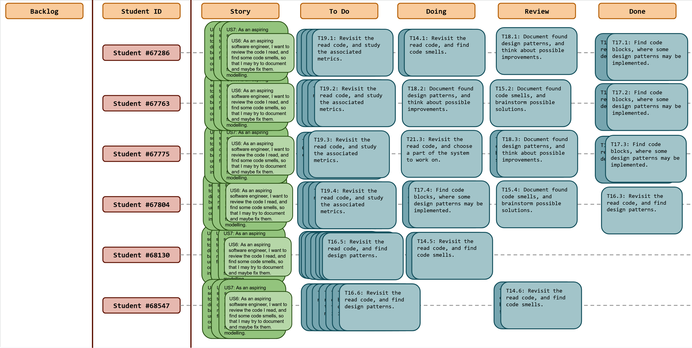
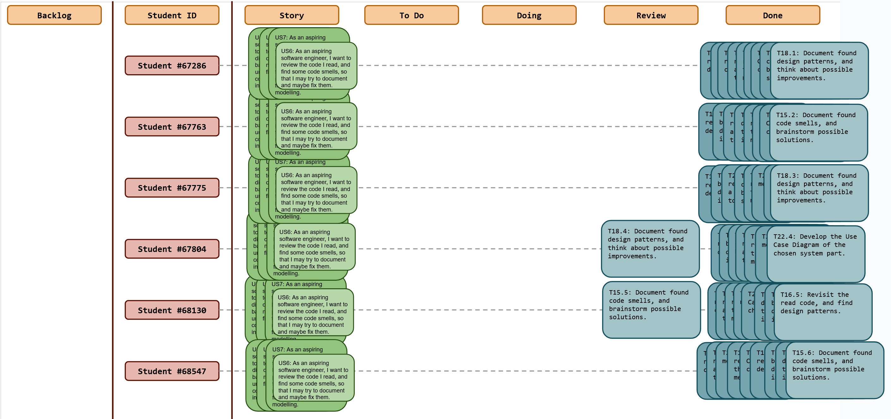
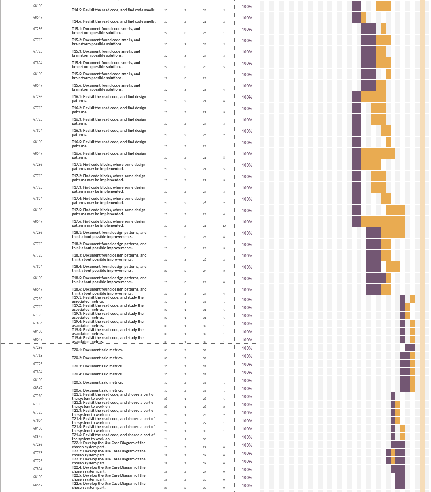

# Sprint 4

## Dates

2025-11-03 - 2025-10-09

## Scrum master

Carolina Ferreira 67804

## Management info
### Sprint Planning Meeting: 
The meeting was held as usual
- As a group, we discussed ways to work better amongst ourselves
- We defined that there would be more weekly meetings
- We created a new channel for communication
- We defined that there were still 4/5 main tasks to complete until the end of the week

### Sprint Review Meeting: 
The meeting was held as usual
- We discussed what was not done in this sprint 
- Checked everyone's work along the week

### Sprint Retrospective Meeting: 
The meeting was held as usual
- Discussed the next steps
- Define new user stories and tasks

## Relevant resources

### Scrum Board at the beginning of the sprint

### Scrum Board in the middle of the sprint

### Scrum Board at the end of the sprint

### Burndown Chart for the sprint

Please add the burndown chart here.

### Gantt Chart

