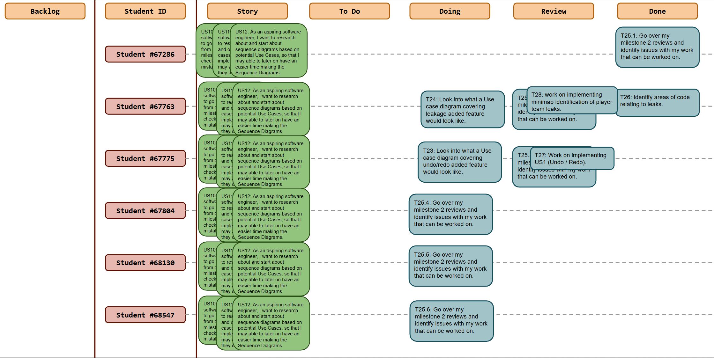
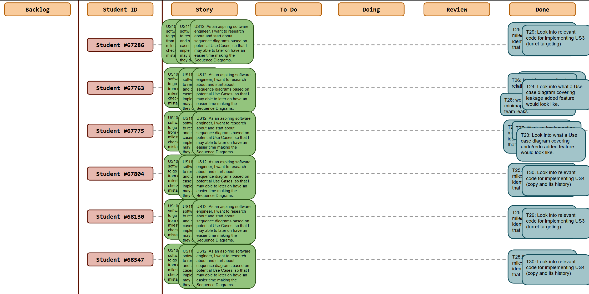
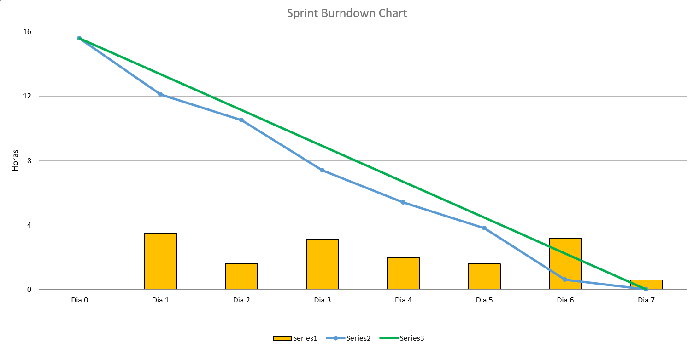
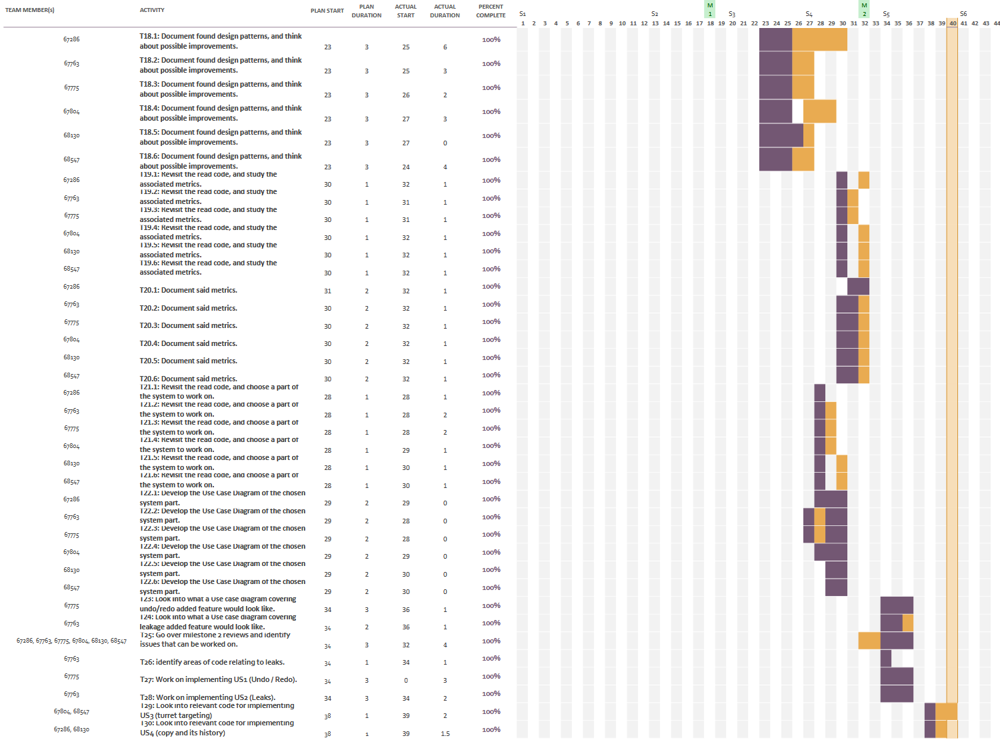

# Sprint 5

## Dates

2025-11-10 - 2025-11-16

## Scrum master

Dinis Neves 68130

## Management info
### Sprint Planning Meeting: 
- go over milestone 2 reviews
- start milestone 3
    -  Start Use cases
    -  Start Sequence diagrams

### Sprint Review Meeting: 
- some reviews left to do
    - go over review organization and issues with delivering all at once instead of spaced out
    - planned work for this week is go over Use Cases and Sequence diagrams
- focus on undo/redo and leakage implementations

### Sprint Retrospective Meeting: 
Issues with assigning work and understanding what was needed to start with M3, reached conclusion that, working on implementation and after doing Use Cases and Sequence diagrams related to that implementation. Would be good to get ahead in implementation.

## Relevant resources

### Scrum Board at the beginning of the sprint

### Scrum Board in the middle of the sprint

### Scrum Board at the end of the sprint

### Burndown Chart for the sprint

### Gantt Chart

