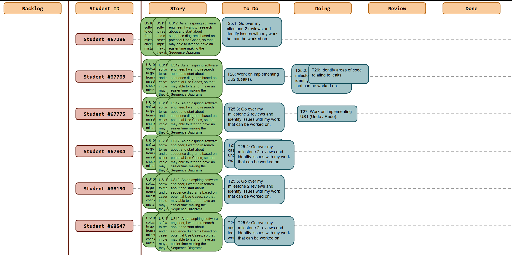

# Sprint 5

## Dates

2025-11-10 - 2025-11-16

## Scrum master

Dinis Neves 68130

## Management info
### Sprint Planning Meeting: 
- go over milestone 2 reviews
- start milestone 3
    -  Start Use cases
    -  Start Sequence diagrams

### Sprint Review Meeting: 
- some reviews left to do
    - go over review organization and issues with delivering all at once instead of spaced out
    - planned work for this week is go over Use Cases and Sequence diagrams
- focus on undo/redo and leakage implementations

### Sprint Retrospective Meeting: 
Went over what some tasks that can be unnecessary, and add tasks related to implementing the new features. Organize what work has been done this week and what is still be done by who and when.

## Relevant resources

### Scrum Board at the beginning of the sprint

### Scrum Board in the middle of the sprint

Please add the scrumboard picture here.

### Scrum Board at the end of the sprint

Please add the scrumboard picture here.

### Burndown Chart for the sprint

Please add the burndown chart here.

### Gantt Chart

Please add the Gantt chart here.
