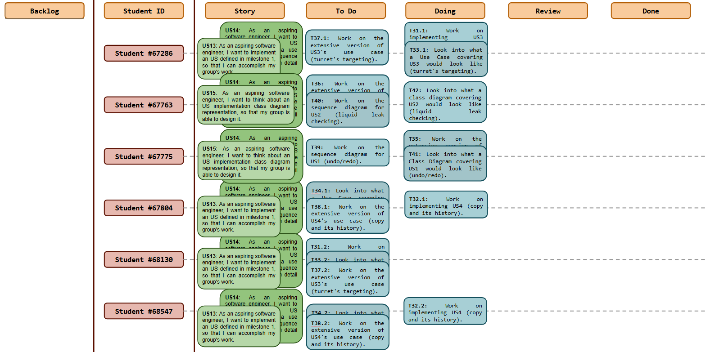
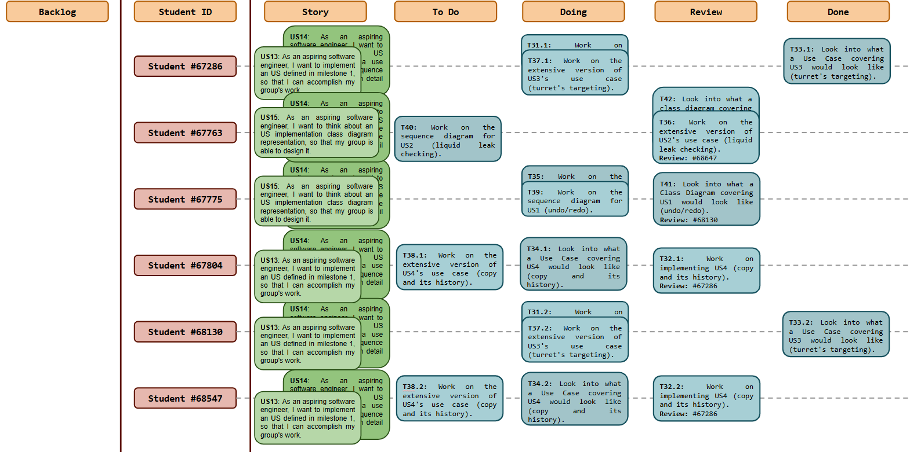
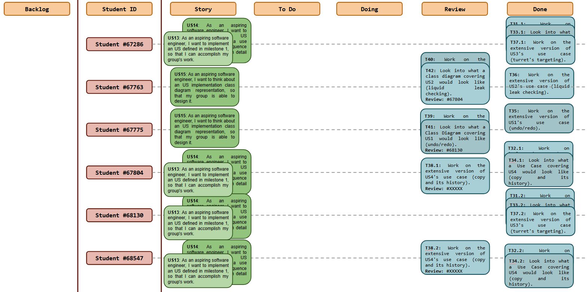
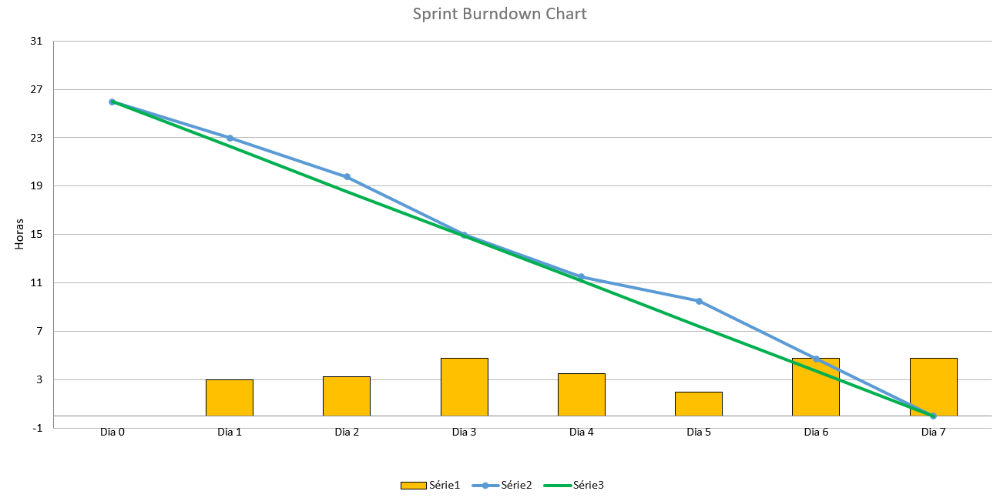
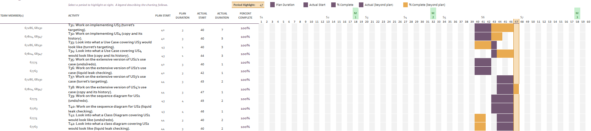

# Sprint 6

## Dates

2025-11-17 - 2025-11-23

## Scrum master

Gabriela Silva (67286)

## Management info
### Sprint Planning Meeting: 
- Set subgroups for implementing each user story
  - US1: Gabriel Falcão
  - US2: Diogo Antunes
  - US3: Dinis Neves and Gabriela Silva
  - US4: Carolina Ferreria and Manuel Oliveira
- Essentially, it was decided to *first* do the code implementation for each user storie, *only then* focus on its details: sequence diagrams and (extensive) use cases
- Class diagrams can start being made for US1 and US2
- Continue doing the work from last sprint

### Sprint Review Meeting: 
- Each subgroup presented their sprint work
- A 5th user story was thought about and analyzed
- Discusion about how to do the unit testing assignments
- Debate about possible future improvements in every field

### Sprint Retrospective Meeting: 
- The sprint was well structured and organized
- Most work left undone was reviewing tasks from colleagues
- Tasks should be done a little sooner, so other colleagues can have enough time to review work

## Relevant resources

### Scrum Board at the beginning of the sprint

### Scrum Board in the middle of the sprint

### Scrum Board at the end of the sprint

### Burndown Chart for the sprint

### Gantt Chart

