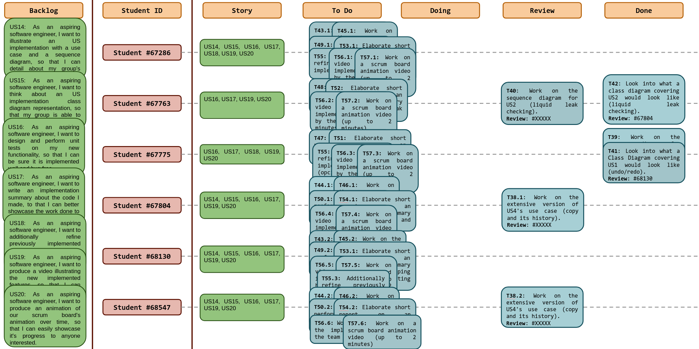
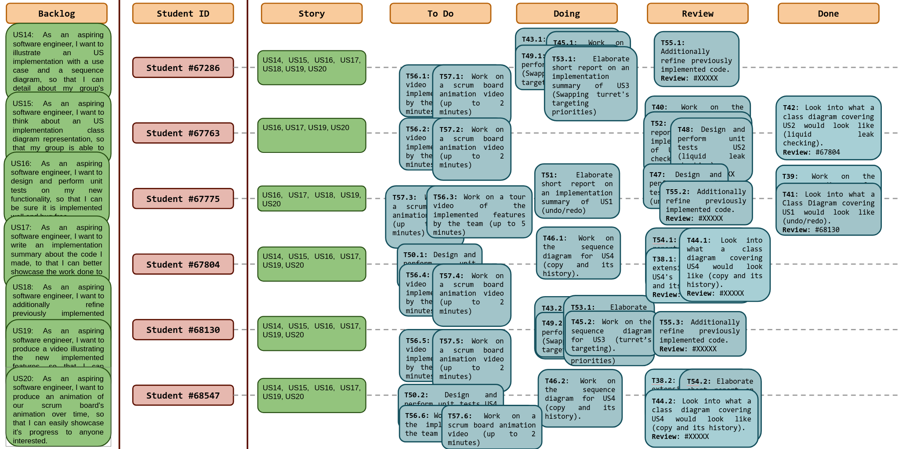
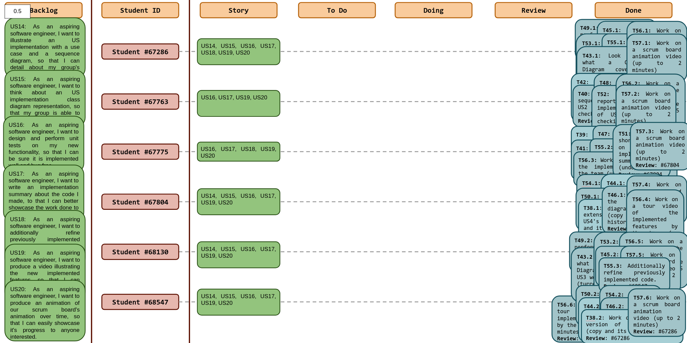
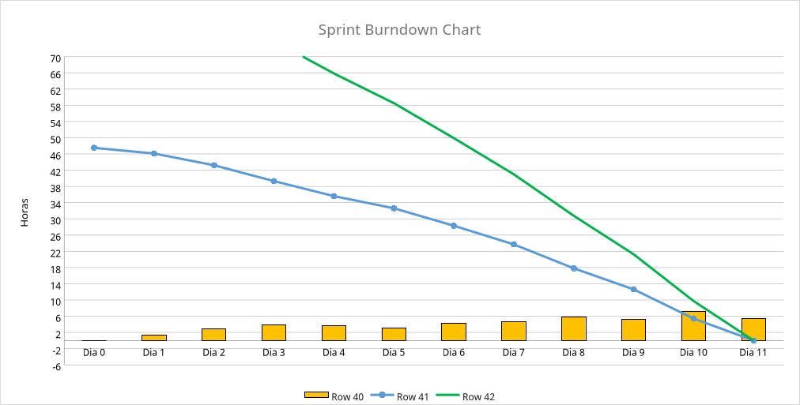
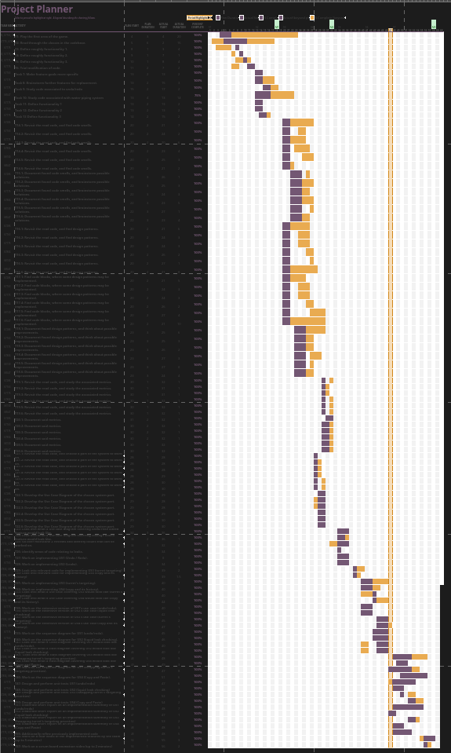

# Sprint 7

## Dates

2025-11-24 - 2025-12-04

## Scrum master

Manel Oliveira (68547)

## Management info
### Sprint Planning Meeting: 
- The subgroups for implementation will be kept for the remainder of projects duration.
- Summary of what is there left to do in the sprint.
  - Class Diagrams for US3 and US4
  - Sequence Diagrams for US3 and US4
  - Unit tests for all USs
  - Implementation summary report of all USs
  - Tour Video of all features
  - Scrum Board animation video
- Group reminder that some reviews were left to be done from last sprint.
- Some members voiced a concern of going back and refining their code.

### Sprint Review Meeting: 
- Each subgroup shared the work done so far
- Discussed the reviews that were needed at that point
- Division of labor regarding the remaining necessary videos

### Sprint Retrospective Meeting: 
- This was the hardest sprint, because of the sprint itself
- It was concluded that the work handout added unneeded difficulty

## Relevant resources

### Scrum Board at the beginning of the sprint

### Scrum Board in the middle of the sprint

### Scrum Board at the end of the sprint

### Burndown Chart for the sprint

### Gantt Chart

