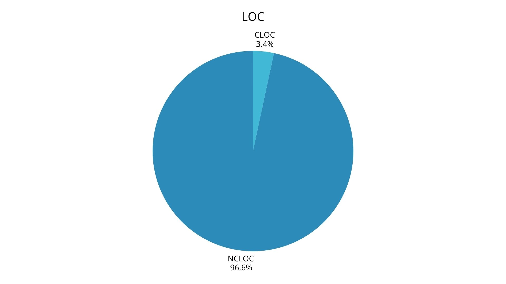
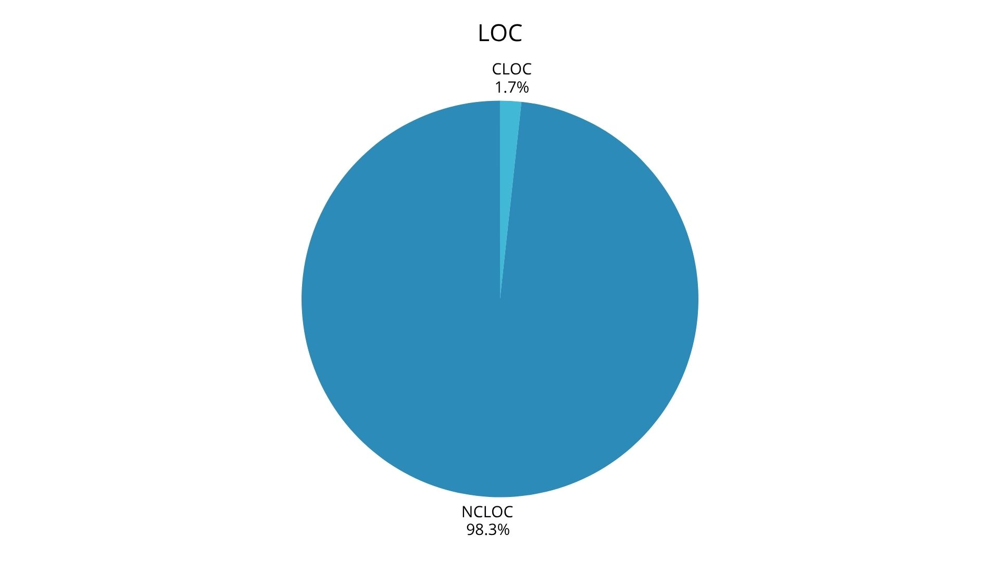
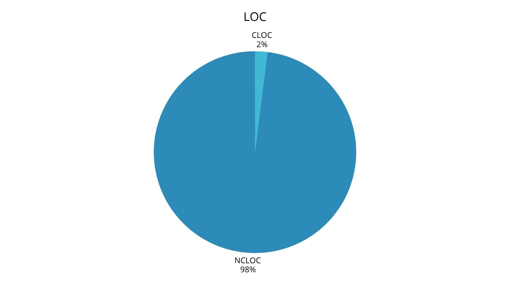

# Code metrics Report
## Author
- Carolina Ferreira (67804)
---
# LoC (Lines of Code)
The following report aims to analise the Mindustry code base using the Lines od Code metric. This metric "measures the volume of code by counting all non-comment and non-blank lines, including variable declarations and statements.". (https://www.geeksforgeeks.org/software-engineering/lines-of-code-loc-in-software-engineering/).

The chosen metrics are as following:
- LOC (Lines of Code): the total number of lines, including code, comments and blank lines
- CLOC (Comments Lines of Code): the total number of comment lines
- NCLOC (Non-Comment Lines of Code): the total number of non-comment lines

## *Project analysis*
**LOC**: 129 625 lines  
**CLOC**: 7993 lines   
**NCLOC**: 121 991 lines

This project has, in total, 129 625 lines of code, of which 7993 are comments and 121 991 lines are either actual code lines or blank lines. Another interesting value is the ratio of comments in relation to the size of the code - only **6**% - which is a relatively low value. 

### CLOC analyses
As said before, only 6% of the Mindustry code base are comments, which indicates a severely under-documented code. This lack of documentation, for a code this size (we're talking about almost 130 thousand lines), makes the tasks of understanding and expanding the code harder for developers reading the code for the first time, since there is little-to-no explanation to code implementations and specific decision, resulting in the possible introduction of bugs.
___
## *Code smells analysis*
Related to the last matter, analysing the code base via the LOC metric allows us to verify some of the code smells my pears found: Large class and Long method, and in some aspects, also the Dead Code smell. 

### **Long Method code smell - pollInputPlayer() (found by Gabriel Falcão 67775)**

**LOC**: 265 lines  
**CLOC**: 9 lines   
**NCLOC**: 259 lines

This checks with the report given by my colleague: this class as **265** lines and only **9** comments, which intensifies the major problem.

### **Long Method code smell - registerEvents() (found by Manuel Oliveira 68547)**

**LOC**: 348 lines  
**CLOC**: 6 lines   
**NCLOC**: 342 lines

Without being redundant, this values validate the existence of a Long Method code smell.

### Large Class code smell found durying analysis

During my analysis of the Class metrics, I was able to found the Large Class code smell multiple times, but there is one class bigger than all the other: the ``Block`` class.

**Block Class**

**LOC**: 5782 lines  
**CLOC**: 114 lines   
**NCLOC**: 5668 lines

As you can see, this class, unlike the majority of the other, is bloated, full of methods, parameters, etc. Viewing the metrics really helps us consolidate that thought, even more while comparing with the other classes metrics. 

___
## Graphs
[TabelaMetrics.xlsx](Assets/TabelaMetrics.xlsx)
### Project analysis

### Code Smell 1

### Code Smell 2

### Code Smell 3
