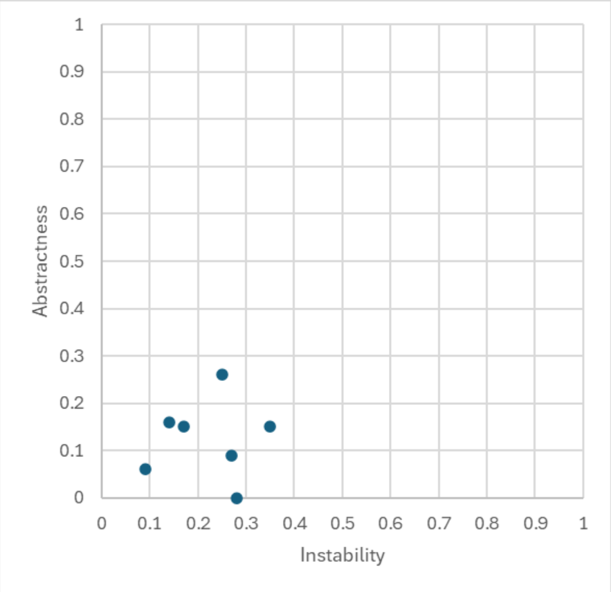
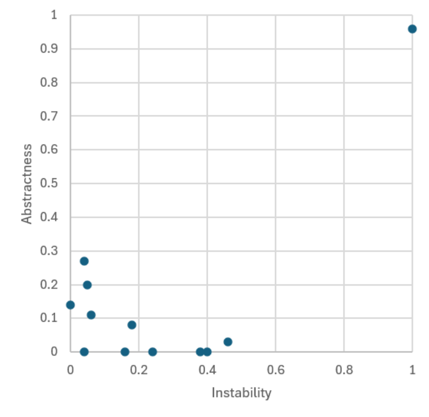
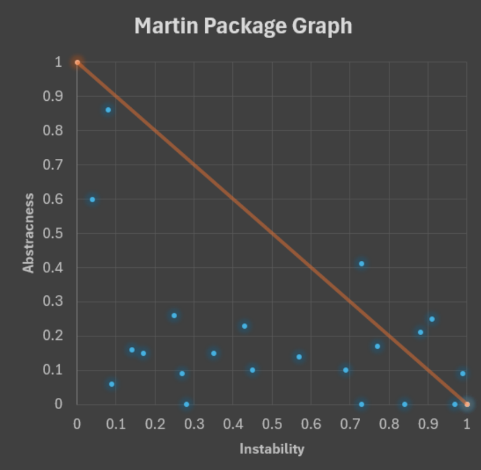
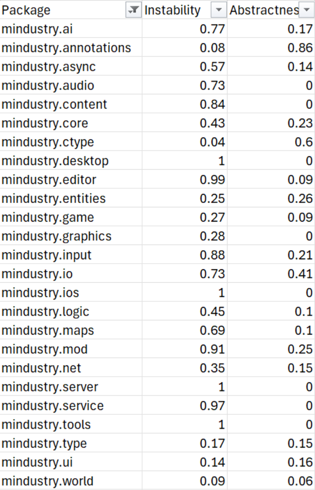

# Code metrics Report
## Author
- Dinis Neves (68130)

# Martin Package

#### Small summary of Martin Package Metrics

Martin Package Metrics are made to measure package design quality, measure how well code is organized in its different packages. It measures package:

Afferent Coupling (Ca): how many other packages depend on this package. (depended on)

Efferent Coupling (Ce): how many other packages this package depends on. (depends on)

Instability (I): formula to measure ratio of dependencies. Ce / (Ce + Ca). *X axis* 0 to 1 values

Abstractness (A): formula to measure ration of (abstract classes + interfaces) / total amount of classes. *Y axis* 0 to 1 values

Depending on the package, the closer it is in a Abstract, Instability graph to the main sequence (a line that crosses (1 fully abstract, 0 Stable), (0 fully concrete, 1 unstable)) the better.

Distance (D): is the distance to the Main Sequence.

The smaller the distance the better below is (asset_01) shows not balanced packages as packages with D > 0.5 and well design packages as packages with D < 0.5.

## Analysis of collected metrics

The packages in the Mindustry game tend to have well balanced packages with exceptions like the *mindustry/entities/comp* being a very different from all other packages. Being composed of almost all classes being abstract and depending on many other packages.
From the same parent package *mindustry/entities* parent package, other sub packages tend to be balanced towards the other extreme not abstract, and few depending on them.

The packages have a tendency of being not abstract, as seen in (asset_01) the scatter diagram is heavily weighed down with most dots hugging or coming close to hugging the x axis (Instability axis).

The same conclusions about the bias in the packages can be seen across different Martin Package graphs. Packages tend to be not very abstract. Some packages like the *mindustry/ui* and *mindustry/world* also tend to be not very balanced, being very depended on for its level of abstraction.

## Relevant graphs

### Analysis of graphs
(asset_01) MetricsTree graph shows that by majority packages do not tend to stray away from the Main sequence having usually a small distance in between. Outlier packages are *mindustry/entities/comp* that contains all abstract classes, and depends on other classes while other classes do not depend on it putting it in the Zone of Uselessness.

Other graphs confirm the assumptions and conclusions from (asset_01) but have filtered information.

Graphs from MetricsTree and MetricsReloaded have slightly different values but do not differ from each other significatly.
In the *SE202526/Milestone2/CodeMetrics/DinisNeves/assets* folder more graphs and the full table of Martin Package values for every package is available.

MetricsTree Graph (asset_01)

(parent packages that have greater than 0.5 distance)
MetricsReloaded MainPackagesBad (asset_02)

(sub packages that have greater than 0.5 distance with *mindustry/entities/comp* being in the top right corner)
MetricsReloaded SubPackagesBad (asset_03)

(close to asset_01 but ignoring child packages)
MetricsReloaded MainPackages (asset_04)

MetricsReloaded parent package table (asset_05)
