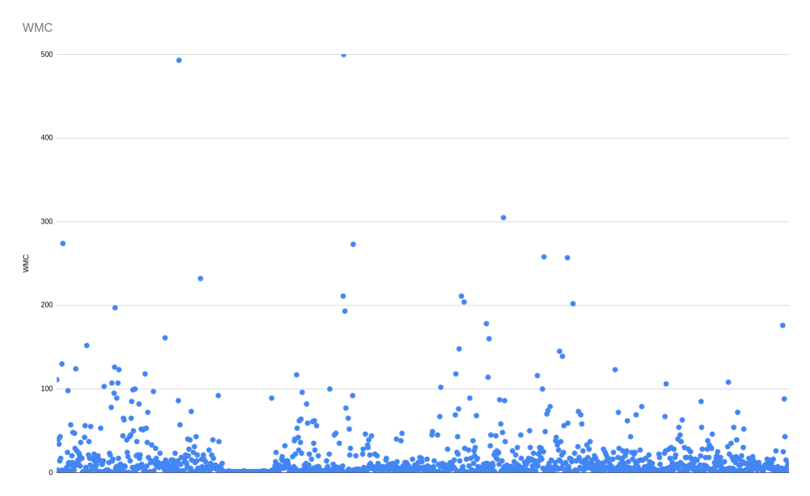
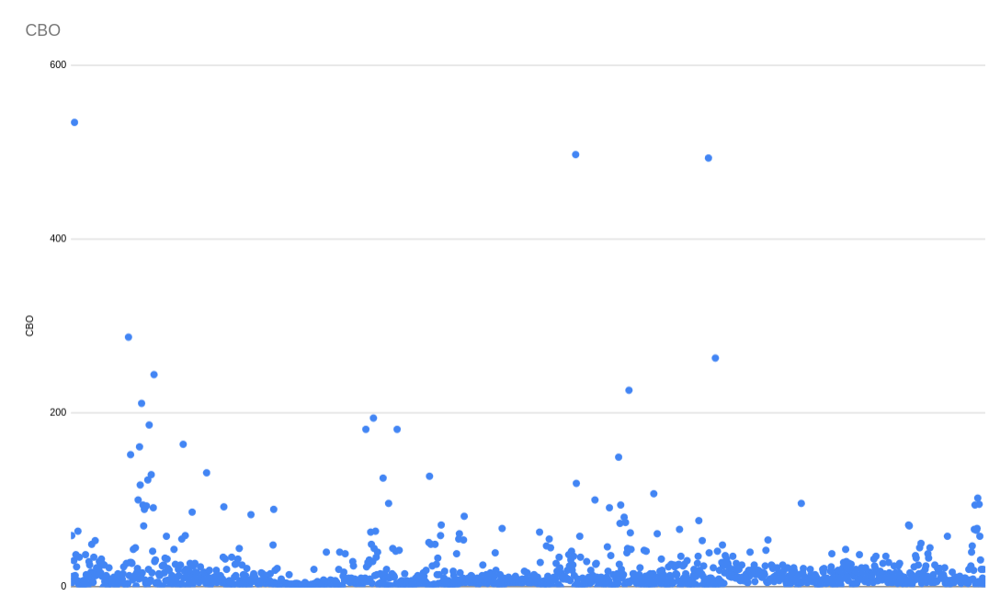

# Code metrics Report
## Author
- Manuel Oliveira (68547)

# Chidamber-Kemerer Metrics

## Analysis of collected metrics
The metrics I found relevant to analyse in this report are WWC, DIT and CBO, because from the metrics in this set, these are the ones I believe give the broadest picture of this project's structure.
As per standard in this metric set, all this metrics were treated on a project scope, studying all classes.

### WWC
This is the metric that evaluates the number of methods defined in each class.
A lower number of declared classes has been reported to be more beneficial to a project, as it makes for more reusable and easy-to-maintain classes.
The standard I considered adequate for this analysis was that no more than 10% can have more than 24 methods defined in them, and what I found is that about 18% os classes surpass this number.
That said given other metric reports that is not a horrible statistic whilst being still a bad one. There are some very bad classes like **mindustry.Vars** with about 500 methods, as it's possible to see on the first graph, but the average class is not too much above the standard.

### DIT
DIT studies the depth of inheritance tree, and shows the maximum inheritance path from the class in question to the root class.
Generally the further away a class is from its root class, the more complex it becomes. That said, whilst a high DIT has been found to increase faults, the classes in the middle of the hierarchy tend to cause the most problems, so a DIT of 5 or less is recommended.
From the data I gathered I found that about 19% of all classes have a higher DIT than 5, leading to the overall codebase being quite convoluted and hard to follow.

### CBO
The focus on this metric is to analyse the number of classes to which a class is coupled.
In most cases an excessive coupling between classes tens to degrade reusability and therefore a high CBO is undesirable in most cases.
That said the standard I found to be acceptable is a CBO lower or equal than 14 for each class, and I discovered that about 30% of classes exceed this value.
This is the worst average so far, and as seen on the second chart, the outliers here are not that many, the average code is just overly complex and entangled between itself.

## Relevant graphs

