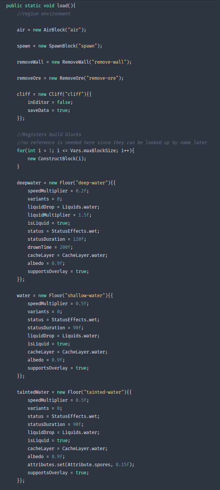
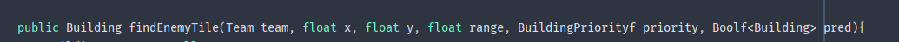
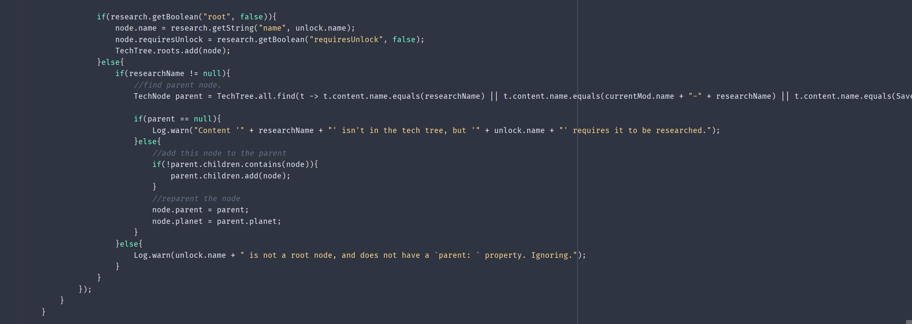

# Code Smell Report
## Author
- Carolina Ferreira (67804)
# Code Smells

## Duplicated Code
The **Duplicated Code** code smell is found in the ``Blocks.java`` file, from the package ``mindustry.content``, more specifically in the ``load()`` method, as showed in the snippet below:

**Duplicated Code** is the product of many factors, and it can even be purposeful. 

**Solution**

In order to solve this problem, we could create a new method used to set each ``Floor``/``ShallowLiquid`` and replace the old code with a call for this new method, giving the desired parameters, in order to not compromise any of the functionalities.

This change not only solves the **Duplication code** problem, but also makes the code much more readable and less error prone, with only a section to debug, instead of multiple.

## Data Clumps
The **Data Clumps** code smell is found in the ``BlockerIndex.java`` file, from the package ``mindustry.ai``, more specifically in the ``findEnemyTile()`` and ``findTile()`` methods, as showed in the snippets below:

As seen above, the ``team``, ``x``, ``y`` and ``pred`` parameters appear together more than once, as a clear sign of **Data Clumps**, a result from a vast number of reasons, like poor program structure or the so-called "copypasta programming".

**Solution**

To solve this case of bad smell in the area (pun inteended), since we're peaking of parameters of a method (or, in this case, multiple methods), these can be replaced with an object cointaning each and every one of them. Consolidating parameters in a single class allows the methods that handle them to go there as well. This way, we produce more readable code and easier to mantain.

## Feature envy 
The **Feature envy** code smell is found in the ``ContentParser.java`` file, from the package ``mindustry.mod``, specifically in the ``readFields()``, as showed in the snippet below:

We can see this code smell better in the following section:

In this method, the ``ContentParser`` class directly accesses methods of ``TechTree`` and ``TechNode`` classes, to set, get and manipulate it's data.

**Solution**

In order to solve this **Feature Envy** problem, we could move this code block into the ``TechTree`` or ``TechNode`` classes, or into it's new own class, which aligns with the goal of the method.