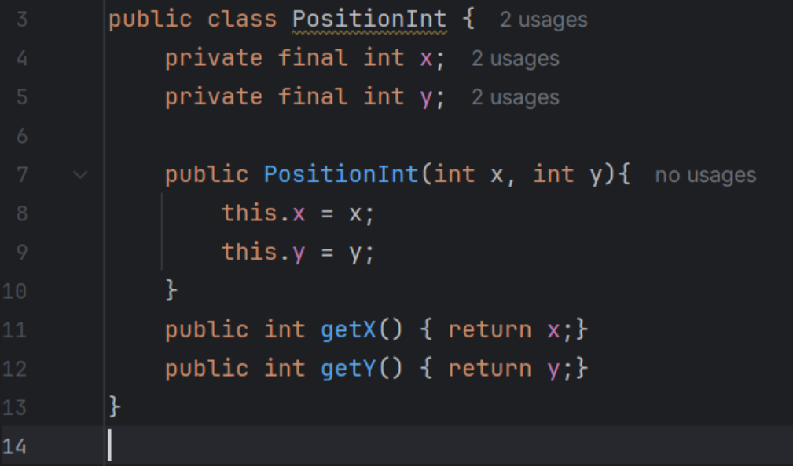
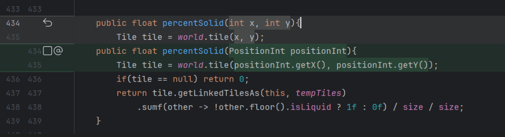
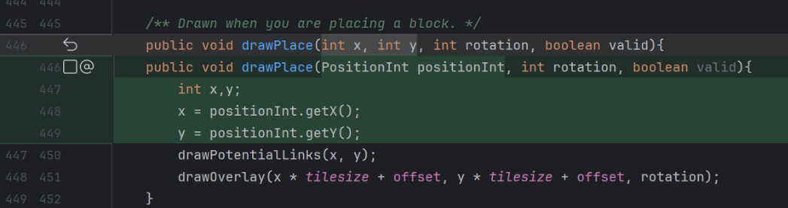
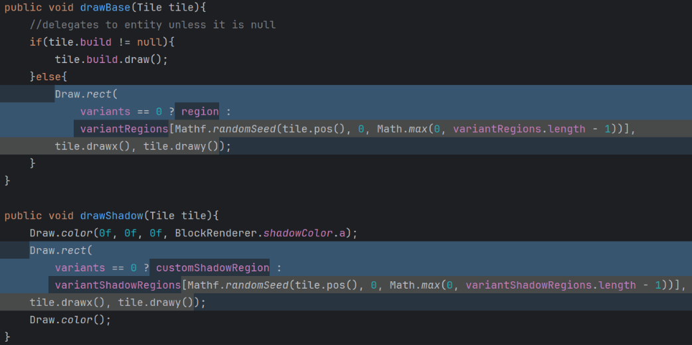
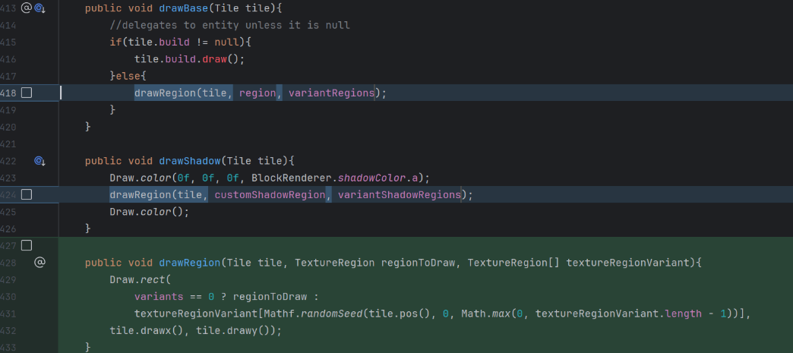
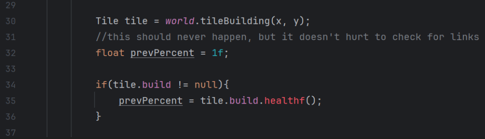
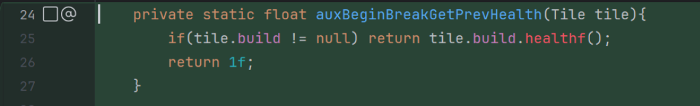
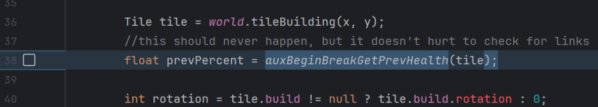

# Code Smells

## Primitive Obsession

One example of primitive obsession is in (and elsewhere) **mindustry/world/Block.java** repetitive use of **int x, int y, int rotation, boolean valid**.

Focusing on **World/Block.java** many functions like *percentSolid(int x, int y)* include x and y coordinates, rotation and a valid boolean as method inputs. Although not the most concise solution I think creating a Position class and variants (like PositionWithRotation) could make the code more readable and/or pleasing to the reader. Creating a clear distinction when a position of a (in this case) block is in the world/sector.
Although **arc/math/geom/Position.java** exists and is used alongside with **core/src/mindustry/world/Tile.java** I believe different Position classes (although not a lot) could exist too.

### Proposed Solution
A position class and maybe variants could be introduced.

### Example Solution
Below is a simple example of a position class that could exist and 2 examples of how it could be implemented

Example class PositionInt

(original code highlighted in light grey vs example solution in green)
*function percentSolid*

*function drawPlace*

---

## Duplicated Code

In the **mindustry/world/Block.java** there are examples of Duplicated code one example is the drawBase and drawShadow functions

**drawBase and drawShadow functions (with duplicated code highlighted in blue)**

Using drawBase and drawShadow functions as examples, both functions have the same code for drawing with the only difference being if it is shadow or not.

### Proposed Solution
A suitable solution to this small example of duplicated code would be to create a auxiliary function that would do the drawing part of both of these functions that could be called upon by both. This proposed solution can make the code more readable.

### Example Solution
In this example solution a function called **drawRegion** is created and replaces both of the draws in **drawBase** and **drawShadow**. All this function (**drawRegion**) does is receive what tile is to be drawn, the type of region, the texture variant of the region, and then draw the respective wanted region.

**drawBase, drawShadow, drawRegion functions after implementing the proposed solution**

---

## Long Method

There are various Long Method code smells examples throughout the code, focusing on the **mindustry/world/Build.java** class we can find some, 3, examples such as:

- beginPlace function
- beginBreak function
- validPlaceIgnoreUnits function

Using the first function as an example, (although not the largest of examples) one can see that the **beginBreak** function could use some auxiliary functions to make it shorter and therefore more legible for anyone who is working on the code.

### Proposed Solution
Creating auxiliary functions that shift the amount of code from one function to many others.

### Example Solution
Using **beginBreak** as an example, **prevPercent** float being declared could be one line of code by adding a auxiliary function

**float prevPercent attribution inside the beginBreak function (original code)**

aux function:

**changed lines in beginBreak of proposed solution**

