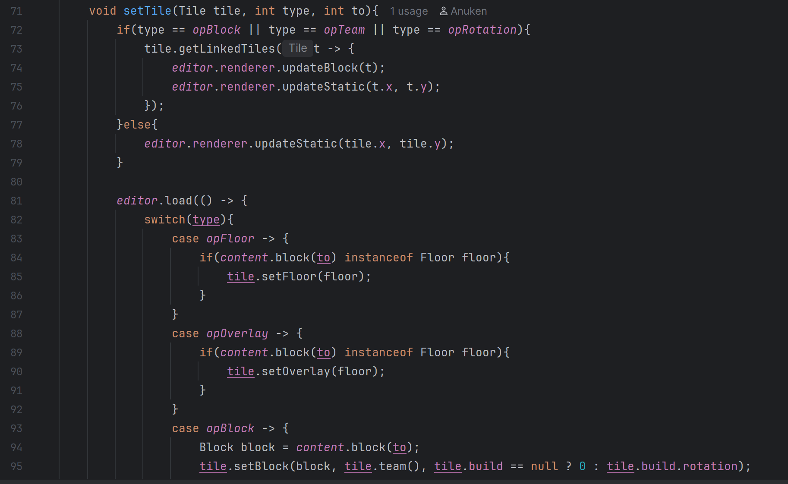
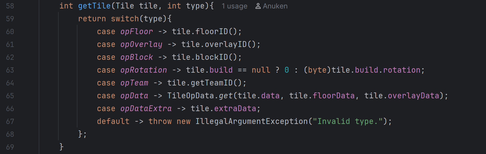

# Code Smell Report
## Author
- Diogo Antunes (67763)
# Code Smells
- Attach a picture of the block of code with the smell
- Reference the file in which the smell was found
- Possible solutions for the code smell you found
## Data Class
*(SaveMeta from package mindustry.io)*

I briefly mentioned it in the Design Patterns section do to its contribution towards, to an extent,
aiding worse encapsulation in the Memento Design Pattern.
It's used to store values of attributes stored in the save file for quick access via getters in the SaveSlot nested class of Saves:  
*(SaveSlot from package mindustry.game)*

### Rationale
Due to the code base's rule of using public attributes where possible,
the class SaveMeta has no methods and contains simply a constructor that takes as parameters the values it stores
with the exceptions:
- Using the "maps" attribute from the class Vars to filter by the String name;
- Reading from JSON via JsonIO getting the mods from the StringMap parameter.

Therefore, being a class with no methods, and providing no additional functionality except for data storage, it's a data class.
### Proposed Solution
SaveMeta should be turned into a record, however, that would require the constructor logic being done externally.  
Currently SaveMeta is instantiated in SaveIO using SaveVer, both from the package mindustry.io. The related code is shown below:  
*(getMeta in SaveIO from package mindustry.io)*

*(getMeta in SaveVersion from package mindustry.io)*

The SaveVersion getMeta method should be modified so that the logic in the constructor of SaveMeta pertaining to json and the map filter is done externally (in SaveVersion).
This allows the correct variables to be passed directly into the record, so that the data representation class doesn't need to be aware of globally-accessed variables (from the Singleton Vars).

## Long Method
## (Code Smell 3 Name)
