# Code Smells Report
## Author
- Diogo Antunes (67763)
# Code Smells
## Data Class
*(SaveMeta from package mindustry.io)*

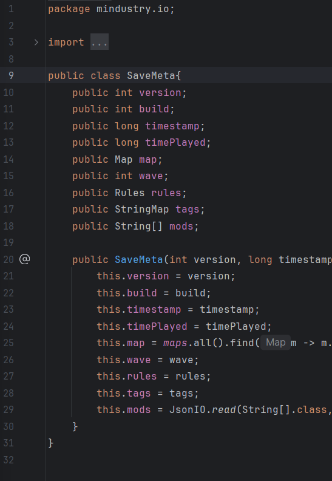

I briefly mentioned it in the Design Patterns section due to its contribution towards, to an extent,
aiding worse encapsulation in the Memento Design Pattern.
It's used to store values of attributes stored in the save file for quick access via getters in the SaveSlot nested class of Saves:  

*(SaveSlot from package mindustry.game)*
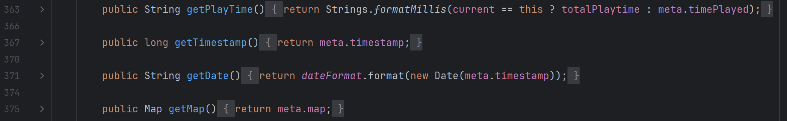
### Rationale
Due to the code base's rule of using public attributes where possible,
the class SaveMeta has no methods and contains simply a constructor that takes as parameters the values it stores
with the exceptions:
- Using the "maps" attribute from the class Vars to filter by the String name;
- Reading from JSON via JsonIO getting the mods from the StringMap parameter.

Therefore, being a class with no methods, and providing no additional functionality except for data storage, it's a data class.
### Proposed Solution
SaveMeta should be turned into a record, however, that would require the constructor logic being done externally.  
Currently SaveMeta is instantiated in SaveIO using SaveVer, both from the package mindustry.io. The related code is shown below:

*(getMeta in SaveIO from package mindustry.io)*
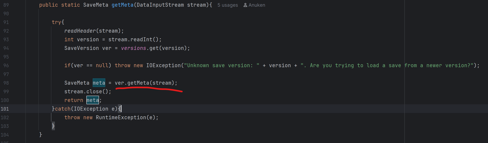

*(getMeta in SaveVersion from package mindustry.io)*
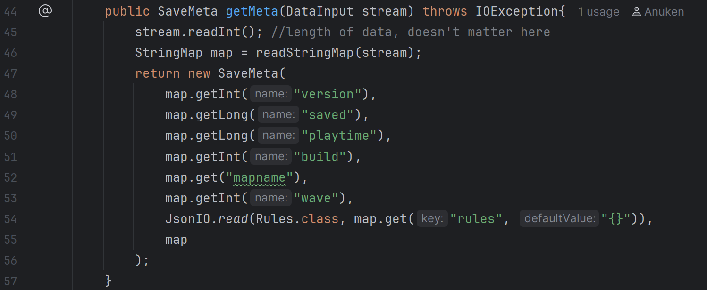
The SaveVersion getMeta method should be modified so that the logic in the constructor of SaveMeta pertaining to json and the map filter is done externally (in SaveVersion).
This allows the correct variables to be passed directly into the record, so that the data representation class doesn't need to be aware of globally-accessed variables (from Vars).

## Divergent Class
*(World class from package mindustry.core)*
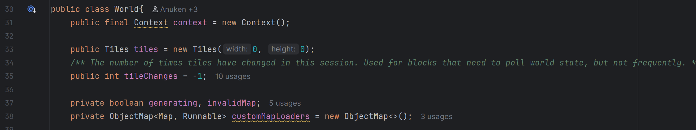

### Rationale
Indicative code metrics:

- Number of methods: 48
- Response for a class: 132
- Weighted Methods per class: 149

These metrics allude to a class wide in responsibility, given the number of methods in general,
as well as the number of methods called in response to a class.  
In this case it is a result of several distinct responsibilities, which include:
- Building
- 
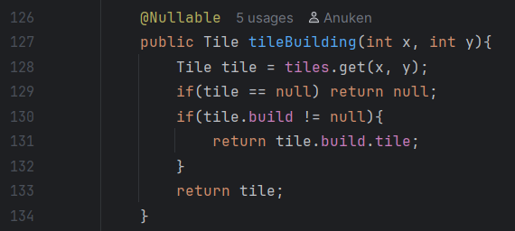

- Loading maps

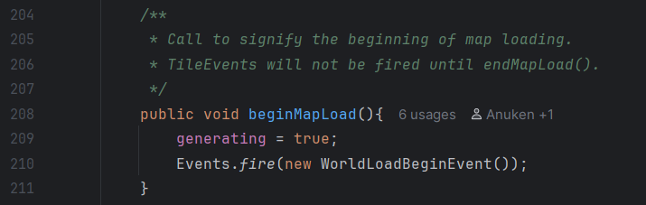

- Loading sectors


- Darkness management (used in map loading, code snippets in proposed solution)

  - addDarkness -> Line 396
  - getWallDarkness -> line 450
  - getDarkness -> line 481
- World raycasting


### Proposed Solution: Separation of Concerns
#### Darkness
Separate the logic of Darkness into another class, "DarknessManager", potentially static.

*(Example method pertaining to Darkness)*
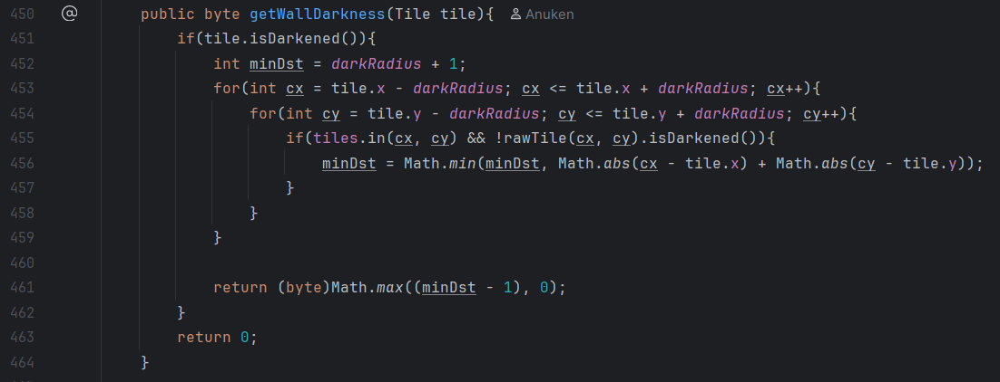
The variable darkRadius above is a global from the class Vars, so the extraction there wouldn't lead to any more coupling.
However, the method rawTile used is from the World class. On the other hand, the method rawTile is simply:

*(Code for rawTile method in World class)*


Therefore, the code logic isn't lengthy or unique enough to justify tying it to the World class. The same logic could still be performed in the extracted Darkness class.
In line 455, we can see the argument attribute "tiles" of the World class being used. However, tiles could simply be put as a method parameter, seen as this is already done in the method addDarkness:

*(Beginning of the addDarkness method seen below)*
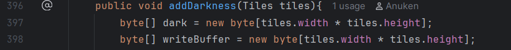

#### Raycasting
The 3 methods related to raycasting are static, so they could be separated so that uses would couple with the extracted class
instead of calling on the World class statically (since they are static methods, they aren't called on an instance).

In example, just like in darkness, raycastEachWorld uses a method of the World class toTile which is actually just a one-line
method that uses a global variable from Vars (therefore refactoring wouldn't make the extracted class depend on World):

*(Code for raycastEachWorld static method in World class)*

*(Code for toTile static method in World class, which uses a global variable tilesize)*


## Switch Statements

*(TileOp class in mindustry.gen)*


Use of a switch case over TileOp type "attribute":  
*(getTile and setTile methods in DrawOperation of package mindustry.editor)*
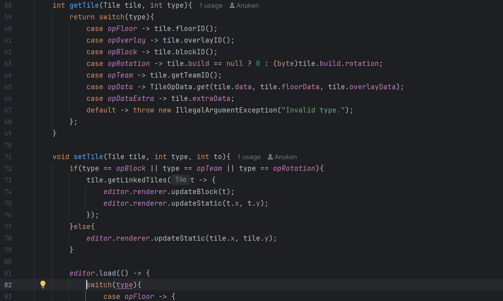

### Rationale
The code metrics of the classes didn't seem to indicate a particular problem.  
The current implementation uses the automatically generated TileOp class. However, this means
there is no formal abstraction for a tile operation, resulting in a switch operation to perform the
respective action per type.
This leads to very strong coupling between DrawOperation and the classes it helps interpret for:
- TileOpData (another automatically generated class);
- TileOp.

### Proposed Solution

Formally abstract TileOp and TileOpData into a TileOp interface implemented by each type of tile operation.
The behaviour of each method implementation wouldn't differ from the logic in the getTile and setTIle method above.  

*(getTile method in DrawOperation of package mindustry.editor)*

In example, the interface would have a getTile method with a Tile tile parameter,
and through polymorphism each class implementation would return what is indicated by the switch case above.  

*(setTile method in DrawOperation of package mindustry.editor)*

For setTile, it should take as a parameter a Tile tile (int to could just be a class attribute).
Also, since content is a global attribute from Vars, they could access it just the same as DrawOperation.

At the end of the method, there's also additional behaviour for 3 of the operation types.
*(end of code for setTile method in DrawOperation of package mindustry.editor)*
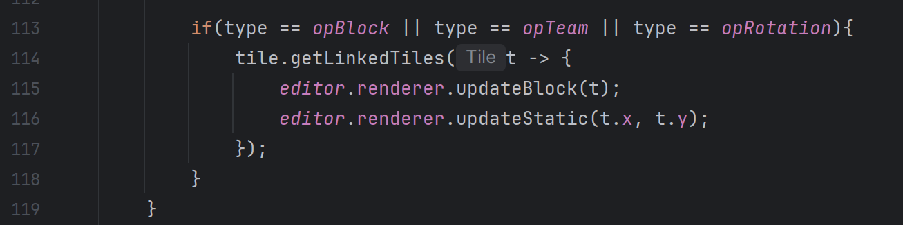
To avoid code duplication, TileOp could be implemented by an abstract class with a protected method that would
perform this added functionality for the ops that require it, so that it could be called at the end of the setTile method.

Example code implementation for OpBlock, which would extend a class called TileUpdateOp that would have the additional
logic mentioned above:

```
public class OpBlock extends TileUpdateOp implements TileOp {
    public OpBlock() {
        ...
    }
    
    @Override
    public int getTile(Tile tile) {
        return tile.blockID();
    }
    
    @Override
    public void setTile(Tile tile, int to){
        Block block = content.block(to);
        tile.setBlock(block, tile.team(), tile.build == null ? 0 : tile.build.rotation);
        if(tile.build != null){
            tile.build.enabled = true;
        }
        //do extra tile.getLinkedTiles(...)
        super.setTile(tile, to);
    }
}
```