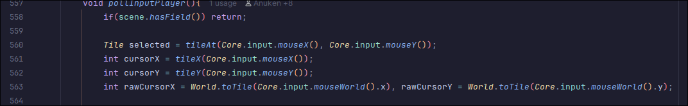
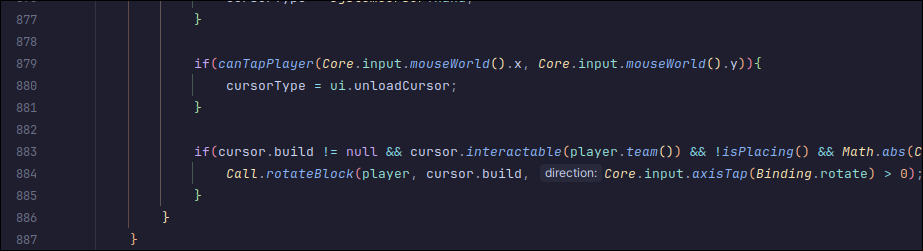
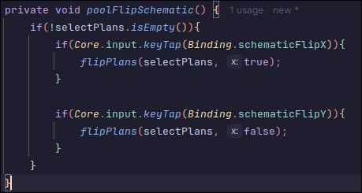

# Code Smell Report
## Author
- Gabriel Falcão (67775)
# Code Smells
- Attach a picture of the block of code with the smell
- Reference the file in which the smell was found
- Possible solutions for the code smell you found
## Long Method
The **pollInputPlayer** has about 330 lines

This method is found in DesktopInput.java

I believe that most actions (if's) could be replaced by stand-alone methods,
not only would it improve the method's readability quite a lot 
it would also be easier to understand which action each if block is treating, 
most are either not commented or the comments barely explain what the action is.

### Proposed Solution
I believe most if's in this method should be stand-alone methods to improve readability.

### Example Solution
Below is one of the many if's inside this method. 
I believe it handles the schematic flipping functionality.
It would be much better if the reader didn't have to guess what it does
through the binding names.

## (Code Smell 2 Name)
## (Code Smell 3 Name)
