# Code Smell Report
## Author
- Gabriel Falcão (67775)
# Code Smells
## Long Method
This is probably the code smell that is most notable across the codebase,
As most methods exceed the 25-30 line average.

Some examples are:
- The **pollInputPlayer** in **DesktopInput.java** has 330 lines
- The **build** in **BannedContentDialog.java** has 84 lines
- The **update** in **BaseBuilderAI.java** has 135 lines

While many of these can be found throughout the codebase, this report
focuses on the **pollInputPlayer** method, as it is one of the longest methods.

Stand-alone methods could replace most actions (ifs),
not only would it improve the method's **readability** quite a lot.
It would also be much easier to understand which action each if block is treating;
Most are either not commented on or the comments barely explain what the action is/does.
Thus, much of the reader's time goes into guesswork through the names of the bindings
polled in each if.

*Start of pollInputPlayer*

*End of pollInputPlayer*

### Proposed Solution
Most ifs in this method should be stand-alone methods to improve readability.

### Useful Metrics

### Example Solution
Below is one of the many ifs inside this method.
I believe it handles the schematic flipping functionality.
It would be much better if the reader didn't have to guess what it does
through the binding names.

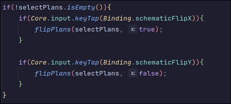

## Data Clump
The abstract class **InputHandler.java**, class **DesktopInput.java**,
class **MobileInput.java**, all employ the use of **4 variables** that are
usually passed around together (they may have different
names in which one of the classes, but they seem to have similar purposes.

### Evidence

#### MobileInput
1. 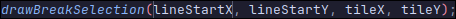
2. 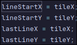
3. 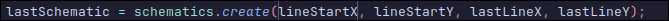

#### DesktopInput

1. 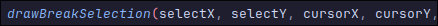
2. 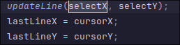
3. 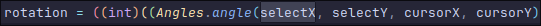

#### InputHandler
1. 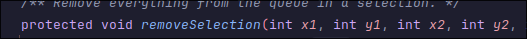
2. 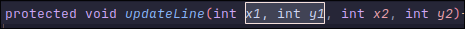
3. 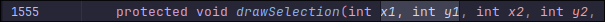

### Proposed Solution

This data clump seems to represent the selection rectangle,
used when a player is selecting a region to break, rebuild, or build.

Thus, I propose creating a record of type SelectionRectangle when passing these 4 around.

## Refused Bequest
All classes int **core/src/mindustry/entities/part** apart from **RegionPart.java**
seem to inherit the method **load** this method is declared as *{}* (does nothing) in the
abstract class (**DrawPart.java**) from which all of the classes in this folder inherit.
The children's classes (apart from **RegionPart.java** mentioned above) inherit the method,
But do not override it with new functionality (since it had none to begin with).
- ShapePart.java

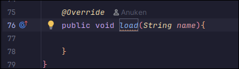
- HaloPart.java

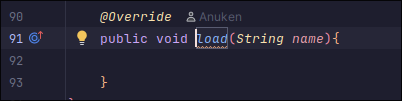
- FlarePart.java

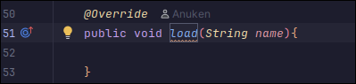

- HoverPart.java

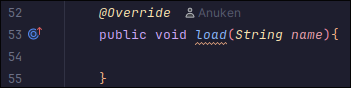

### Proposed Solution
~~Find where this method is used and, if possible, remove it from the abstract class.~~
As proposed by Diogo the best solution here instead of removing the method from the abstract class completely
would be to separate the **DrawPart.java** class into two, one that has most methods used by all its children, another
subclass of **DrawPart.java** ,which only **RegionPart.java** would inherit, with the load method.

# Change Log
I have updated my review of the Long Method code smell. (67775) (12/11/2025) (17:32)
I have updated my review of the Refused Bequest code smell. (67775) (12/11/2025) (17:39)

