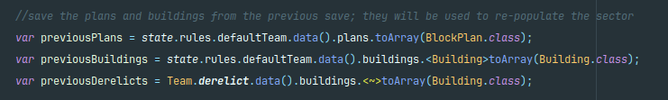
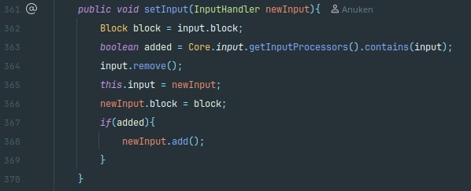
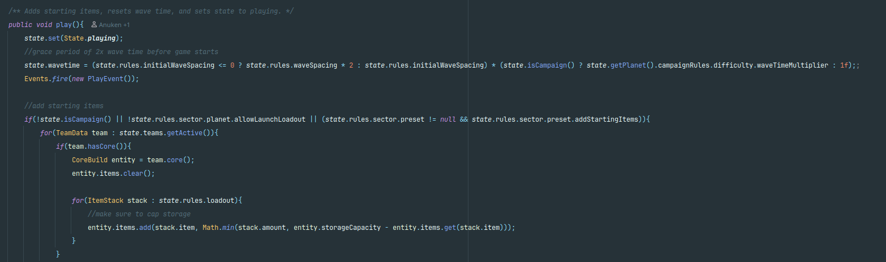
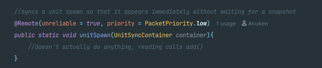
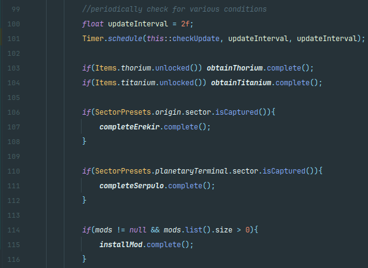
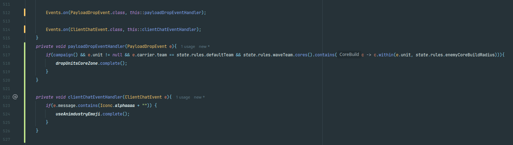

# Code Smell Report
## Author
- Manuel Oliveira (68547)
# Code Smells
## Message Chains
This code smell appears quite often throughout the codebase.

Some examples I've encountered:
- More than once in the **playSector** method in **mindustry/core/Control**
    

- In **setInput**, also of **mindustry/core/Control**

  

- In **play** in **mindustry/core/Logic**

  

### Proposed Solution
In theory, to solve this smell the refactoring technique of Hide Delegate would be used, and therefore spreading the method and variable calls throughout the code base. But in some cases the methods called are from autogenerated code and major project refactoring would be necessary.

## Dead Code

This code smell was not taught in the classes but I found it in the documentation offered in the lectures material, so I decided to use it.

Dead Code is described as a piece of code that by some reason doesn't do anything, the cause of this is often an obsolete method or in some cases entire classes.

I found at least one method obsolete by admission of its authors.
The case I'm referring to is, the **unitSpawn** method, in the **mindustry/entities/units** package in the **Units** class.

### Proposed Solution
The best solution would be to fully delete the unnecessary method, or at least change the documentation to reflect, only, the current function of the method.
But once again the code that calls the example I found is in an autogenerated class and to properly correct this instance it would be necessary to do a substantial code rework.

## Long Method
Even though this code smell is quite common in the codebase there is a particularly bad example of it, specifically in the **mindustry/service** package and in the **GameService** class, the **registerEvents** method.

This method has about 400 lines because it's in charge of periodically checking and setting Events on various gameplay elements, unlockables and achievements, as well as respond to triggers or game events. And even though the method is really long it does make sense to try to define all Events in the same place, despite this good intention it's still a code smell to do it all in the same method.

- periodically checking various conditions

- Events on gameplay elements

### Proposed Solution
The best solution for this would be to split the large method into smaller ones like such:

As well as evaluate occasions where similar code appears and group it together into private methods, although this would be much harder to implement.

Due to the fact that almost every single event called or created is for a specific situation.
