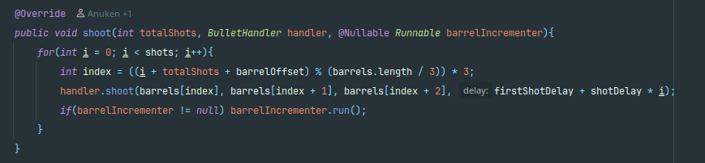
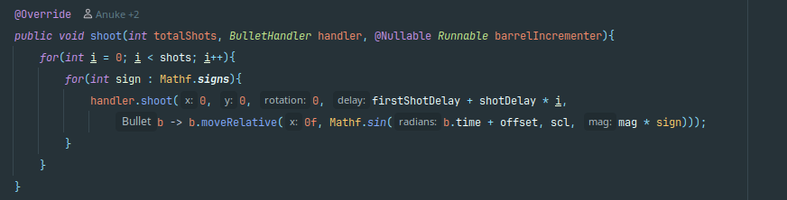
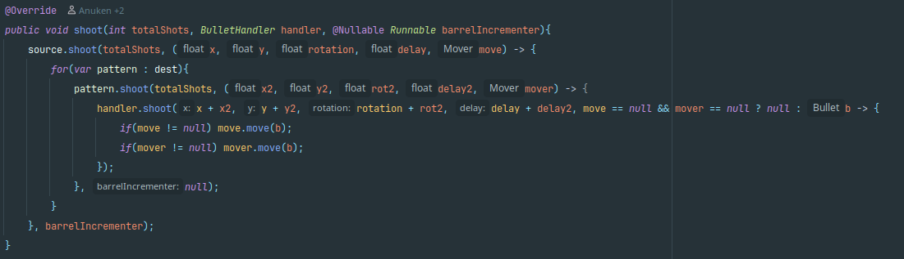
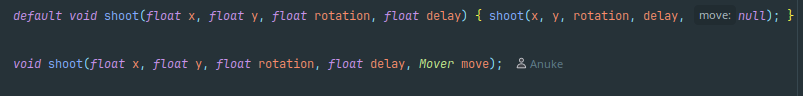
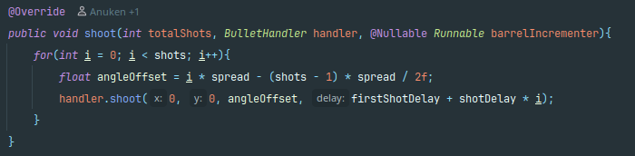
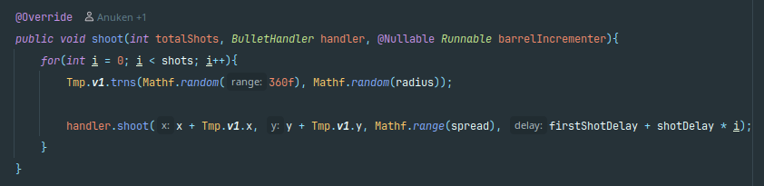

# Code Smell Report
## Author
- Manuel Oliveira (68547)
# Code Smells
## Message Chains
This code smell appears quite often throughout the codebase.

Some examples I've encountered:
- More than once in **playSector** method in **mindustry/core/Control**

- In **setInput**, also of **mindustry/core/Control**
  

- In **play** in **mindustry/core/Logic**
  

### Proposed Solution
In theory, to solve this smell the refactoring technique of Hide Delegate, and therefor spreading the method and variable calls throughout the code base. But in some cases the methods called are from autogenerated code and major project refactoring would be necessary.

## Dead Code
I found at least one method obsolete by admission of its authors.
The case I'm referring to is, **unitSpawn** method, in the **mindustry/entities/units** package in the **Units** class

### Proposed Solution
The best solution would be to fully delete the unnecessary method, or at least change the documentation to reflect, only, the current function of the method.
But once again the code that calls the example I found is in a autogenerated class and to properly correct this instance it would be necessary to do a substantial code rework.

## Shotgun Surgery
In the **mindustry/entities/pattern** there are a lot of classes that demonstrate this code smell.
In this package there are a few classes that implement the method **shoot** in very similar ays for the same purpose but in different variations, and therefore a change to the way shooting is supposed to work would require the alteration of all the implementations.

*ShootAlternate*

*ShootBarrel*

*ShootHelix*

*ShootMulti*

*ShootPattern*

*ShootSine*

*ShootSpread*

### Proposed Solution
To correct this one possible solution would be to merge all the different classes into one and possibly also all the different methods int one with a switch case to choose between the different functionality. 
