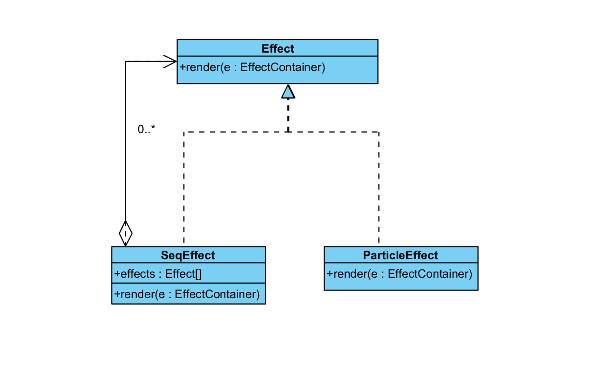
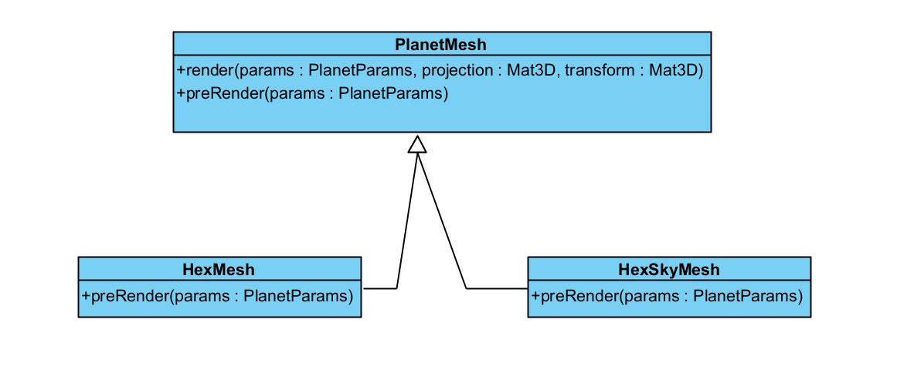
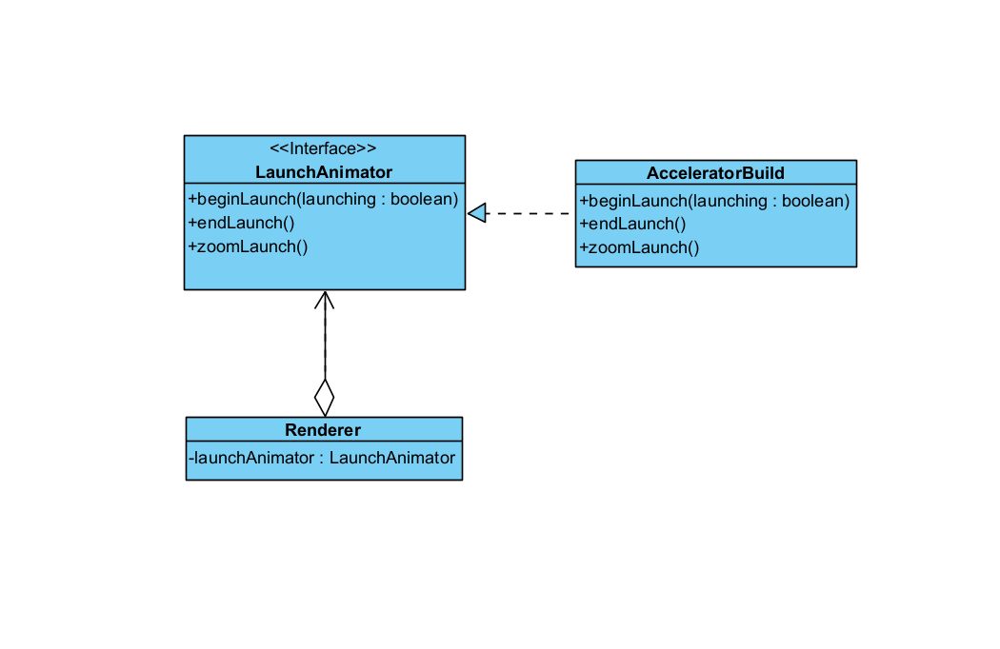

# Design Pattern Report
## Author
- Carolina Ferreira (#67804)
# Design Patterns
- Attach a picture of the block of code with the Design Pattern
- Reference the file in which the Pattern was found
- Possible improvements you found
- Possible blocks of code you believe a Pattern could be implemented
    - Picture of said blocks

## Composite
The Composite, a structural design pattern, allows to compose objects into tree structures and use them as individual objects (https://refactoring.guru/design-patterns/composite).

This design pattern can be found when observing ``Effect`` (``core/src/entities/Effect.java``) and it's sub-classes: ``MultiEffect``, ``SeqEffect``, ``ExplosionEffect``, ``ParticleEffect``, ``RadialEffect``, ``SoundEffect``, ``WaveEffect`` and ``WrapEffect``, all from ``core/src/entities/effect``. In order to simplify this explanation, we're going to focus on two of these subclasses - ``SeqEffect`` and ``ParticleEffect``- since their existence is enough to justify the design pattern.

```java
public class SeqEffect extends Effect{
    public Effect[] effects = {};
    
    (...)

    @Override
    public void render(EffectContainer e){
        var cont = e.inner();
        float life = e.time, sum = 0f;
        for(int i = 0; i < effects.length; i++){
            var fx = effects[i];
            if(life <= fx.lifetime + sum){
                cont.set(e.id + i, e.color, life - sum, fx.lifetime, e.rotation, e.x, e.y, e.data);
                fx.render(cont);
                clip = Math.max(clip, fx.clip);
                break;
            }
            sum += fx.lifetime;
        }
    }
}
```

```java
public class ParticleEffect extends Effect{
    
    (...)
    
    @Override
    public void render(EffectContainer e){
        if(tex == null) tex = Core.atlas.find(region);

        float realRotation = (useRotation ? (casingFlip ? Math.abs(e.rotation) : e.rotation) : baseRotation);
        int flip = casingFlip ? -Mathf.sign(e.rotation) : 1;
        float rawfin = e.fin();
        float fin = e.fin(interp);
        float rad = sizeInterp.apply(sizeFrom, sizeTo, Mathf.curve(rawfin, sizeChangeStart / lifetime, 1f)) * 2;
        float ox = e.x + Angles.trnsx(realRotation, offsetX * flip, offsetY), oy = e.y + Angles.trnsy(realRotation, offsetX * flip, offsetY);

        Draw.color(colorFrom, colorTo, fin);
        Color lightColor = this.lightColor == null ? Draw.getColor() : this.lightColor;

        if(line){
            Lines.stroke(sizeInterp.apply(strokeFrom, strokeTo, rawfin));
            float len = sizeInterp.apply(lenFrom, lenTo, rawfin);

            rand.setSeed(e.id);
            for(int i = 0; i < particles; i++){
                float l = length * fin + baseLength;
                rv.trns(realRotation + rand.range(cone), !randLength ? l : rand.random(l));
                float x = rv.x, y = rv.y;

                Lines.lineAngle(ox + x, oy + y, Mathf.angle(x, y), len, cap);
                Drawf.light(ox + x, oy + y, len * lightScl, lightColor, lightOpacity * Draw.getColorAlpha());
            }
        }else{
            rand.setSeed(e.id);
            for(int i = 0; i < particles; i++){
                float l = length * fin + baseLength;
                rv.trns(realRotation + rand.range(cone), !randLength ? l : rand.random(l));
                float x = rv.x, y = rv.y;

                Draw.rect(tex, ox + x, oy + y, rad, rad / tex.ratio(), realRotation + offset + e.time * spin);
                Drawf.light(ox + x, oy + y, rad * lightScl, lightColor, lightOpacity * Draw.getColorAlpha());
            }
        }
    }
}
```

As seen in the above code snippets, both this classes override the ``render()``, but only ``SeqEffect`` - the Composite - delegates the work to it's sub-elements: the ``Effect`` objects kept in ``effects``. On the other hand, ``ParticleEffect`` - on of the leafs - executes the code itself, without delegating some work to any other object.

The ``init()`` is also override by both this classes, with a similar behaviour as the described. 

Unlike the usual Composite pattern, the ``Effect`` is not an Interface, despite acting like one to its subclasses. Furthermore, ``effects`` is a public variable and there are no ``add()``, ``remove()`` and ``getChildren()`` methods, which could all be improvements to make.

**Diagram

## Template
As behavioral design pattern, Template Method defines the skeleton of an algorithm in a superclass that can be overridden in a subclass, without changing its structure (https://refactoring.guru/design-patterns/template-method).

In this case, observing the ``core/src/mindustry/graphics/g3d`` might enlighten us on what is the generic implementation of this design pattern. In it, we have the Abstract Class ``PlanetMesh`` and its subclasses ``HexMesh`` and ``HexSkyMesh``. In the superclass, we can find the ``Template`` method: the ``render``method, that defines overall rendering process — binding shaders, setting matrices, rendering meshes — as we can see bellow:

```java
public void render(PlanetParams params, Mat3D projection, Mat3D transform){
    if(mesh.isDisposed()) return;

    preRender(params);
    shader.bind();
    shader.setUniformMatrix4("u_proj", projection.val);
    shader.setUniformMatrix4("u_trans", transform.val);
    shader.apply();
    mesh.render(shader, Gl.triangles);
}
```

As we can see, one of the steps of this algorithm is the hook method ``preRender()``, a method present in the ``PlanetMesh`` class with the comment ``/** Should be overridden to set up any shader parameters such as planet position, normals, etc. */`` and implemented in all the subclasses, as seen bellow:
```java
public class HexSkyMesh extends PlanetMesh{
    
    (...)
    
    @Override
    public void preRender(PlanetParams params){
        Shaders.clouds.planet = planet;
        Shaders.clouds.lightDir.set(planet.solarSystem.position).sub(planet.position).rotate(Vec3.Y, planet.getRotation() + relRot()).nor();
        Shaders.clouds.ambientColor.set(planet.solarSystem.lightColor);
        Shaders.clouds.alpha = params.planet == planet ? 1f - params.uiAlpha : 1f;
    }
```
```java
public class HexMesh extends PlanetMesh{
    
    (...)
    
    @Override
    public void preRender(PlanetParams params){
        Shaders.planet.planet = planet;
        Shaders.planet.emissive = planet.generator != null && planet.generator.isEmissive();
        Shaders.planet.lightDir.set(planet.solarSystem.position).sub(planet.position).rotate(Vec3.Y, planet.getRotation()).nor();
        Shaders.planet.ambientColor.set(planet.solarSystem.lightColor);
    }
}
```
The ``HexSkyMesh`` class also as its own implementation of the template method, a variation of the ``render`` method - not a total rewrite. 

**Diagram**


## Strategy
Strategy - a pretty similar behavioral design pattern to the one we investigated before (**Template Method**) - is a pattern separate family of algorithms into different classes, and make their objects interchangeable. (https://refactoring.guru/design-patterns/strategy)

While checking in the ``core/src/mindustry/world/blocks`` directory, you come across the ``LaunchAnimator`` Interface - the ``Strategy`` interface - containing a family of algorithms implemented by the ``AccelaratorBuild`` class, found in the ``Accelerator`` class in ``core/src/mindustry/world/blocks/campaign``. 

```Java
public interface LaunchAnimator{

    void drawLaunch();

    default void drawLaunchGlobalZ(){}

    void beginLaunch(boolean launching);

    void endLaunch();

    void updateLaunch();

    float launchDuration();

    default Music landMusic(){
        return Musics.land;
    }

    default Music launchMusic(){
        return Musics.launch;
    }

    float zoomLaunch();
}
```

We can see some implemented methods in the ``AcceleratorBuild`` class bellow:
```Java
public void beginLaunch(boolean launching){
    if(!launching) return;

    this.launching = true;
    Fx.coreLaunchConstruct.at(x, y, launchBlock.size);

    cloudSeed = Mathf.random(1f);
    float margin = 30f;

    Image image = new Image();
    image.color.a = 0f;
    image.touchable = Touchable.disabled;
    image.setFillParent(true);
    image.actions(Actions.delay((launchDuration() - margin) / 60f), Actions.fadeIn(margin / 60f, Interp.pow2In), Actions.delay(6f / 60f), Actions.remove());
    image.update(() -> {
        image.toFront();
        ui.loadfrag.toFront();
        if(state.isMenu()){
            image.remove();
        }
    });
    Core.scene.add(image);

    Time.run(chargeDuration, () -> {
        Fx.coreLaunchConstruct.at(x, y, launchBlock.size);
        Fx.launchAccelerator.at(x, y);
        Effect.shake(10f, 14f, this);

        for(int i = 0; i < launchLightning; i++){
            float a = Mathf.random(360f);
            Lightning.create(team, lightningColor, lightningDamage, x + Angles.trnsx(a, lightningOffset), y + Angles.trnsy(a, lightningOffset), a, Mathf.random(lightningLengthMin, lightningLengthMax));
        }

        float spacing = 12f;
        for(int i = 0; i < 13; i++){
            int fi = i;
            Time.run(i * 1.1f, () -> {
                float radius = block.size/2f + 1 + spacing * fi;
                int rays = Mathf.ceil(radius * Mathf.PI * 2f / 6f);
                for(int r = 0; r < rays; r++){
                    if(Mathf.chance(0.7f - fi  * 0.02f)){
                        float angle = r * 360f / (float)rays;
                        float ox = Angles.trnsx(angle, radius), oy = Angles.trnsy(angle, radius);
                        Tile t = world.tileWorld(x + ox, y + oy);
                        if(t != null){
                            Fx.coreLandDust.at(t.worldx(), t.worldy(), angle + Mathf.range(30f), Tmp.c1.set(t.floor().mapColor).mul(1.7f + Mathf.range(0.15f)));
                        }
                    }
                }
            });
        }


    });
}

@Override
public void endLaunch(){
    launching = false;
    launchTime = 0f;
}

@Override
public float zoomLaunch(){
    float rawTime = launchDuration() - renderer.getLandTime();
    float shake = rawTime < chargeDuration ? Interp.pow10In.apply(Mathf.clamp(rawTime/chargeDuration)) : 0f;

    Core.camera.position.set(x, y).add(Tmp.v1.setToRandomDirection().scl(shake * 2f));

    if(rawTime < chargeDuration){
        float fin = rawTime / chargeDuration;

        return chargeZoomInterp.apply(Scl.scl(landZoomTo), Scl.scl(chargeZoomTo), fin);
    }else{
        float rawFin = renderer.getLandTimeIn();
        float fin = 1f - Mathf.clamp((1f - rawFin) - (chargeDuration / (launchDuration + chargeDuration))) / (1f - (chargeDuration / (launchDuration + chargeDuration)));

        return landZoomInterp.apply(Scl.scl(landZoomFrom), Scl.scl(landZoomTo), fin);
    }
}
```
The ``Context`` in this case is the ``Renderer`` class, found in the ``mindustry.core`` package. One of the global variables of this class is a private instance of the Strategy interface, a common sign of the Strategy design pattern.+
```Java
public class Renderer implements ApplicationListener{
    (...)
    //currently landing core, null if there are no cores or it has finished landing.
    private @Nullable LaunchAnimator launchAnimator;
```
**Diagram**


