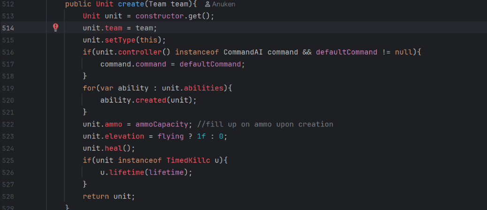
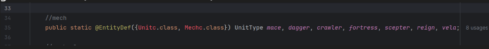
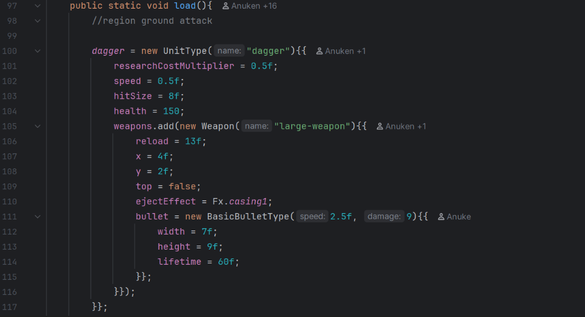
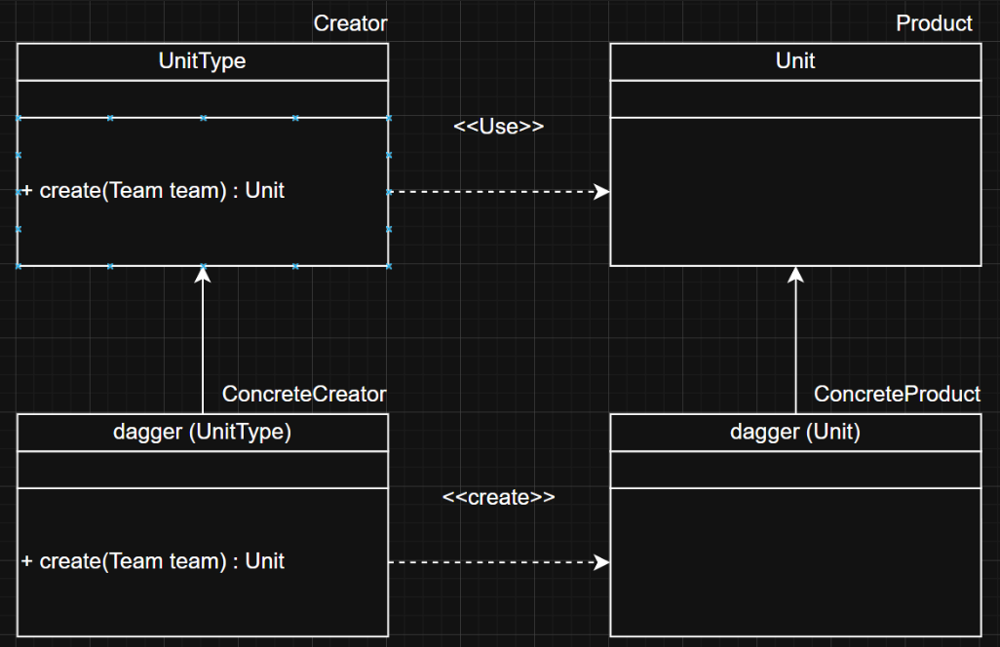
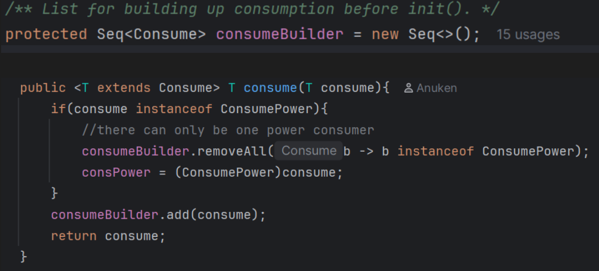
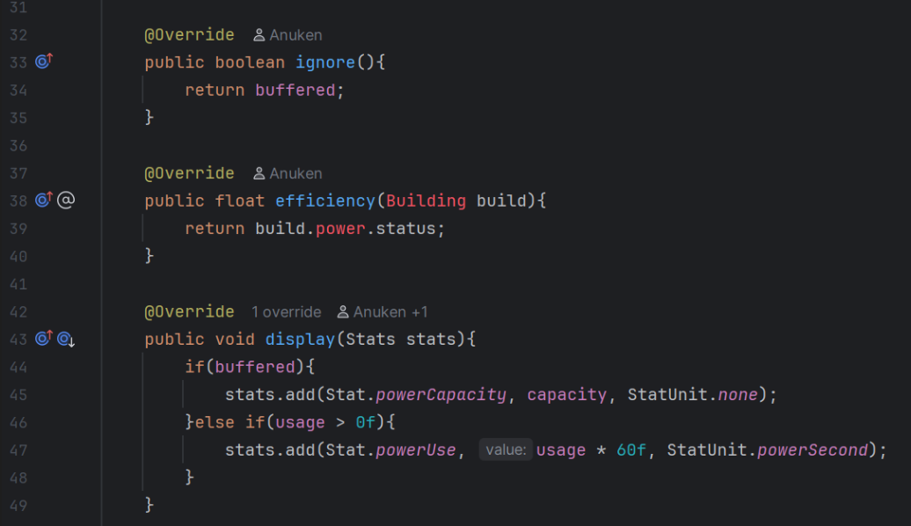
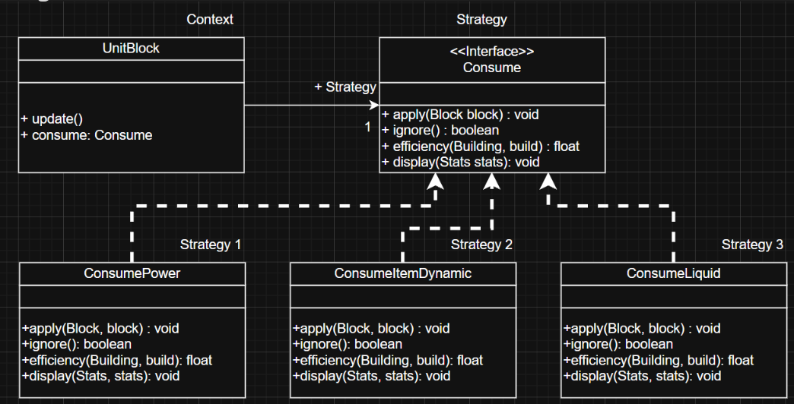
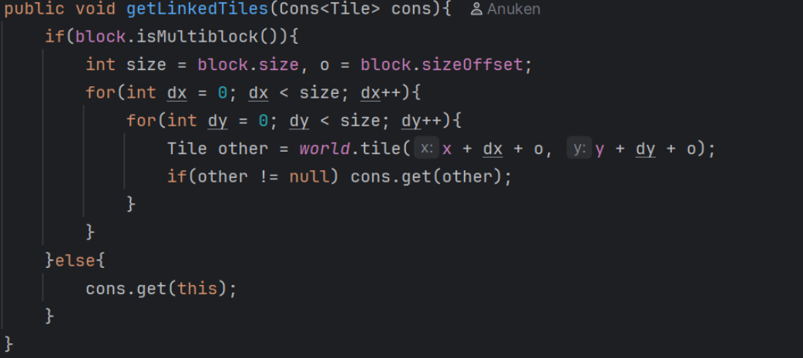
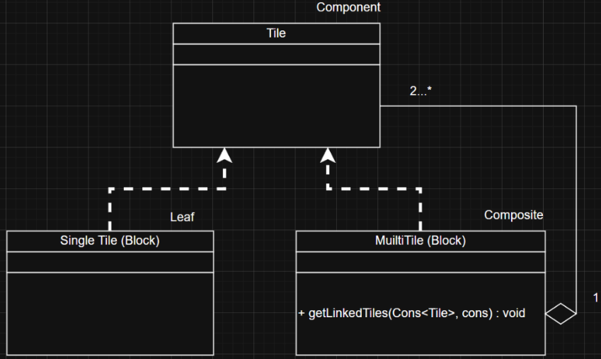

# Design Pattern Report
## Author
- Dinis Neves  (68130)
# Design Patterns
- Attach a picture of the block of code with the Design Pattern
- Reference the file in which the Pattern was found
- Possible improvements you found
- Possible blocks of code you believe a Pattern could be implemented
    - Picture of said blocks

## Factory Method
The Factory Method design pattern can be identified in the **mindustry/type/UnitType.java** class. It is not clearly a factory method due to, not having a abstract Creator and abstract Product, and also using classes that are generated when compiling the code. But how the UnitType class works specially the **create** function works with every UnitType having a different implementation of create, (each will create different units). I believe this can still be attributed to the Factory Method design pattern.

### Code

**mindustry/type/UnitType.java**
**create function**

**mindustry/content/UnitTypes.java**
**generated class (ConcreteCreator Creator)**

**mindustry/content/UnitTypes.java**
**dagger unit type information**

### Diagram
**All unit behavior depends on the type of unit**

## Strategy
Strategy the design pattern can be found being used inside of the **mindustry/world/blocks/units/UnitFactory.java** due to each block costing resources to be created, each Block has a consume that is a mixture of different types of implementations of consume (For example ConsumePower). Classes implementing the **Consume interface** differently is an example of the **strategy pattern**.

### Code

**mindustry/world/Block.java**
**where consumes are being called using block as an example**

**mindustry/world/consumers/ConsumePower.java**
**different implementations from functions inside mindustry/world/consumers/Consume.java**

### Diagram

## Composite

Within the **mindustry/world/Tile.java** a composite pattern can almost be found and maybe could be used so that some code could be cleaned up. Blocks need to store their size and contain a function to check to see if they are a Multiblock or not. Blocks also contain the function **getLinkedTiles** to get their own tiles.

The composite pattern could be used by creating a Single Tile and Multi Tile class. Using the composite pattern would remove the necessity for within the block class have the **getLinkedTiles** and **isMultiBlock** functions

Below are code snippets that show how similar the way the tiles work in the mindustry game. Composite functions, add and remove are also siminalr to creeating and removing blocks, (components)

### Code
**mindustry/world/Block.java**
**isMultiblock function**

**mindustry/world/Tile.java**
**function close to getChildren**

### Diagram
