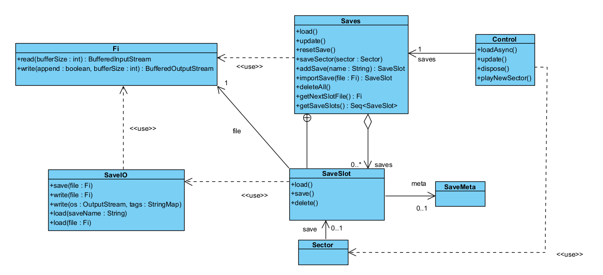

# Design Pattern Report
## Author
- Diogo Antunes (#67763)
# Design Patterns
- Attach a picture of the block of code with the Design Pattern
- Reference the file in which the Pattern was found
- Possible improvements you found
- Possible blocks of code you believe a Pattern could be implemented
    - Picture of said blocks

## Memento
Mindustry allows saving progress regularly (and automatically).  
To allow saving without progress loss,
the data is stored by communicating with the Saves.java class, which contains a nested class
SaveSlot:

Saves.java constructor line 25

Saves.java, line 243, method addSave:

This creates a new save slot and adds it to the Sequence of SaveSlots.
SaveSlots store data in a file they store as an attribute via the abstraction Fi.  
However, SaveIO is used as an intermediary in this interaction to actually read and write to the file.

The diagram below shows the associated classes and main methods to exemplify usage:

SaveIO, SaveMeta - core/src/mindustry/io  
Saves (SaveSlot is a nested class) - core/src/mindustry/game  
Control - core/src/mindustry/core  
Sector - core/src/mindustry/type  
Fi is external

### Rationale
There is a client (Control class) that interacts with an instance of the Saves class.
Saves serves as a caretaker, managing multiple SaveSlot instances, each representing 
an abstraction of saved game data (found in its file attribute).

The code diverges from the pattern since the Caretaker should have a sequence of Memento instances and an Originator.
Although not an attribute of the Caretaker, SaveIO could be considered the Originator, serving as the intermediary between the saved data file abstraction Fi.
It isn't an attribute, as all its methods are static.  
SaveSlot also has an attribute meta (instance of the data class SaveMeta), containing more frequently accessed data.
It also uses SaveIO to communicate with its own file.

Encapsulation is broken because SaveIO interacts directly with Fi instances instead of with SaveSlots, which serve as the higher-level Memento abstraction.
meaning the Caretaker is aware of the internal state of the SaveSlot in order to have SaveIO communicate with the file it contains.
However, this repository often uses public attributes for this express purpose, so it breaks the convention in a way consistent to the rules it sets for itself.

Additionally, there is another class associated with the SaveSlot(Sector), but only Control handles this association, so storing save data is also done in another class.

## (Design Pattern 2 Name)
## (Design Pattern 3 Name)
