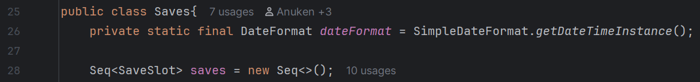
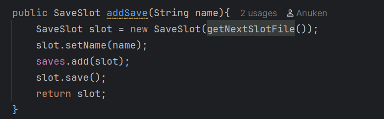
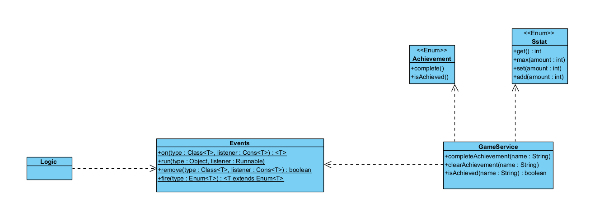
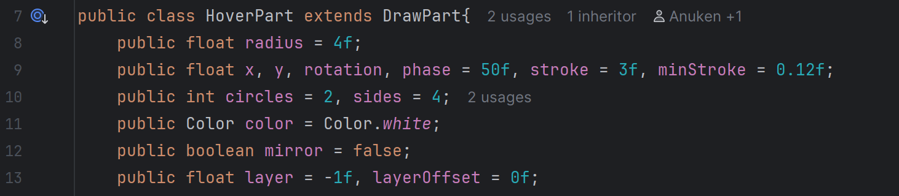
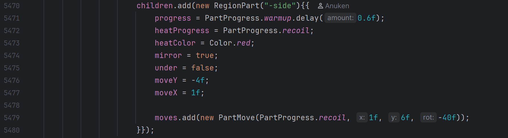

# Design Pattern Report
## Author
- Diogo Antunes (67763)
# Design Patterns
## Memento
Mindustry allows saving progress regularly (and automatically).  
To allow saving without progress loss,
the data is stored by communicating with the Saves.java class, which contains a nested class
SaveSlot:

Saves.java constructor line 25

Saves.java, line 243, method addSave:

This creates a new save slot and adds it to the Sequence of SaveSlots.
SaveSlots store data in a file they store as an attribute via the abstraction Fi.  
However, SaveIO is used as an intermediary in this interaction to actually read and write to the file.

The diagram below shows the associated classes and main methods to exemplify usage:

SaveIO, SaveMeta - core/src/mindustry/io  
Saves (SaveSlot is a nested class) - core/src/mindustry/game  
Control - core/src/mindustry/core  
Sector - core/src/mindustry/type  
Fi is external

### Rationale
There is a client (Control class) that interacts with an instance of the Saves class.
Saves serves as a caretaker, managing multiple SaveSlot instances, each representing
an abstraction of saved game data (found in its file attribute).

The code diverges from the pattern since the Caretaker should have a sequence of Memento instances and an Originator.
Although not an attribute of the Caretaker, SaveIO could be considered the Originator, serving as the intermediary between the saved data file abstraction Fi.
It isn't an attribute, as all its methods are static.  
SaveSlot also has an attribute meta (instance of the data class SaveMeta), containing more frequently accessed data.
It also uses SaveIO to communicate with its own file.

Encapsulation is broken because SaveIO interacts directly with Fi instances instead of with SaveSlots, which serve as the higher-level Memento abstraction.
meaning the Caretaker is aware of the internal state of the SaveSlot in order to have SaveIO communicate with the file it contains.
However, this repository often uses public attributes for this express purpose, so it breaks the convention in a way consistent to the rules it sets for itself.

Additionally, there is another class associated with the SaveSlot(Sector), but only Control handles this association, so storing save data is also done in another class.

## Mediator
Mindustry connects the in game actions to completable achievements using the Events class as an intermediary:

*(Example Events and Triggers that result in achievement updates from package mindustry.service in core/src)*

Only some of the classes that interact with GameService via Events are mentioned due to the many places they are referenced
for purposes other than just achievement updates.

*(Example achievements from Achievement enum from package mindustry.service in core/src)*

The diagram below examplifies the communication between the Logic class that handles logic for entities and waves,
and the GameService class.

*Note: Visual Paradigm doesn't seem to like the use of > in the generic parameter names, so it's missing one after Enum\<T>*

### Rationale
Any game available on online platforms and otherwise usually has some form of unlockable completion indicator for certain
milestones achieved in a game. These are achievements. In mindustry these range from killing enemies, to winning fights against
other players, to producing resources and some more obscure, hard to categorise actions that usually reward exploring the game's mechanics.

Since effectively any event in the game can trigger something that an achievement would like to track, we can observe how
Triggers and In-game Events relate to specific achievements. Therefore, we can observe that this Events class serves
as the intermediary between every other class that activates Triggers or In-Game Events, and the GameService class.
GameService sets up logic to handle certain events, testing for conditions that result in achievements being completed.

It also communicates with the Achievement enum that holds these individual achievements, as well as the enum SStat which stores values
evaluated to check for completing certain achievement requirements.

This is preferential to each of these classes individually attempting to communicate with the GameService, since the interactions
would be very similar (might lead to shotgun surgery due to modifying all classes that called GameServices about an achievement if
its criteria was modified).

## Composite

*(RegionPart class from package mindustry.entities.part in core/src)*

*(HoverPart class from package mindustry.entities.part in core/src)*

The diagram below shows how parts are interconnected in a tree-like structure:

### Rationale

These part classes extend DrawPart, but only one subclass (RegionPart) has children of the superclass type, making RegionPart easily identifiable
as the composite in this tree-like structure, where all other subclasses of DrawPart are leaves.
No distinction is made between the composition of parts (via RegionPart), and individual parts, so the design pattern is fitting.

As mentioned in the Code Smell detected by Gabriel Falcão 67775, load is only properly implemented by RegionPart. The method getOutline() is similar,
except only RegionPart actually overrides the method.

Also, its draw(), load() and getOutline() methods also iterate over the children, calling the method on them too.
No add, remove or such method exists to modify the children attribute since, as standard for this code base, the public children attribute is directly
accessed and modified.

For example:

*(Example of direct access to children in the load method from the Blocks class
from package mindustry.content in core/src)*

