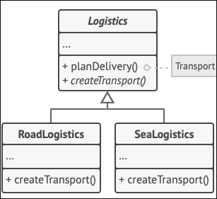
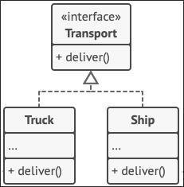

# Design Pattern Review
## Reviewers
- Diogo Antunes (67763)
- Gabriel Matias (67775)
- #REVIEWER NAME (#STUDENT ID)

## Change log
- Diogo Antunes (67763) (04/11/2025 10:32)
- Gabriel Matias (67775) (06/11/2025 23:01)

# Review

## Review of Template Method
- Diogo Antunes (67763)

While this example of the template method doesn't have a lot of steps that are overridden by subclasses, the methods that are changed can contain very substantial additions of logic, such as the generate method in Serpulo, with 500 lines of code, including the class Room defined within the method.

The generate method in the abstract class goes to the process of map generation as mentioned, and each planet can have its own logic without such additions having to be explicitly known by the method, which allows for making further additions more easily in future updates.

## Review of Factory Method
- Gabriel Falcão (67775)

This probably isn't the best example of the factory method, as you said, the **Factory Method** consists of delegating the creation of objects to the subclasses of a class.  The `TechTree` does indeed provide many ways of creating a node, but none of those are overridden by a subclass (no one inherits from `TechTree`), so saying that *concrete creators* like `ErekitTechTree` and `SerpuloTechTree` produce `TechNode` objects isn't correct, as they ask `TechTree` to create the objects for them.
### Methods
About the second part, usually **Factory Method** refers to ***one or more*** method/s that are overridden by the subclasses, since here no subclasses exist, if this were to be a **Factory Method**, it would have a drastic difference from the one mentioned in 
[Refactoring Guru Factory Method](https://refactoring.guru/design-patterns/factory-method)

### Objects
I do indeed agree that the product created by the methods is always the same type, but the factory method talks about objects of the same type of super class.

### Proposed 1
I actually would propose the **Builder**, although not correctly implemented (as most design patterns in the code base), pattern here, as mentioned in [Refactoring Guru Builder Pattern](https://refactoring.guru/design-patterns/builder), as you have the **directors** (`SepuloTechTree` and `ErekirTechTree`), the **builder** (`TechTree`), that would also serve as the **product**.

### Proposed 2
A **Decorator** since nodes can be *decorated* with other nodes.
