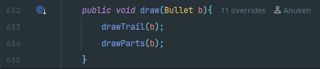
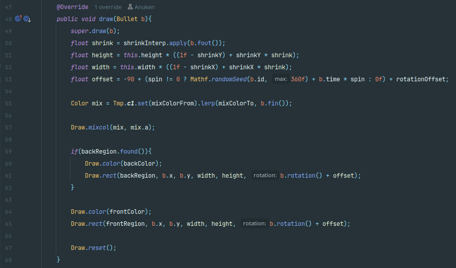
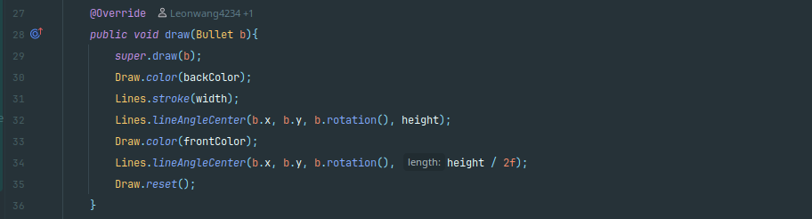
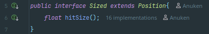
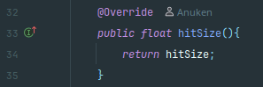
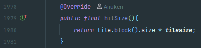
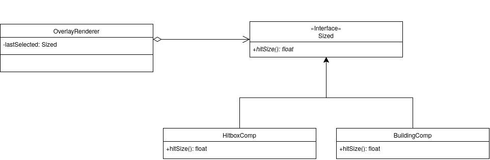
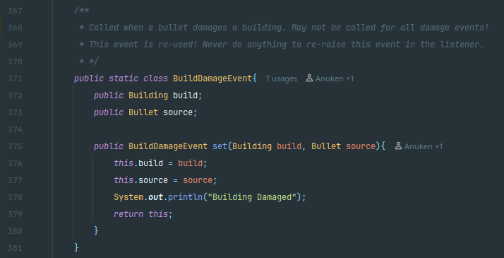
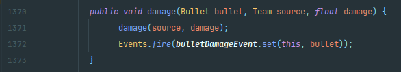
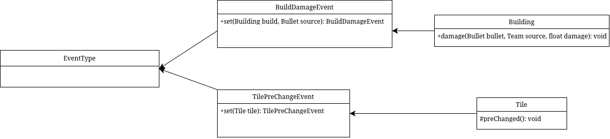

# Design Pattern Report
## Author
- Manuel Oliveira (68547)
# Design Patterns

## Template Method
The example of **Template Method** I found is in **core/src/mindustry/entities/bullet** and consists of all the bullet types that exist in the game. 
What is happening here is that each class represents a different type of bullet and to achieve this, nearly all classes in this package extend the **BulletType** class, or the **BasicBulletType** class, that itself extends the **BulletType** class, and modify some methods from it while keeping the basis for the implementation of a bullet. This way the responsibility of implementing a bullet is spread out, and **BulletType** implements the more common and fundamental aspects and the rest of the classes specify upon it.

For example the method **draw**, it is implemented for the "first" time in **BulletType**, but as needed it is reimplemented in classes that extend **BulletType**:
- This is the more basic implementation of the **draw()** function implementation in **BulletType**:

- Then the implementation in **BasicBulletType** that extends **BulletType**:

- And in the class **LaserBoltBulletType** that extends **BasicBulletType**:

### Diagram
Given that **BulletType** for example has about 1000 lines of code, quite a few methods were ignored for simplification.

## Strategy
The case of **Strategy** that I want to talk about is in **core/src/mindustry/entities/Sized.java**. As many examples in this Codebase, this one doesn't fit exactly in the textbook standard of the **Strategy** design pattern.
That said, what is happening is that we have the interface **Sized**, witch would be our **Strategy**, that only declares one method, **hitSize()**, witch is then implemented in different ways in a variety of classes depending on the class's purpose.

//note: possible context in core/src/mindustry/graphics/OverlayRenderer.java

I believe this still counts as a **Strategy** design pattern because it still applies the basic principles of the pattern. The situation is still the **Strategy** establishing the basic guidelines for implementation, and then the **Context** delegates the work of implementing it to a **linked Strategy object**.

### Example
Here, as stated above the **Sized** declares the **hitSize()** function, witch is then implemented by abstract class **HitboxComp** and **BuildingComp** for example

- The first declaration in **Sized**

- Implementation in **HitboxComp**

- A different implementation in **BuildingComp**

### Diagram
As often, quite a few methods were omitted for simplification

## Observer
In this case I found a fairly evident example of the **Observer** design pattern in **core/src/mindustry/game/** with **EventType** as the **Publisher**.
This design pattern specifically is very close from the one given in class, in the sense that the main function of the class considered the **Publisher** is to notify all the **Subscribers** of the respective events they subscribed to. Although the implementation it takes to reach this could be considered a bit unorthodox.  

### Example
For example in the **BuildDamageEvent** class inside the **EventType** class, it's main function is to define the event to be called once a bullet damages a building.
- The declaration in **EventType**

And then this event can be **Subscribed** to freely throughout the codebase, for example in **core/build/generated/source/kapt/main/mindustry/gen/Building.java**
- Use in **Building**

### Diagram
This is the diagram for the situation described above, and once again, given that some classes have a lot of code that isn't important for our purposes it is omitted.
Besides that, the diagram might seem quite different, this is because this class uses events to notify its **Subscribers** instead of the usual implementation of "notifySubscribers()" and "update()" methods.
But I believe that seeing as the purpose remains the same as an observer, this situation still counts as one.

