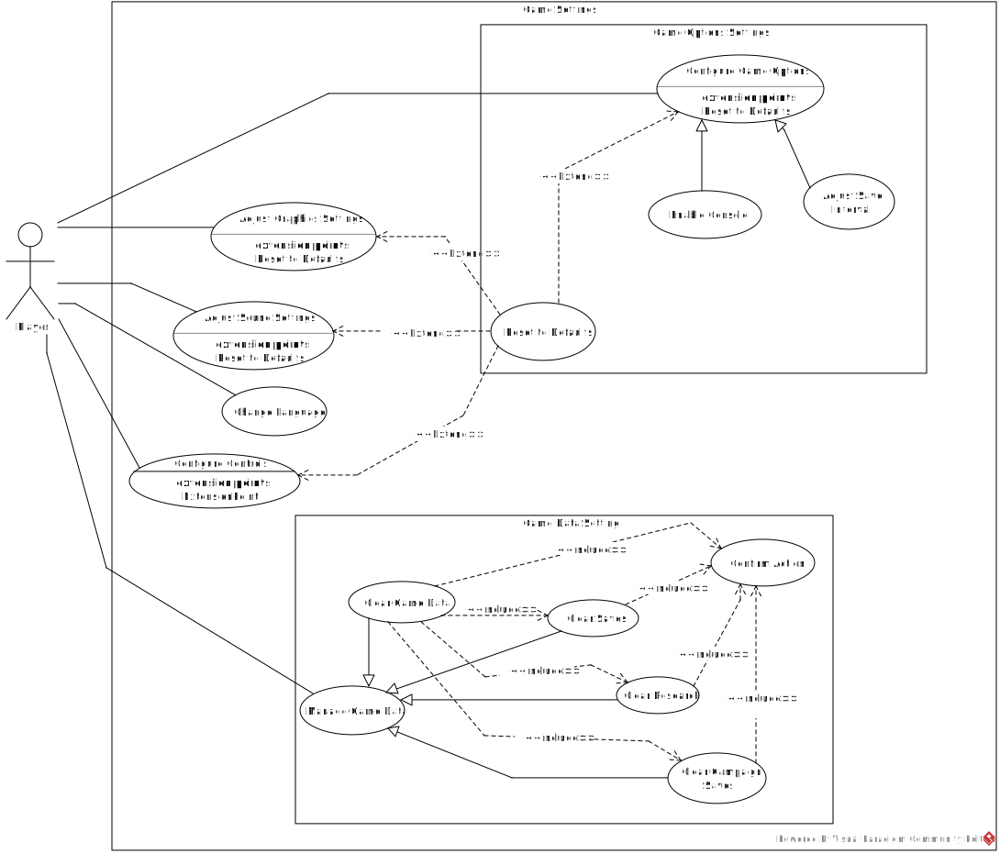

# Use Case Diagram Report
## Author
- Carolina Ferreira (67804)

# Use Cases - Game Settings
This Use Case Diagram addresses the functionalities associated with the Game Settings menu, and deepens on two of those use cases.
## Diagram

## Configure Game Options

### Description
The player selects the "Configure Game Options" option.
### Actors

#### Primary
- Player
#### Secondary
- None
---
## Enable Console (Generalization)

### Description
The player enables the Console.
### Actors

#### Primary
- Player
#### Secondary
- None
---
## Adjust Save Interval (Generalization)

### Description
The player adjusts the save interval.
### Actors

#### Primary
- Player
#### Secondary
- None
---
## Adjust graphics settings 

### Description
The player selects the "Adjust Graphic Settings" option.
### Actors

#### Primary
- Player
#### Secondary
- None
---
## Adjust Sound Settings

### Description
The player selects the "Adjust Sound Settings" option.
### Actors

#### Primary
- Player
#### Secondary
- None
---
## Change Language

### Description
The player changes the game language.
### Actors

#### Primary
- Player
#### Secondary
- None

---

## Configure Controls

### Description
The player configures its controls (keybind).
### Actors

#### Primary
- Player
#### Secondary
- None
---

## Manage game data

### Description
The player chooses the "Manage game data" option.
### Actors

#### Primary
- Player
#### Secondary
- None
___

## Clear game data

### Description
The player clears all data - Saves, Research, Campaign Saves.
### Actors

#### Primary
- Player
#### Secondary
- None
---

## Clear game saves

### Description
The player clears all game saves.
### Actors

#### Primary
- Player
#### Secondary
- None
---

## Clear game Campaign Saves

### Description
The player clears all game campaign saves.
### Actors

#### Primary
- Player
#### Secondary
- None
---

## Clear game research

### Description
The player clears all game researches.
### Actors

#### Primary
- Player
#### Secondary
- None
---

## Confirm action

### Description
The player checks a final confirmation to a destructive or irreversible action, being dependent to the occurrence of a delete action. 
### Actors

#### Primary
- Player
#### Secondary
- None
---

## Reset to Defaults (Abstract) 

### Description
The player resets the section values to Default. This an extension to other use cases.
### Actors

#### Primary
- Player
#### Secondary
- None