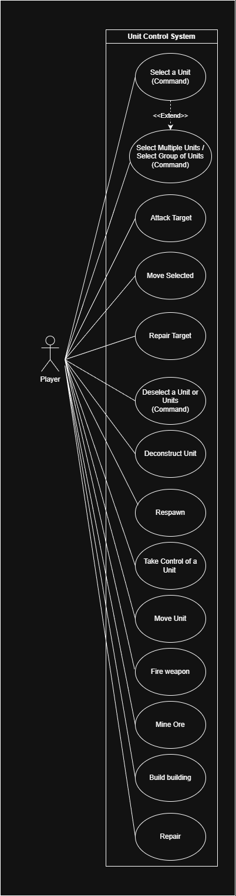

# Use Case Diagram Report

## Author
- Dinis Neves (68130)

# Use Cases - Unit Control System
Unit control / command System
## Diagram

---  

## 1. *Select a unit*
### Description
The player selects one available unit.
### Actors
Player
#### Primary
Player
#### Secondary
None
  
---  

## 2. *Attack target*
Select Group of Units
### Description
The player selects various units.
### Actors
Player
#### Primary
Player
#### Secondary
None
  
---  

## 3. *Attack target*

### Description
The player makes selected units attack a target.
### Actors
Player
#### Primary
Player
#### Secondary
None
  
---  

## 4. *Move Selected*
### Description
The player picks a position for the selected units to move to.
### Actors
Player
#### Primary
Player
#### Secondary
None
  
---  

## 5. *Repair Target*
### Description
The player selects a block or building to be repaired by the elected units.
### Actors
Player
#### Primary
Player
#### Secondary
None
  
---  

## 6. *Deselect Unit or Units*
### Descritpion
The player deselects the selected units or unit.
### Actors
Player
#### Primary
Player
#### Secondary
None
  
---  

## 7. *Deconstruct Unit*

### Description
The player Deconstructs a unit through the deconstructor.
### Actors
Player
#### Primary
Player
#### Secondary
None
  
---  

## 8. *Respawn*

### Description
The player respawns back at the base block.
### Actors
Player
### Primary
Player
### Secondary
None
  
---  

## 9. *Take Control of a Unit*

### Description
The player takes control of the target unit.
### Actors
Player
### Primary
Player
### Secondary
None

  
---  

## 10. *Move Unit*

### Description
The player moves the controlled unit.
### Actors
Player
### Primary
Player
### Secondary
None

  
---  

## 11. *Fire Weapon*

### Description
The player fires the controlled unit's weapon.
### Actors
Player
### Primary
Player
### Secondary
None

  
---  

## 12. *Mine ore*

### Description
The player mines an available ore if possible.
### Actors
Player
### Primary
Player
### Secondary
None

  
---  

## 13. *Repair*

### Description
The player repairs a block or unit.
### Actors
Player
### Primary
Player
### Secondary
None