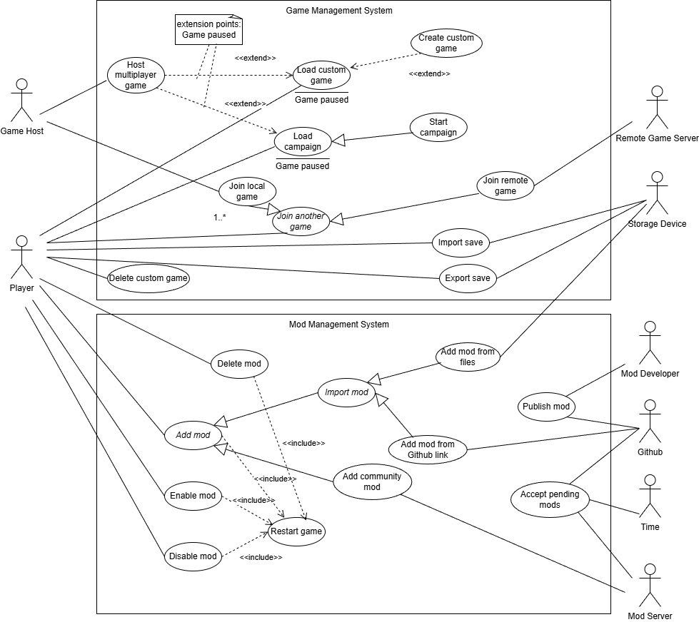
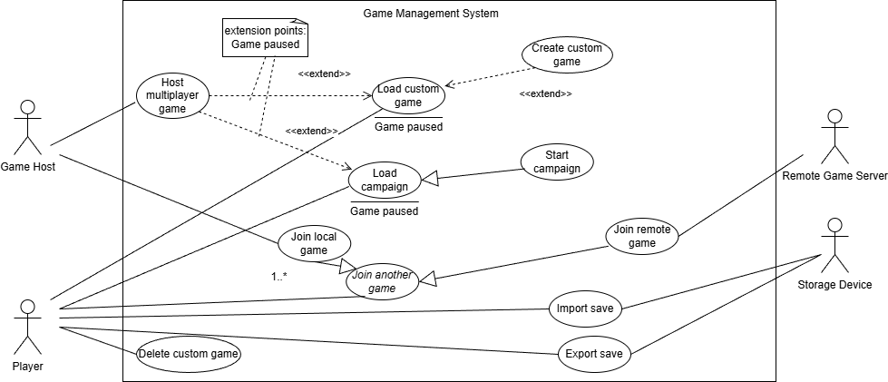

# Use Case Diagram Report
## Author
- Diogo Antunes (67763)

## Big Diagram

# Use Cases - Game Management System
Use Case Diagram pertaining to:
- Loading existing games
- Creating new games
- Joining existing games (from other players)

#### Actors
Player - Mindustry game user.  
Game Host - Mindustry game user hosting a LAN-access map.  
Remote Game Server - Machine hosting an internet-access map.  
Storage Device - Digital device that can store files.

## Diagram

Note:
Both the campaign and the Load custom game have a Game paused extension point to allow connecting to multiplayer.
They do not share logic except for the very end when the player enters the map, allowing the user to pause and
choose the option to Host a multiplayer game, which by itself I feel doesn't justify creating a behaviour fragment.

## Load custom game

### Description
The player selects a saved game to continue playing.
### Actors

#### Primary
Player
#### Secondary
None

## Create Custom Game (extending use case)

### Description
The player customises a game from available maps and rules and starts playing.
### Actors

#### Primary
Player
#### Secondary
None

## Delete custom game

### Description
The player deletes an existing save for a custom game.
### Actors

#### Primary
Player
#### Secondary
None

## Load Campaign

### Description
The player picks a planet and sector map from unlocked content and continues exploration.
### Actors

#### Primary
Player
#### Secondary
None.

## Start Campaign

### Description
Starts the game tutorial in an available, pre-determined planet and sector map picked by the player.
### Actors

#### Primary
Player
#### Secondary
None.

## Host multiplayer game (extending use case)

### Description
The player's active game becomes temporarily available to other players in the same LAN (becomes the host).
### Actors

#### Primary
Game Host
#### Secondary
None

## Join another game (abstract)

### Description
The player participates in a game organised by another entity.
### Actors

#### Primary
Player
#### Secondary
Player (0 or more) - other players in the map that affect gameplay.

## Join local game

### Description
The player participates in a game organised by another player in the local network.
### Actors

#### Primary
Player
#### Secondary
Player (0 or more) - other players in the map that affect gameplay.  
Game Host

## Join remote game

### Description
The player chooses a game server hosted by a remote server to play in from a list of options.
### Actors

#### Primary
Player
#### Secondary
Player (0 or more) - other players in the map that affect gameplay.  
Remote Game Server.

## Import save

### Description
The player creates a new game save from an external file.
### Actors

#### Primary
Player
#### Secondary
Storage Device

## Export save

### Description
The player stores a generated file from a game save.
### Actors

#### Primary
Player
#### Secondary
Storage Device

# Use Cases - Mod Management System
Use Case Diagram pertaining to:
- Adding/Removing/Publishing mods

#### Actors
Player - Mindustry game user.  
Mod Developer - Web-user that creates additional content for Mindustry with the intent of releasing it.  
Mod Server - Mindustry server that processes mod storage and access.  
Time - An agent that performs abstract operations routinely.  
Github - The online platform used to store potential mods.  
Storage Device - Digital device that can store files.

## Diagram

## Delete mod

### Description
The player deletes a mod out of those currently activated.
### Actors

#### Primary
Player
#### Secondary
None

## Add mod (abstract)

### Description
The player installs a mod to change game content.
### Actors

#### Primary
Player
#### Secondary
None

## Enable mod

### Description
The player enables the effect of a disabled game mod.
### Actors

#### Primary
Player
#### Secondary
None

## Disable mod

### Description
The player disables the effect of an enabled game mod.
### Actors

#### Primary
Player
#### Secondary
None

## Restart game (included use case - behavior fragment)

### Description
The game performs a restart operation.
### Actors

#### Primary
None
#### Secondary
None

## Import mod (abstract)

### Description
The player installs a mod from a chosen source to change game content.
### Actors

#### Primary
Player
#### Secondary
None

## Add mod from files

### Description
The player installs a mod from an external file in a local device.
### Actors

#### Primary
Player
#### Secondary
Storage Device

## Add mod from Github link

### Description
The player installs a mod from an external file in a remote repository.
### Actors

#### Primary
Player
#### Secondary
Github

## Add community mod

### Description
The player installs a mod offered within the game.
### Actors

#### Primary
Player
#### Secondary
Mod Server

## Publish mod

### Description
A developer assigns the tag to make their content visible to the game server on github.
### Actors

#### Primary
Mod Developer
#### Secondary
Github

## Accept pending mods

### Description
A interval-based poll event triggers to process pending mod requests on github.
### Actors

#### Primary
Time
#### Secondary
Github  
Mod Server