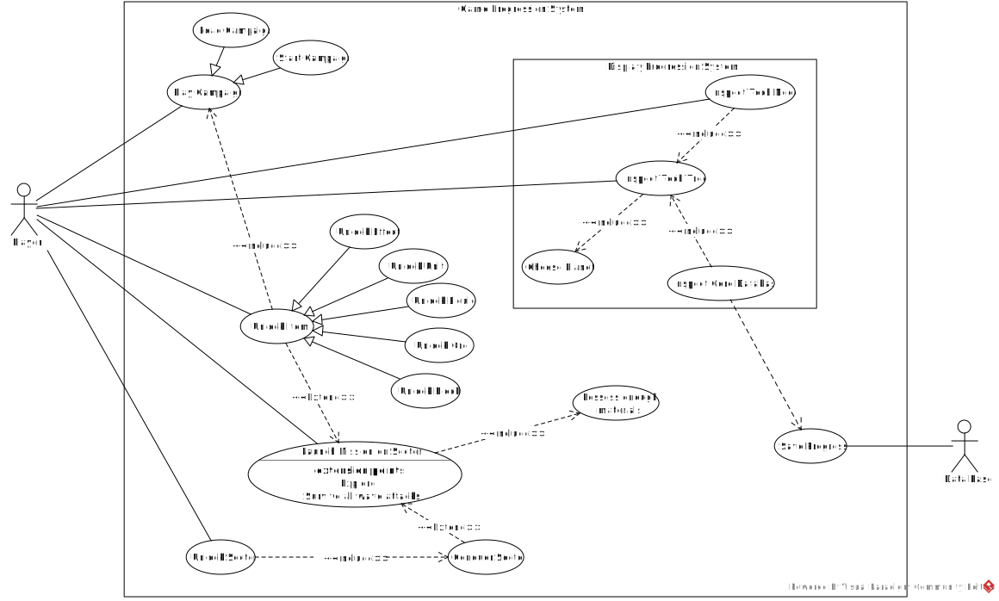

# Use Case Diagram Report
## Author
- Gabriela Silva (67286)

# Use Cases - (subtopic name/s)
Game Progression and Display Progression

## Diagram

## Use Case 1 Name
*Play Campaign*
### Description
The goal for this use case is for the player to start playing the game in campaign mode, where progression takes place in multiple missions on sectors. The player can choose between starting a new campaign or loading one.
### Actors
Player
#### Primary
Player
#### Secondary
None

## Use Case 2 Name
*Unlock Item*
### Description
O propósito deste use case é mostrar a interação do jogador perante o seu progresso, através do desbloqueamento de novos itens. Estes *itens* podem ser **Units**, **Effects**, **Ores**, **Blocks** ou **Liquids**. Estende o use case *Launch Mission On Sector*, i.e., pode acontecer durante uma instância desse use case, enquanto o jogador explora.
### Actors
Player
#### Primary
Player
#### Secondary
None

## Use Case 3 Name
*Launch Mission on Sector*
### Description
Este use case representa o início de uma missão do jogador num determinado sector. Para tal, o jogador deve possuir os materiais específicos necessários para o início da missão.
### Actors
Player
#### Primary
Player
#### Secondary
None

## Use Case 4 Name
*Unlock Sector*
### Description
Este use case tem o propósito de mostrar que o jogador pode desbloquear um novo sector. Para tal, o jogador deve ter começado uma missão num sector, e deve ter conquistado esse mesmo sector, sobrevivendo a todos as ondas de ataques de inimigos e protegendo a sua base. 
### Actors
Player
#### Primary
Player
#### Secondary
None

## Use Case 5 Name
*Inspect Tech Tree*
### Description
Através deste use case, é possível representar a interação de visualização do jogador com a árvore de progresso do jogo. Para tal, deve-se selecionar o **Planet**, cujo se quer conhecer o progresso atual. Por defeito, o planeta selecionado inicialmente é o **Serpulo**.
### Actors
Player
#### Primary
Player
#### Secondary
None

## Use Case 6 Name
*Inspect Tech Node*
### Description
Este use case permite que o jogador consiga inspecionar cada item da árvore de progresso do jogo. Para tal, requer que o jogador esteja com a árvore de jogo aberta.
### Actors
Player
#### Primary
Player
#### Secondary
None

## Use Case 7 Name
*Inspect Core Database*
### Descritpion
Este use case permite que o jogador consiga visualizar todos os itens desbloqueados de ambos os planetas (por defeito) no seu progresso. Para tal, requer que o jogador esteja com a árvore de jogo aberta e depende do estado da base de dados do jogo.
### Actors
Player
#### Primary
Player
#### Secondary
None

## Use Case 8 name
*Store Progress*
### Description
This use case represents the storage of the game progress in the game's data base. It is important, since the viewing the game progression depends on the state of the game progression and this can be achieved and stored by the data base.
### Actors
Data Base
#### Primary
Data Base
#### Secondary
None