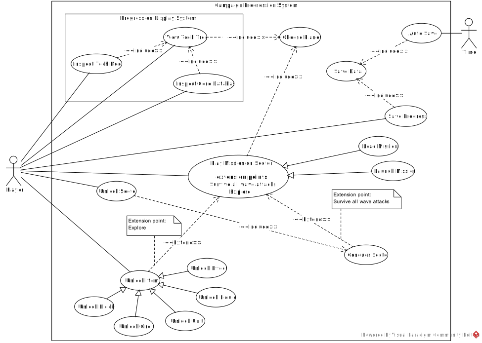

# Use Case Diagram Report
## Author
- Gabriela Silva (67286)

# Use Cases - System Names
*Campaign Progression* and *Progression Display*

## Diagram

---

## 1. *{abstract} Play Mission on Sector*
### Description
The player plays a mission on a sector of a planet.
### Actors
Player
#### Primary
Player
#### Secondary
None

---

## 1.1. *Load Mission*
### Description
The player loads a mission previously started to play.
### Actors
Player
#### Primary
Player
#### Secondary
None

---

## 1.2. *Start Mission*
### Description
The player starts a new mission to play.
### Actors
Player
#### Primary
Player
#### Secondary
None

---

## 2. *{abstract} Unlock Item*
### Description
The player unlocks a new item in their game progression, while exploring. The item can be _Units_, _Effects_, _Ores_, _Blocks_ and _Liquids_.
### Actors
Player
#### Primary
Player
#### Secondary
None

---

## 2.1. *Unlock Effect*
### Description
The player unlocks a new Effect in their game progression, while exploring.
### Actors
Player
#### Primary
Player
#### Secondary
None

---

## 2.2. *Unlock Unit*
### Description
The player unlocks a new Unit in their game progression, while exploring.
### Actors
Player
#### Primary
Player
#### Secondary
None

---

## 2.3. *Unlock Liquid*
### Description
The player unlocks a new Liquid in their game progression, while exploring.
### Actors
Player
#### Primary
Player
#### Secondary
None

---

## 2.4. *Unlock Ore*
### Description
The player unlocks a new Ore in their game progression, while exploring.
### Actors
Player
#### Primary
Player
#### Secondary
None

---

## 2.5. *Unlock Block*
### Description
The player unlocks a new Block in their game progression, while exploring.
### Actors
Player
#### Primary
Player
#### Secondary
None

---

## 3. *Unlock Sector*
### Description
The player unlocks a new sector of a planet, by surviving all mission's wave attacks and protecting their base.
### Actors
Player
#### Primary
Player
#### Secondary
None

---

## 4. *View Tech Tree*
### Description
The player views their campaign progression tree, regarding a selected planet.
### Actors
Player
#### Primary
Player
#### Secondary
None

---

## 5. *Inspect Tech Node*
### Description
The player inspects an item of their campaign progression tree.
### Actors
Player
#### Primary
Player
#### Secondary
None

---

## 6. *Inspect Core Database*
### Description
The player inspects all current unlocked items for both planets.
### Actors
Player
#### Primary
Player
#### Secondary
None

---

## 7. *Save Progress*
### Description
The player saves their progress on the campaign.
### Actors
Player
#### Primary
Player
#### Secondary
None

---

## 8. *Auto Save*
### Description
The passage of time automatically saves the progression of the campaign.
### Actors
Time
### Primary
Time
### Secondary
None

---

## Change log
_Created_: 07/11/2025 01:51
_Improved after Diogo's review_: 12/11/2025 21:35