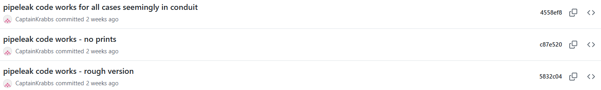
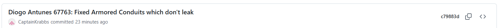
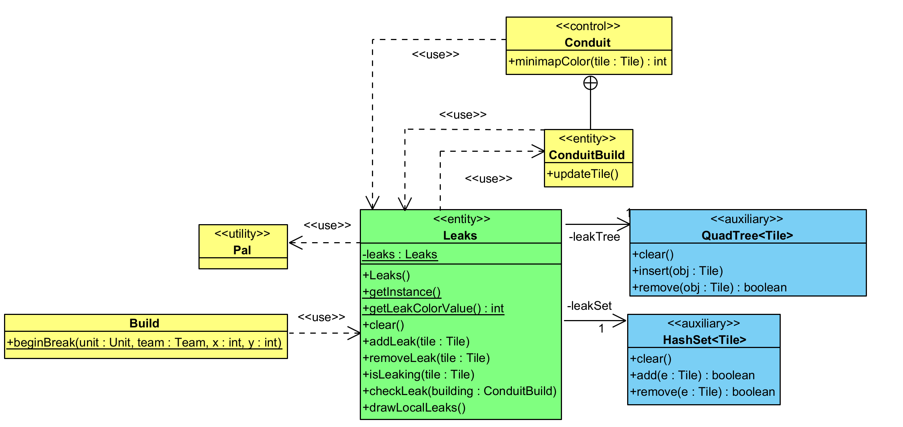

# User story 2
Leak identification via minimap and proximity
## Author(s)
- Diogo Antunes (67763)
## Reviewer(s)
- Gabriel Matias Falcão (67775)
- Manuel Oliveira (68547)
- Carolina Ferreira (67804)  

(*Please add the user story reviewer(s) here, one in each line, providing the authors' name and surname, along with their student number. In the reviews presented in this document, add the corresponding reviewers.*)
## User Story:
As a USER WITH AN IN-GAME BASE THAT COVERS A WIDE AREA,
I want to be instantly informed of the location of any leaks of
liquid resources within my base, with their locations clearly highlighted
on the minimap in a different colour the moment they occur,
so that I don't have to identify them manually,
reducing time wasted on looking for the source of resource loss
in a busy game environment.

#### Note (regarding changes from Milestone 1)
- Did not go forward with the decision to add leak messages because when extending an existing leaking pipe, this would be considered
  a new leak, resulting in messages being sent often during casual base-building when setting up liquid flow systems.
### Review

Gabriel Matias Falcão (67775), 24/10/2025

*This could be developed further as a sort of alert system, using the chat or some user interface, in which the player could sort between alerts (destroyed units, pipes, blocks...)*

Manuel Oliveira (68547), 24/10/2025

*The feature looks worth implementing if not too worksome for our timeframe.*

*(Please add your user story review here)*
## Note about content of the following work

This user story extends existing user interaction with the game by showing leaks, so aside from time, there's no primary actor directly interacting with the created system.

For example, the act of breaking/placing of a block stays the same. However, at some point in the logic that handles the update for this scenario, if the block is a leaking liquid-carrying block, or is adjacent to one such block,
the new functionality is triggered.

This means that despite the work document specifying (in the case of class diagrams) to include classes modified or implemented, that alone isn't
enough to describe many of the use cases that eventually access the new functionality. As such, I will include the main pathway of class methods used to reach that point
if it is necessary to explain the added functionality.

Additionally, only the Desktop version of the game is considered, since that is the version readily available for testing.

## Use case diagram


#### Actors
Player - Mindustry game user.  
Time - Fixed interval of time in game ticks (game time unit).

## Use case textual description
[Textual Description](US2%20Use%20Case%20Textual%20Description.md)

#### Review
**Author** : Manel Oliveira (68547), 21/11/2025 20:00
A simple note about the document and folder's organization. Maybe split this readme into different files akin to what Gabriel did, and an Assets folder. It really isn't that big of an issue, but it's important to keep things organized.

**Break block** and **Place block** maybe should be generalised to a possible **Interact With Block**. This may not be the case, but from my point of view in this situation they seem to have the same effect on the system. The same could be said to **Enter map** and **Leave map**.

Shouldn't **Enter map** include **Update leakable block tile**?
My reasoning for this is, when a player enters a map with a pre-existing leak, they didn't break or place blocks, but a leak is still displayed.

Other than this the diagram and every use case report seemed very comprehensible and represents very well what I experienced personally testing this feature.

**Author** : Diogo Antunes (67763), 21/11/2025 23:44  
Review response:  
I intend on organising the folder once the final version for class diagrams has occurred, to avoid image name duplication when I'm still changing files.
I will take note to name these images properly, instead of just numbering them, and will adopt the subsection structure as in User Story 1 to better organise my work.

Regarding break block and place block, as mentioned in the use case, break block has an extra step not present in place block.
Additionally, the player interaction is set off under different circumstances, so grouping the two doesn't feel like it follows specification,
even if the two use cases are quite similar.  
Enter map and Leave map have very similar logic, but different ways of starting the interaction, so once again, I feel I shouldn't group them.
On the other hand, I will further factorise the line of resetting logic into clear leaks common to both use cases, and modify the class diagrams accordingly too.  
Regarding enter map loading all tiles, which would add them to the leaks registered. However, I feel this goes under the update buildings use case,
as the focus for the use case of entering a map and leaving a map is purely the logic reset that happens as a result on directly entering the map.
Anything that happens afterward involves loading the map save and retrieving data and then loading buildings, which I feel goes beyond the use case, and more into the scenario into **Update building**.

## Implementation documentation
### Tour Report
#### Commits:
12/11/2025

15/11/2025

18/11/2025

19/11/2025

20/11/2025

26/11/2025


#### Affected classes
**Created:**  
``Leaks`` (mindustry.game package in core/src)  
Manages known leaks in the game.

**Modified:**  
``Conduit`` (mindustry.world.blocks.liquid package in core/src)  
Added minimapColor method to override ``Block`` implementation so that the color returned depends on whether the tile is leaking:
````java
    @Override
    public int minimapColor(Tile tile){
        if (Leaks.getInstance().isLeaking(tile)) {
            return Leaks.getLeakColorValue();
        } else {
            return super.minimapColor(tile);
        }
    }
````

``ConduitBuild`` (nested class of Conduit)  
Added a call to check for leaks at the end of ``updateTile()`` so that when the tile updates, there's a check for whether it stopped/started leaking:
````java
Leaks.getInstance().checkLeak(this);
````

``Pal`` (mindustry.graphics package in core/src)  
Contains the colors used in game. Added a new color ``leakingWarn`` to be used when showing leaks.

``DesktopInput`` (mindustry.input package in core/src)  
Added a call to draw the leak overlays (the dashed circles) in ``drawBottom()``.
````java
Leaks.getInstance().drawLocalLeaks();
````

``Build`` (package mindustry.world package in core/src)  
When breaking a block in ``beginBreak()``, there is an explicit attempt to remove the tile from leaks.
````java
Leaks.getInstance().removeLeak(tile);
````

#### Modification class diagram (all classes and methods modified/created)


### Implementation summary
The implementation consists of adding a ``Leaks`` singleton that stores currently active leaking tiles in both a ``HashSet`` (for quickly checking if a tile is present
in the set) and a ``QuadTree`` that stores it in a grid layout to find leaks within a rectangular area more efficiently.

The classes above were modified so that when an action occurs that updates the flow of liquid, this is shown in the minimap (in example: plugging a leak with a solid block,
removing a block that was plugging a leak, or putting down an open-ended pipe (``Conduit``) that begins to leak into a puddle).
The minimap gains a bright blue spot dot to indicate that a spot is leaking, which is removed when the leak stops.  
Additionally, moving close to a leak shows a circle around the leak,
which is useful if the leak wasn't very visible in a busy base.

#### Review
*(Please add your implementation summary review here)*
### Class diagrams
[Class Diagrams](US2%20Class%20Diagrams.md)
#### Review
**Author** : Carolina Ferreira (67804) 23/11/2025 19:11

Besides a little punctuation error in the **Update leakable block tile** section - "The ``checkLeak`` method, checks for a transition from *not leaking -> leaking* and vice versa and in such case adds/removes the tile
from the data structures ``leakTree`` and ``leakSet`` using the ``addLeak(Tile tile)`` or ``removeLeak(Tile tile)`` methods (missing the comma - **,**) respectively." - there are no other elements to correct, in my opinion.

During my review, Diogo corrected the **Clear leaks** diagram, which is confirmed by the commits made in the past few hours. Therefore, I have no further comment on his report. It's a comprehensive report that provides the desired information.

### Sequence diagrams

[Sequence Diagrams](US2%20Sequence%20Diagrams.md)
#### Review
*(Please add your sequence diagram review here)*
## Test specifications

I wasn't able to create unit tests for the new functionality. The ``ApplicationTests`` supports setting up a very reduced game environment to allow for testing functionalities. The problem is that the ``Leaks`` class specifically interacts with the ``Renderer`` from ``Vars``, and ``Renderer``
has a series of **public final** attributes that in test mode cause errors due to some structures at a lower level of abstraction (a ByteBuffer that isn't working in test mode). No existing unit test seems to use renderers either, due to their communication with the display that becomes problematic in a test case.

The problem is that ``Leaks`` communicates with the ``Renderer`` instance of ``Vars`` that contains many static attributes. Since ``Renderer`` has public final attributes, I cannot assign new class instances that are modified using an anonymous class with different attributes to disable the creation of the classes that cause the errors during test.
I can also not simply create a modified Renderer without those attributes as exising attributes cannot be removed by anonymous classes.

Additionally, since ``Leaks`` is a singleton, I also cannot create an anonymous class that wouldn't require communicating with the ``MinimapRenderer`` in ``Renderer`` as the instantiation of the singleton is encapsulated in the own class via the ``getInstance()`` method.
As such, unless a separate project branch was created as a version that removed that interaction entirely from Leaks, creating unit tests doesn't seem to be possible. Also, that branch would omit functionality that communicates with the renderer, so it would only function for the test, and nto for playing the game, which doesn't seem to align
with the scenario for which tests are created.

because loading the ``Renderer`` class in test mode causes errors due to some data structures (byte buffers) that are loaded in some
**public final** attributes of the class. The issue with these is that I unfortunately cannot use anonymous classes to override their function since attributes cannot be overridden by anonymous classes.
Since the main important method in ``Leaks`` ``checkLeak()`` requires using the ``Renderer`` instance in ``Vars`` to access the minimap, and others are simply complementary to it (or in the case of showLocalLeaks interact with drawing to the display,
so can't be tested in test mode), it means no tests can be reasonably done without creating an entirely separate branch with modified logic to allow for testing, but that would then not function for the normal game scenario. This doesn't
seem to be the outcome we're looking for in unit tests, so I'll set that aside.

Additionally, with ``Leaks`` being a singleton, the class instantiation is done in the static method ``getInstance()``, so I can't simply create an override in an anonymous class, because that anonymous class would never be used.
Classes call ``Leaks.getInstance()`` to gain access to the singleton instance, so this behavior cannot be modified.

### Scenario-based testing
#### Test guide
Note: I don't specify different tests for different liquid types because the logic does not interact with liquid types directly, only with liquid-transferring blocks, for which the functionality while
holding any liquid should not differ, as the liquids are not handled separately. However, it would be a good idea to test multiple liquids, which I did while testing, but it is not worth writing multiple
scenario tests with the exact same wording except for the name of the carried liquid. This is because the functionality is about leaking liquid resources, and the logic doesn't make a distinction between liquids, since it doesn't
interact with them directly.

It's also worth noting that in some tests I didn't include variants for whether a leak happens over water or over ground, as the only difference is whether a puddle appears (in-game occurrence unrelated to new functionality),
and there is no distinction made between leaks over ground or over liquid sources (all leaking pipes are leaks).


These tests cover single player tests:

| Pre-Condition                                                                                                                                                                | Test case id                                            | Step number                                        | Description                                                                                                                                                                                             | Expected Result                                                                                                                                                                                                                                                 | Video          |
|------------------------------------------------------------------------------------------------------------------------------------------------------------------------------|---------------------------------------------------------|----------------------------------------------------|---------------------------------------------------------------------------------------------------------------------------------------------------------------------------------------------------------|-----------------------------------------------------------------------------------------------------------------------------------------------------------------------------------------------------------------------------------------------------------------|----------------|
| - At map selection screen                                                                                                                                                    | Joining map with leaks                                  | Step 1<br/>Step 2                                  | - Join a custom game.<br/>- Open minimap.                                                                                                                                                               | - Map loads all active leaks. Nearby player-team leaks have light-blue dashed circle.<br/>- All leak tiles have corresponding pixels on minimap as light blue color.                                                                                            |  |
| - Within a map with player-team leaks<br/>- Enough resources for block placement                                                                                             | Plugging player team leak with block                    | Step 1<br/>Step 2<br/>Step 3                       | - Move close to a nearby leak in the team-controlled section.<br/> - Place block on leaking end of conduit.<br/>- Open minimap.                                                                         | - Dashed circle around leak shows.<br/>- Leak stops. Dashed circle disappears.<br/>- Minimap pixel for corresponding tile stops being light blue.                                                                                                               |
| - Within a map with plugged leak <br/>- Player-team conduit leak over ground plugged by solid block                                                                          | Creating player team leak by breaking block over ground | Step 1<br/>Step 2<br/>Step 3<br/>Step 4<br/>Step 5 | - Approach nearby plugged leak in the team-controlled section without liquid floor.<br/>- Open minimap.<br/>- Close minimap.<br/> - Remove solid block from flowing end of conduit.<br/>- Open minimap. | - No dashed circle loads around plugged leak (since there is no leak).<br/>- Corresponding minimap pixel is not light blue<br/>- Normal overworld shown.<br/>- Puddle forms on ground. Dashed circle around newly created leak.<br/>- Corresponding minimap pixel is light blue.              |
| - Within a map with plugged leak<br/>- Player-team conduit leak over water plugged by solid block                                                                            | Creating player team leak by breaking block over water  | Step 1<br/>Step 2<br/>Step 3<br/>Step 4<br/>Step 5 | - Approach nearby plugged leak in the team-controlled section with liquid floor.<br/>- Open minimap.<br/>- Close minimap.<br/> - Remove solid block from flowing end of conduit.<br/>- Open minimap.    | - No dashed circle loads around plugged leak (since there is no leak).<br/>- Corresponding minimap pixel is not light blue<br/>- Normal overworld shown.<br/>- Dashed circle around newly created leak.<br/>- Corresponding minimap pixel is light blue. |
| - Within a map with player-team active leak<br/>- Within range of player-team conduit leak                                                                                   | Player team leak out of range                           | Step 1                                             | - Move away from nearby leak.                                                                                                                                                                           | - Dashed circle around leak disappears.                                                                                                                                                                                                                         |
| - Within a map with player-team active leak<br/>- Outside of range of player-team conduit leak                                                                               | Player team leak within range                           | Step 1                                             | - Move towards nearby leak.                                                                                                                                                                             | - Dashed circle around leak shows.                                                                                                                                                                                                                              |
| - Within a map with multiple player-team active leak<br/> Player-team leaks within intersecting range of detection<br/>- Outside of range of at one player-team conduit leak | Multiple player team leaks within range                 | Step 1                                             | - Move between multiple leaks.                                                                                                                                                                          | - Dashed circle around all nearby leaks show.                                                                                                                                                                                                                   |

Leak forwarding (creating new leak and patching old ones on extending a leaking pipeline).

| Pre-Condition                                                                                                                                                                    | Test case id                               | Step number                                        | Description                                                                                                                                                                   | Expected Result                                                                                                                                                                                                                                                                                                                                                                                                                                                                                                                                                                                                                           |
|----------------------------------------------------------------------------------------------------------------------------------------------------------------------------------|--------------------------------------------|----------------------------------------------------|-------------------------------------------------------------------------------------------------------------------------------------------------------------------------------|-------------------------------------------------------------------------------------------------------------------------------------------------------------------------------------------------------------------------------------------------------------------------------------------------------------------------------------------------------------------------------------------------------------------------------------------------------------------------------------------------------------------------------------------------------------------------------------------------------------------------------------------|
| - Within a map with player-team active leak<br/> - Within building range of leak over ground (not the same as dashed-circle range)                                               | Extending leaking pipeline over ground     | Step 1<br/>Step 2<br/>Step 3<br/>Step 4            | - Open minimap.<br/>- Close minimap.<br/>- Place a line of conduits at the leaking end of a conduit.<br/>- Open minimap.                                                      | -The minimap tile corresponding to the leaking tile is light blue.<br/>- Normal overworld shown.<br/>- The leak is plugged (puddle on the ground in front of conduit gets smaller). A new leak is created (puddle on the ground in front of last conduit in pipeline begins to grow)<br/>- Minimap previous leak pixel no longer light blue. Pixel corresponding to end of leaking pipeline now light blue.                                                                                                                                                                                                                               |
| - Within a map with player-team active leak from a long pipeline (>15 conduit blocks)<br/> - Within block breaking range of second conduit in pipeline. | Breaking long leaking pipeline over ground | Step 1<br/>Step 2<br/>Step 3<br/>Step 4<br/>Step 5 | - Open minimap.<br/>- Close minimap.<br/>- Break the second conduit in the pipeline (starting from the source pump).<br/>- Immediately open minimap.<br/>- Wait a few seconds | - There is a leak on the minimap corresponding to the tile at the end of the pipeline (last conduit).<br/>- Normal overworld shown. <br/>- There are two leaks, one at the end of the pipeline (liquid still draining), one where the pipeline was broken.<br/>- Both leaks are shown on the minimap in light blue color.<br/>- The pixel at the end of the pipeline (from before the break) loses the light blue color (remainining liquid from conduit has drained, no longer leaking).|

Map changing resets known leaks (doesn't keep active leaks from other map):  
Non-campaign here is just for simplicity, exiting a map in general triggers a logic reset. It's just so the instructions better match exact steps.
Picking another game with the same map is for the same purpose, since it will result in spawning in a similar area, which is more helpful for ensuring that the leaks from the last map aren't still active.

| Pre-Condition                                                                                                      | Test case id      | Step number                                                              | Description                                                                                                                                                                                                                         | Expected Result                                                                                                                                                                                                                                                                                                                                                                                                                                                                     |
|--------------------------------------------------------------------------------------------------------------------|-------------------|--------------------------------------------------------------------------|-------------------------------------------------------------------------------------------------------------------------------------------------------------------------------------------------------------------------------------|-------------------------------------------------------------------------------------------------------------------------------------------------------------------------------------------------------------------------------------------------------------------------------------------------------------------------------------------------------------------------------------------------------------------------------------------------------------------------------------|
| - Within a map for a custom game (non-campaign) with player-team active leaks<br/>- The user has other saved games |  Leaving a map and joining another  | Step 1<br/>Step 2<br/>Step 3<br/>Step 4<br/>Step 5<br/>Step 6<br/>Step 7 | - Press "Esc".<br/>- Press "Save & Quit".<br/>- Press "ok". <br/>- Press "Play" in the main menu.<br/>- Press "Load Game".<br/> - Click on another game in the same map (different from the game at the start).<br/>- Open minimap. | - Pause menu is displayed. Including "Save & Quit" button"<br/>- Quit confirmation menu is displayed.<br/>- Main menu displayed.<br/>- Play options displayed "Campaign, Join Game, Custom Game, Load Game".<br/>- Existing saves for custom games are displayed.<br/> The map is joined. Map leaks are loaded.<br/>- None of the leaks from the old map are visible in light blue (unless there are active player-team leaks in the same tiles). All active leaks are shown in light-blue color. |

The set of tests for where the leaks are in another team's blocks would have similar steps but the result should always be that any leaks related to blocks
placed by another team are not shown (if the player can even build/break said blocks depends on the ruleset).

It's also worth noting that anywhere a conduit is mentioned, the in-game **reinforced-Conduit** that of the block type ``ArmoredConduit`` should experience the same results as above.
I have not detailed these tests separately as all the logic in the pre-conditions, descriptions and results are the same except for the name difference.

### Review
*(Please add your test specification review here)*