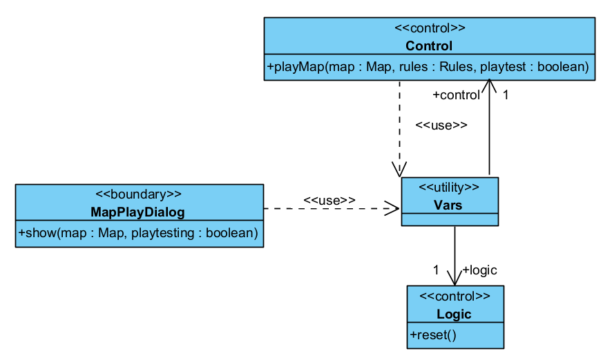
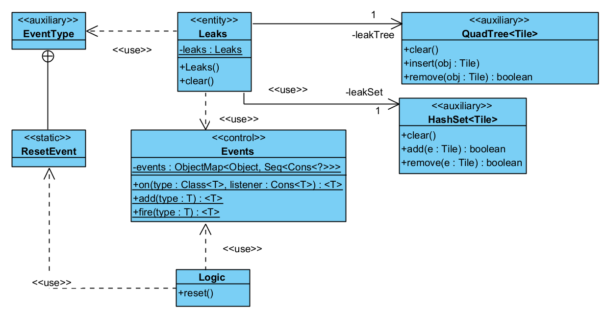
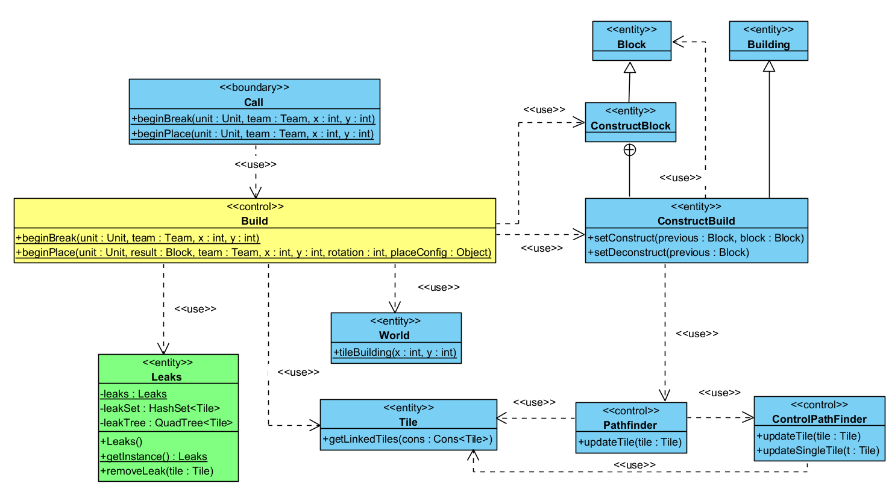
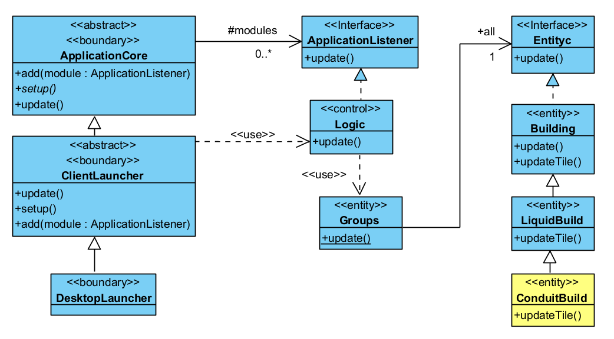
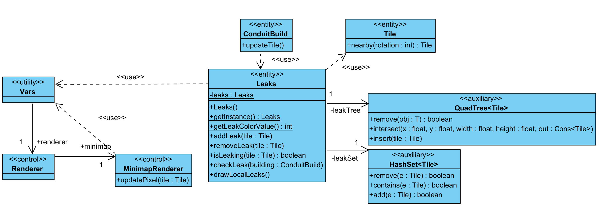
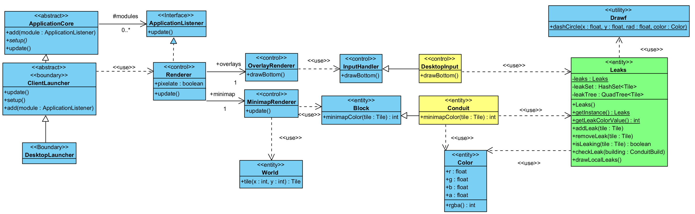
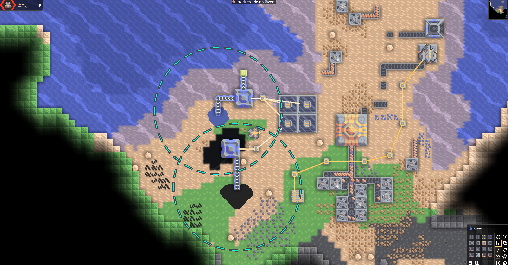

# Class Diagrams

Note: after teacher feedback, I removed classes not in the sequence diagrams from the class diagrams (where it doesn't break structure), including utility classes.
However, I kept classes in cases where:
- They were the class types of data returned in the sequence diagrams but where the classifier was not necessary to call for methods (eg: only public attributes of the class were used)
- They are interfaces or extended by classes present in the sequence diagram (where the method called in the sequence diagram belongs to the abstract super). Eg. ``ApplicationCore`` in **UpdateBuilding**
- They are a utility class (and not justifiably boundary, control, or entity) for which the functionality was abstracted. Eg:``Drawf`` utility class has method ``dashCircle()`` abstracted into Leaks in sequence diagram "Update leak display".

Color-coding:
- Blue: Unmodified but relevant class;
- Yellow: Class modified for new functionality;
- Green: Class created for new functionality;

## Enter map

This class diagram is related to the player action of joining a map. It's worth noting that selecting a map to play in the code is different from
selecting a map to play in the campaign. However, within the use case context, the interaction is the same since the use case doesn't involve the map selection, but instead what happens afterwards.

- The ``show`` method in the class ``MapPlayDialog`` handles the press of a button to play the map, which calls the ``playMap`` method in the
  instance of the ``Control`` class present in ``Vars`` (a class that connects many classes with a wide variety of purposes).
- This ``playMap`` method calls for a logic ``reset`` in the ``Logic`` instance in ``Vars``. This ``Logic`` class handles entities and waves, but doesn't store
  the game state as indicated in its documentation.

## Leave map

In this case the action is confirmed in the method ``showQuitConfirm()`` in the class ``PausedDialog`` that calls ``runExitSave()`` of the same class.
This method directly calls for a ``reset()`` on the instance of the ``Logic`` class in ``Vars``.

## Clear leaks (behavior fragment)

This class diagram represents the behaviour fragment common to the two use cases above. It describes how in the constructor, ``Leaks`` sets up a response to a ``ResetEvent``
that is stored in ``Events``. On entering and leaving the map, this event is fired (in the cases above, fired in the ``reset()`` method of the ``Logic`` class).
It involves calling ``clear()`` for the attributes leakSet and leakTree to avoid having identified leaks carry over into other maps.

## Break block, Place block, Request tile update (included use case)

I joined the class diagram because ``BreakBlock`` and ``PlaceBlock`` only call slightly different methods, and ``Request tile update`` is a behavior fragment
included in both that makes more sens in context.

Involvement of classes:
- When a player places/breaks a block, this creates a call for ``beginPlace/beginBreak`` respectively, which calls a static method of the same name in ``Build``.
- From here, the ``world`` attribute (``World`` instance) of ``Vars`` is accessed to obtain the tile at position *(x, y)*, from which the building in that tile can be obtained.
- (when breaking a block, it also explicitly attempts to ``removeLeak`` with the ``Leaks`` singleton instance to avoid keeping leaks for destroyed blocks).
- With this ``Building`` instance, after processing other logic not relevant to the use case (unrelated to added functionality), the methods ``setConstruct`` (for place) or ``setDeconstruct`` (for break) are called,
  leading to a request to update the tile.
- The **Request tile update** simply represents calling ``updateTile(Tile tile)`` method in the ``Pathfinder`` instance of Vars calls ``updateTile(Tile tile)`` in the ``ControlPathFinder`` instance also of ``Vars``.
- This updateTile in ``ControlPathfinder``calls ``updateSingleTile(Tile t)`` for each tile in the building (a building can have multiple tiles), adding the position of each tile
  to a queue of updates.
- The ``updateTile()`` is custom defined for each building and has no logic in its original definition. However, the logic for the specific
  case of leakable tiles (conduits) can be seen in the use case "Update leakable block tile".

## Update building

This class diagram shows how Buildings are updated in mindustry.
The ``DesktopLauncher`` is executed to launch the game and start running it. It is a specialization of ``ClientLauncher``, which during setup,
adds an instance of ``Logic`` (an implementation of ``ApplicationListener``), among other modules, to the ``ApplicationCore`` super class.

As such, when ``ClientLauncher`` calls ``update()`` at a regular interval(which involves calling ``super.update()``),
it calls the saved ``Logic`` instance's ``update()`` method too. This gets passed on as:  
``Logic``-->``Groups``, and in the data structure that holds instances of ``Entityc`` calls ``update()`` for each of them, including the ``ConduitBuild`` we're looking for in particular.
As seen in the diagram, one of these ``Entityc`` can be implemented by a ``Building``, which will call the ``updateTile()`` method during ``update()``.
The content of this method differs greatly with the purpose of the block type, but for ``ConduitBuild``, it involves sending the liquid forward, and
for the **new functionality**, checking for leaks (updating the ``Leaks`` singleton).  
That functionality was separated into a Behavior fragment due to being common to 2 use cases.

## Update leakable block tile

This class diagram reflects the extended behaviour of ``updateTile()`` for a conduit building. After pushing forward contained liquid,
it communicates with the ``Leaks`` singleton by calling ``checkLeak(this)`` to tell the singleton that changes may have occurred. To even verify that the leak is worth checking, the method
checks that the building is of a block type that can leak (is a ``Conduit`` block with attribute ``leaks`` true), and that the building team is the same as the player team.
The tile connected to the one being checked is obtained via calling ``nearby()`` on the building's tile.
It's checked for solidity to indicate if there is currently a leak (different to checking if there used to be a leak -> checking if the tile is stored in the ``Leaks`` instance).
The ``checkLeak`` method, checks for a transition from *not leaking -> leaking* and vice versa and in such case adds/removes the tile
from the data structures ``leakTree`` and ``leakSet`` using the ``addLeak(Tile tile)`` or ``removeLeak(Tile tile)`` methods, respectively.
This is so that in the **Update leak display** use case leaks can be displayed based on player proximity.
Either of the two transitions mentioned above also leads to requesting for an update in the minimap for the pixel that represents the tile.
``Leaks`` communicates with a ``MinimapRenderer`` instance stored in the ``Renderer`` instance in ``Vars``.
It then sets the tile as pending for an update in the next minimap update using ``updatePixel(Tile tile)``, to change the colour and indicate a leak.

## Update leak display

This class diagram is related to the frequent calling of the renderer update method that updates the minimap, ensuring pending updates are drawn it.
In the user story scenario, these updates concern tiles labelled as leaking in the ``Leaks`` singleton class.
It also covers drawing the rendering of the overlay that shows leaks close to the player.

The ``DesktopLauncher`` is executed to launch the game and start running it. It is a specialization of ``ClientLauncher``, which during setup,
adds an instance of ``Renderer`` (an implementation of ``ApplicationListener``), among other modules, to the ``ApplicationCore`` super class.

As such:
- The game runs with an instance of ``Renderer`` (which contains a ``MinimapRenderer`` attribute), and frequently calls its ``update()`` method.
- If the game is not in a menu state, it needs to update the minimap, which it does by calling the ``update()`` method in the ``MinimapRenderer`` instance **minimap**.

Note on stereotypes:  
I consider the renderers to be of the **control** stereotype as they communicate with the lower
structures that hold the data for the on-screen pixels.
### - Minimap Update
- ``update()`` in ``MinimapRenderer`` goes through pending updates for world positions that were sent for update
  (the global Vars can translate these into tiles, and then blocks, from which a color can be fetched).
- Adding to pending updates is described in another use case, but as shown in the diagram involves the ``updateTile`` method in ``ConduitBuild`` I modified to allow this.

I won't go further into detail of the many intermediate classes that the renderer goes through to get the Block and color avoid confusion.

What I'm omitting in the diagram to condense the logic is the following:

- The ``Vars`` class has an attribute of class ``World`` that stores the tiles of the active map and can get a tile given an ``int`` position value using a method ``tile(int pos)``.

**Relevant case for minimap**
- The relevant case here is when the tile corresponds to a ``Block`` specialization ``Conduit``. Getting the color for display is done using ``minimapColor(Tile tile)`` I overrode in ``Conduit``
  to return the int value for the light blue color ``Pal.leakingWarn`` if the tile is leaking (``super`` otherwise).
- This color is obtained by calling the static ``getLeakColorValue()`` method in Leaks. The integer value returned by the ``rgba()`` called on this color is stored in the int buffer that represents the colors to display on the minimap.
- This presence of a leak is quickly checked by using the ``isLeaking(tile Tile)`` method in the singleton ``Leaks``, which checks if it has the tile stored.
- Note: ``Pal`` is the palette class that stores used colors of the ``Color`` class. The pixel map and such buffers that the application uses after getting
  the color from a block to place each color were also omitted to avoid confusion.

### - Showing local leaks (going back to ``update`` in ``Renderer``)
- The ``update()`` method in ``Renderer`` also calls the own class's ``draw()`` method if the ``boolean pixelate`` from the ``Renderer`` static instance in ``Vars`` is turned off (decided in settings).
- This method performs ``drawBottom()`` in ``OverlayRenderer``, which calls a method of the same name in ``DesktopInput``(assuming playing in Desktop).
- In ``DesktopInput``, the **new functionality** is finally called on the instance of the ``Leaks`` singleton: ``drawLocalLeaks``.
- This method uses the player's x and y coordinates from the static ``Player`` instance in ``Vars`` to find all leaks within a 10 block radius of the player
  and show a blue-dashed ring as below (drawn using the static ``dashCircle(float x, float y, float rad, Color color)`` method in the ``Drawf`` class):

Note: I considered the InputHandler and DesktopInput here as control and not as boundary because they perform multiple functions,
and in this use case they aren't handling direct input, but instead managing a portion fo the logic regarding drawing overlays in the map.