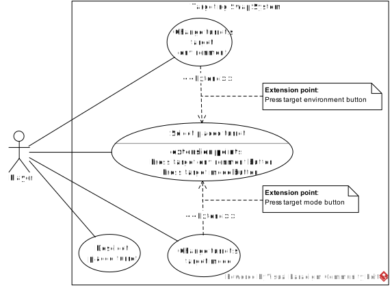

# User story 3
Swapping turret's targeting priorities
## Author(s)
- Dinis Neves (68130)
- Gabriela Silva (67286)
## Reviewer(s)
- Diogo Antunes (67763)

(*Please add the user story reviewer(s) here, one in each line, providing the authors' name and surname, along with their student number. In the reviews presented in this document, add the corresponding reviewers.*)
## User Story:
[User Story 3: Swap Targeting](../../Milestone1/UserStory3.md)
### Review
*(Please add your user story review here)*
## Use case diagram

## Use case textual description
[Textual description from Swap Targeting's use case diagram](./USECASE-TEMPLATE.md)
### Review
**Author** : Diogo Antunes (67763), 23/11/2025 16:13

**Select placed turret** steps 3 and 4 allude to a separate interaction from the current use case.
The player doesn't seem to have to deselect, it can happen at some point. Therefore, I think it would make more sense for deselection
to be a separate use case since it seems to originate from a separate interaction by the player.

Another point, it might be my own lack of familiarity with the functionality, but I find it difficult to understand the difference between
target **type** and target **mode**. I assume type would relate to prioritising health, defence and such enemy traits, while type refers to factors like distance,
potentially? However, this wouldn't make sense as it should only be one or the other. Therefore, it's not immediately obvious to me what functionality this may indicate.
Since the "type" used for priority may cover a set of traits not easily grouped, it's an understandably abstract term. 

Upon reading the Alternative flow, I can gather that type is related to grounded or flying enemies. However, I feel that **type** and **mode** are a little unclear.
However, I'm also unable to suggest a better word at this point, maybe (for mode) something like "Change turret's target unit environment" but even that's not entirely appropriate.

With that in mind, the functionality is an easy to understand extension to the turret mechanics. I personally just think the wording for **type** and **mode** could be clearer,
as well as the deselection being considered part of the **Select placed turret** use case.

---
_The use case diagram's textual description was modified according to this review._

## Implementation documentation
(*Please add the class diagram(s) illustrating your code evolution, along with a technical description of the changes made by your team. The description may include code snippets if adequate.*)
### Implementation summary
(*Summary description of the implementation.*)
#### Review
*(Please add your implementation summary review here)*
### Class diagrams
(*Class diagrams and their discussion in natural language.*)
### Review
*(Please add your class diagram review here)*
### Sequence diagrams
[Sequence diagrams for Swapping Turret's Targeting User Story](./SEQUENCE-DIAGRAMS.md)
#### Review
*(Please add your sequence diagram review here)*
## Test specifications
(*Test cases specification and pointers to their implementation, where adequate.*)
### Review
*(Please add your test specification review here)*
