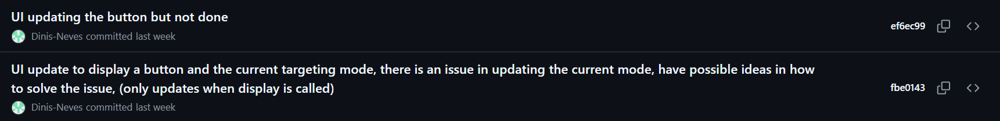
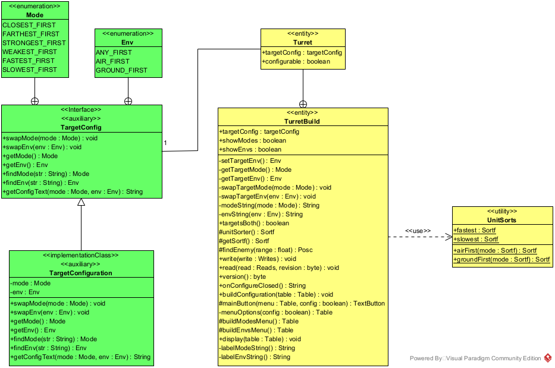

# User story 3
Swapping turret's targeting priorities
## Author(s)
- Dinis Neves (68130)
- Gabriela Silva (67286)
## Reviewer(s)
- Diogo Antunes (67763)

(*Please add the user story reviewer(s) here, one in each line, providing the authors' name and surname, along with their student number. In the reviews presented in this document, add the corresponding reviewers.*)
## User Story:
[User Story 3: Swap Target Configurations](../../Milestone1/UserStory3.md)
### Review
*(Please add your user story review here)*
## Use case diagram

## Use case textual description
[Swap Target Configurations Use Case Diagram textual description](./USECASE-TEMPLATE.md)
### Review
**Author** : Diogo Antunes (67763), 23/11/2025 16:13

**Select placed turret** steps 3 and 4 allude to a separate interaction from the current use case.
The player doesn't seem to have to deselect, it can happen at some point. Therefore, I think it would make more sense for deselection
to be a separate use case since it seems to originate from a separate interaction by the player.

Another point, it might be my own lack of familiarity with the functionality, but I find it difficult to understand the difference between
target **type** and target **mode**. I assume type would relate to prioritising health, defence and such enemy traits, while type refers to factors like distance,
potentially? However, this wouldn't make sense as it should only be one or the other. Therefore, it's not immediately obvious to me what functionality this may indicate.
Since the "type" used for priority may cover a set of traits not easily grouped, it's an understandably abstract term. 

Upon reading the Alternative flow, I can gather that type is related to grounded or flying enemies. However, I feel that **type** and **mode** are a little unclear.
However, I'm also unable to suggest a better word at this point, maybe (for mode) something like "Change turret's target unit environment" but even that's not entirely appropriate.

With that in mind, the functionality is an easy to understand extension to the turret mechanics. I personally just think the wording for **type** and **mode** could be clearer,
as well as the deselection being considered part of the **Select placed turret** use case.

---

_The use case diagram's textual description was modified according to this review._

---
## Implementation documentation

#### Commits

17/11/2025:


19/11/2025:


20/11/2025:


21/11/2025:


22/11/2025:


23/11/2025:


26/11/2025:


27/11/2025:


28/11/2025:


30/11/2025:


03/12/2025:


#### Briefing 
The implemenation of this user story took place mostly around the ``Turret`` class, since it was added new configurations to it. It was created one new interface: ``TargetConfig``, which is implemented by the new class ``TargetConfiguration`` and contains two enumerations ``Mode`` and ``Env``. They contain a list of possible modes and environments for the targeting configuration of a turret.
````java
/** Possible target modes **/
public enum Mode {
    CLOSEST_FIRST,      // The closest enemies around the turret. This is the default mode.
    FARTHEST_FIRST,     // The farthest enemies from the turret, in its range (or other one)
    STRONGEST_FIRST,    // The strongest enemies (with higher maxHealth) around the turret.
    WEAKEST_FIRST,      // The weakest enemies (with lower maxHealth) around the turret
    FASTEST_FIRST,      // The fastest enemies around the turret (highest u.type.speed * u.speedMultiplier)
    SLOWEST_FIRST       // The slowest enemies around the turret (lowest u.type.speed * u.speedMultiplier)
};

/** Possible target environments **/
public enum Env {
    ANY_FIRST,          // Any Air or Ground target enemy
    AIR_FIRST,          // Focus *first* on Air targets enemies
    GROUND_FIRST;       // Focus *first* on Ground targets enemies;
};
````

It is possible to **combine** the targeting environment with a mode. For instance, it is possible for a turret to target the *strongest ground* units around it. For targets that target both air and ground units, it is possible to (or not) focus on an environment.

#### Logic
To sort the enemy units that a turret will attack, the ``SortUnits`` class was utilized. There was already four ways for sorting them (``Sortf`` objects): ``closest``, ``farthest``, ``strongest`` and ``weakest``. It was added two new ways: ``fastest`` and ``slowest``.

````java
public class UnitSorts {
  public static Sortf
      fastest = (u,x,y) -> -u.type.speed * u.speedMultiplier + Mathf.dst2(u.x,u.y,x,y) / NEGATIVE_WEIGHT,

      slowest = (u,x,y) -> u.type.speed * u.speedMultiplier + Mathf.dst2(u.x, u.y, x, y) / NEGATIVE_WEIGHT;
}
````

To combine the targeting environment with a targeting mode, it was also implemented two new (static) functions that handle air or ground units first, with the mode parameterized: ``airFirst(mode)`` and ``groundFirst(mode)``.
````java
public class UnitSorts {
    public static Sortf airFirst(Sortf mode) {
        return (u, x, y) -> {
            if(u.type.flying) return mode.cost(u, x, y);
            else return NEGATIVE_WEIGHT + mode.cost(u, x, y);
        };
    }

    public static Sortf groundFirst(Sortf mode) {
        return (u, x, y) -> {
            if(u.type.flying) return NEGATIVE_WEIGHT + mode.cost(u, x, y);
            else return mode.cost(u, x, y);
        };
    }
}
````

These configurations are defined and depend on the ``Turret``'s ``targetConfig`` new instance variable. The sort occurs in the ``unitSorter()`` new method in the ``TurretBuild`` class (inner class from ``Turret``). This method is called in the function ``findEnemy()`` in the same way the default sort was before this functionality was added.

````java
protected Sortf unitSorter() {
    Sortf mode = getSortf();
    TargetConfig.Env env = getTargetEnv();
    
    if(env == TargetConfig.Env.AIR_FIRST)
        return UnitSorts.airFirst(mode);

    else if(env == TargetConfig.Env.GROUND_FIRST)
        return UnitSorts.groundFirst(mode);

    return mode;
}
````

To display this configuration, the ``Turret`` block became configurable (``configurable = true`` in its constructor), which means it can be configured by the player, by clicking on it. Two configurations were added in the ``Turret``'s constructor. The method ``configure()`` is responsible to update the turret's configurations. Every time a configuration option is pressed, the method is called and updates the variable that matches the configuration being swapped (``targetMode`` or ``targetEnv``)-

````java
public Turret(String name) {
  // ...
  configurable = true;

  targetConfig = new TargetConfiguration(TargetConfig.Mode.CLOSEST_FIRST, TargetConfig.Env.ANY_FIRST);

  config(TargetConfig.Mode.class, (TurretBuild build, TargetConfig.Mode mode) ->{
      if(!configurable) return;
      build.swapTargetMode(mode);
  });

  config(TargetConfig.Env.class, (TurretBuild build, TargetConfig.Env env) ->{
      if(!configurable) return;
      build.swapTargetEnv(env);
  });

  configClear((TurretBuild build) ->{
      new TargetConfiguration(TargetConfig.Mode.CLOSEST_FIRST, build.setTargetEnv());
  });
}
````


#### Display
The current target configurations were added to the turret's information table. This table is shown at the right bottom corner, above the building menu, when the mouse cursor is hovering over the placed turret.

The configurations are also shown when the player clicks on the turret, by showing two buttons with the current target mode (left one) and environment (right one).

#### UI interaction

Having the two buttons shown, the player can choose to swap the turret's target configurations or to not do anything. Every time one of the buttons is pressed, the system displays the possible options for that target configuration, unless the turret can not target both environments. In that case, the environment button is disabled and can not be pressed on; the mode button is always enabled.

When having the options displayed, if one is chosen and it is different from the current configuration, the configuration is swapped to that option. Otherwise, an error message appears, informing that the option chosen is the same as the current one. The player can eventually do nothing, by unselecting the turret.

#### Class diagram for modifications


Since this class diagram only shows modifications on the codebase, the represented ``UnitSorts`` attributes are just the ones that were added: ``fastest`` and ``slowest``.

Part of the new private methods are helper functions for the ``buildConfiguration()`` method, which is an *@override* method from the ``Building`` class, as ``display()`` and ``onConfigureClosed()`` are. The other part are helper functions that come from the ``TargetConfiguration`` class.

The three methods ``read()``, ``write()`` and ``version()`` were modified for saving and loading target configurations.


##### Note
Color code meaning:
- <mark style="background: #32e556ff;"> Green</mark>: Classes that were *created* 
- <mark style="background: #fbff02f0;">Yellow</mark>: Classes that were *modified*

### Implementation summary
- Main class affected: ``TurretBuild`` inner class from ``Turret``
- Took advantage of the sorting modes from the ``UnitSorts`` class for defining target modes
- Most dispendious part of the implementation: Handling the UI with several text buttons
- Main problem: Maps that in its initially launch have turrets placed on some tile in the grid. These maps have problems on saves and loads. However, saving and loading target configurations are working, except for that particular case.
- It was needed to handle (a lot of) corrupted old save files because of the loading and saving part.

#### Review
*(Please add your implementation summary review here)*
### Class diagrams
[Swap Target Configurations Class Diagram](./CLASS-DIAGRAMS.md)
### Review
*(Please add your class diagram review here)*
### Sequence diagrams
[Swap Target Configurations Sequence Diagrams](./SEQUENCE-DIAGRAMS.md)
#### Review
**Author** : Diogo Antunes (67763), 29/11/2025 14:46

**Select Placed Turret**

- Boundary ``InputHandler`` interacts directly with an entity ``TurretBuild``, this shouldn't happen in a sequence diagram.  
- I think there should be separate vertical activity rectangles for the interactions with TurretBuild as it doesn't seem to be one run on interaction, but instead multiple starting from the InputHandler.  
- The arrows having the "return" text are a different style from what I used, instead of being empty, but the lesson powerpoints also show return arrows in a variety of ways.

**Change Turret's Target Mode**

- There is no return arrow at the end for a synchronous message, which I think is wrong.  
- The combined fragment strict seems to have been applied incorrectly. It should encompass the section with the opt combined fragment as well in a separate operand.
In truth, there actually doesn't seem to be a need for this combined fragment.
- "Playerr" has a typo.

**Change Turret's Target Environment**

- Strict doesn't seem to be necessary here.
- There's also direct communication between the boundary and the entity within the operand in strict.

I'm assuming "environment button is pressed" is the value of an attribute and not an additional interaction from the player, since ``ClickListener`` receives all input.
With that assumption, the opt looks right.

**Unselect Turret**

- Boundary communication with entity again.  
- The ``onConfigureBuildTapped(build)`` is synchronous but has no empty return.
- The activity bar in ``hideConfig()`` that starts in ``BlockConfigFragment`` starts within an "alt" operand and carries over to the next. i'm not sure this is according to specification,
but I might be wrong in pointing this out.

**Other notes**

- There seems to be a use of public methods like ``toString()`` at times or using java boolean negation like "!targetsBoth()" which potentially lessens readability
considering it's meant to be understood by non-programmers. However, since each method in the sequence diagram is supposed to correspond to something in the code, I'm not sure how this could be changed without removing meaning.
Altering the method name in the sequence diagram and then explaining the abstraction that was used could be an option but I'm not at all sure that would be the right thing to do.

---
_The sequence diagrams report was modified according to this review._

**Answer:**
We believe that, since every message and condition of the sequence diagram must be justified by code in the codebase, the methods should stay as abstract as the coding is, with a textual explanation (when necessary) in the report.

We also want to explain that when the first version of the sequence diagrams report was made, the boundary handling with buttons was then not understanded by us. After a deeper research, we managed to understand that "*mode button is pressed*" can be translated to the method ``isPressed()`` in the ``TextButton`` and ``ClickListener`` classes.

The *strict* fragment was ambiguous in the first version of the sequence diagrams report. After modifying it, we've understood that in the current version, it must have the *strict* fragment in both *Change Turret's Target Mode* and *Change Turret's Target Environment* sequence diagrams, since different and not directly related lifelines have behaviors that must be from a *strict order*.

The "*return*" in the return messages was explicitly written because in the *Visual Paradigm* application, we did not manage to hide the sequence numbers of the time line, which leads us to decide that a message with just a number would look weird.

---


## Test specifications
[Swap Targeting Configurations Functionality Testing](./SYSTEM-TESTING.md)
### Review
**Author:** Gabriel Falcão (67775) (3/12/25) 10:53

Besides the typos I have described bellow, I like your test specification report, not only that I would say that the video is well done, and correctly represents what the tests ask for.

**Better Test Descriptions**:
- In test *Test Targeting Display* instead of "2. Hover over the turret" you should write "2. Hover the cursor over the turret"
- In test  *Test Targeting broad (using custom map for testing targeting)* you should elaborate on what these two turrets are **2. Navigate towards the first two turrets.**, I do understand that they are within view but the Player's view covers quite a lot of screen, maybe add some indicator on the map; maybe define their type, scatter, duo, salvo.
**Typos**:
- thee targeting -> the targeting
- through all of the targeting as if it -> through all of the targeting options as if it were
- The selected option is also has -> The selected option also has
	- Test Targeting broad (using any map), step 3
- 3. Press one of the options or option. -> 3. Press one of the options.
	- I'm not sure if you meant something else with this.

From what was stated above, I really like that you included the video, gives us some visuals of what is actually being testes, not just some script to be followed.
