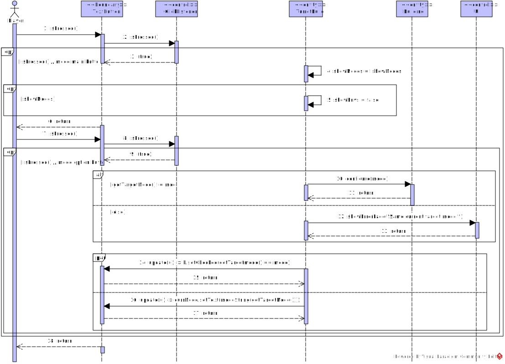
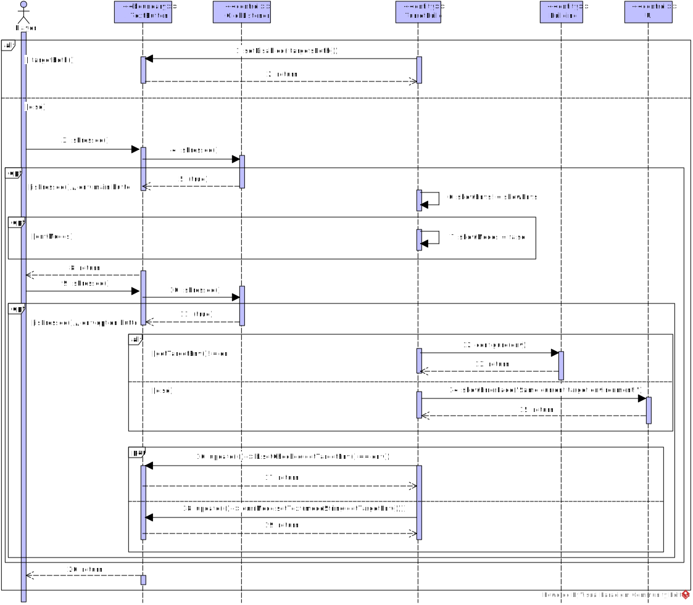

## Select Placed Turret


To select a turret, the player must simply tap on a built turret. This turret **must be from the same team of the player**, which is checked by the alternative combined fragment. If not the case, the system doesn't allow the player to click on it.


## Change Turret's Target Mode


``DesktopInput`` and ``InputHandler`` classes handle the game-world input, such as movement, selection and placing blocks. Actually, these classes often execute the check ``!Core.scene.hasMouse()`` to verify if the mouse cursor is hovering over or interacting with any UI element. Because of that, the most accurate boundary for the player's action to press an UI text button can be the ``ClickListener`` class.

To open the mode's options menu, there is a toggle ``boolean showModes``. Each time the main mode button is pressed, the menu is shown/hidden. There can only be one menu opened at a time, so:
````java
if(showModes) showEnvs = false;
````

The same happens for when pressing the main target environment, but (clearly) with the toggles exchanged.

Every time a target mode option is selected (by pressing on its text button), the current target mode is updated (on change). Two updates are run: the option button's highlight and the displayed text in the main mode button.

## Change Turret's Target Environment


Changing the target environment is essentialy similar to changing the target mode. The only (but impactful) change is that if the turret can only attack in *one* environment (air or ground), then the player can not change it, because it is not possible.

For that, the main button that displays the current target environment is disabled.
````java
 // button is disabled if turret does not target in both environments
currEnv.setDisabled(!targetsBoth());
````


## Unselect Turret


To stop selecting a turret, the player simply has to tap (click) on a tile that is **not** the tile where the selected turret is built.

There are two essential paths:
- The player clicks on a tile *without* a building on it
- The player clicks on a tile *with* a building on it

To check which case is happening, the ``tileTapped(build)`` checks ``if(build == null)``. If it returns true, it simply means that there is no building in the tile and the turret build is immediatly unselected by calling the ``hideConfig()`` method from the ``BlockConfigFragment`` *control* class.

For when a player clicks on a different building than the turret build selected, there are two conditions to be checked:
- If the mouse cursor isn't above a configuration fragment: ``hasConfigMouse()``
- If the current turret build is showing its configuration panel: ``config.isShown()``

Since when selecting a turret, its configuration is always shown, it is then checked if the clicked building is different from the turret build selected by running the ``onConfigureBuildTapped(build)`` on the ``TurretBuild`` *entity* class.

For a clear understanding, the following code snippets are the most relevant part of this interaction:
- ``TileTapped()`` method on ``InputHandler`` class:
````java
boolean tileTapped(@Nullable Building build) {
    // (...)
    if(build == null) {
        // (...)
        config.hideConfig();
        
    }
    // (...)
    if(!config.hasMouse()) {
        if(config.isShown() && config.getSelected().onConfigureBuildTapped(build)) {
            // (...)
            config.hideConfig();
        }
    }
}
````

- ``onConfigureBuildTapped()`` on ``Building`` class:
````java
boolean onConfigureBuildTapped(Building other) {
    // (...)
    return this != other;
}
````