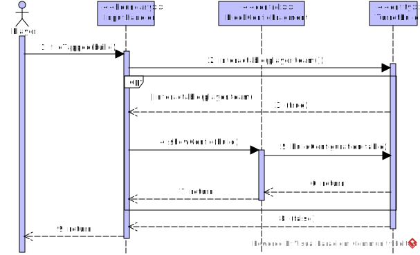
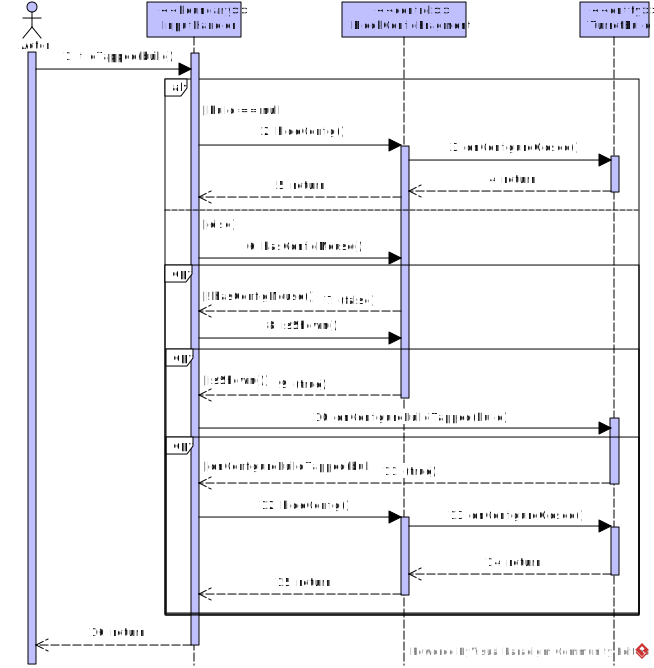

## Select Placed Turret


This sequence diagram represents the message flow between the player and the code base when selecting a placed turret in the grid.

The ``update()`` method triggers the player's interaction of selecting (``Binding.select``) a built build, which is better described by this code snippet:
````java
if (Core.input.keyTap(Binding.select) && !Core.scene.hasMouse()) {  

    Tile selected = world.tileWorld(input.mouseWorldX(), input.mouseWorldY());  
    if (selected != null) {  
        Call.tileTap(player, selected);  
    }  
}
````
The built turret being selected **must be from the same team of the player**, which is checked by the alternative combined fragment. If not the case, the system doesn't allow the player to click on it, returning nothing.

The only interesting action in this sequence diagram is the selection of the turret. The *Configuration Display* is referenced and detailed below in this report. 

### Configuration Display

This sequence diagram doesn't represent a particular use case, but part of the *Select Placed Turret* one. Since it is complex and big enough, it was refactorized, so it is easier to understand.

// TO DO (after changing the display to a menu rather than a live-updatable button)

## Change Turret's Target Environment && Change Turret's Target Mode
// TO DO (after changing the display to a menu rather than a live-updatable button)
These two use cases will (probably) be very similar as sequence diagrams.

## Unselect Turret


The above sequence diagram shows how a player stops selecting a turret. For that, the player simply has to tap (click) on a tile that is **not** the tile where the selected turret is built.

There are two essential paths:
- The player clicks on a tile *without* a building on it
- The player clicks on a tile *with* a building on it

To check which case is happening, the ``tileTapped(build)`` checks ``if(build == null)``. If it returns true, it simply means that there is no building in the tile and the turret build is immediatly unselected by calling the ``hideConfig()`` method from the ``BlockConfigFragment`` *control* class.

For when a player clicks on a different building than the turret build selected, there are two conditions to be checked:
- If the mouse cursor isn't above a configuration fragment: ``hasConfigMouse()``
- If the current turret build is showing its configuration panel: ``config.isShown()``

Since when selecting a turret, its configuration is always shown, it is then checked if the clicked building is different from the turret build selected by running the ``onConfigureBuildTapped(build)`` on the ``TurretBuild`` *entity* class.

For a clear understanding, the following code snippets are the most relevant part of this interaction:
- ``TileTapped()`` method on ``InputHandler`` class:
````java
boolean tileTapped(@Nullable Building build) {
    // (...)
    if(build == null) {
        // (...)
        config.hideConfig();
        
    }
    // (...)
    if(!config.hasMouse()) {
        if(config.isShown() && config.getSelected().onConfigureBuildTapped(build)) {
            // (...)
            config.hideConfig();
        }
    }
}
````

- ``onConfigureBuildTapped()`` on ``Building`` class:
````java
boolean onConfigureBuildTapped(Building other) {
    // (...)
    return this != other;
}
````