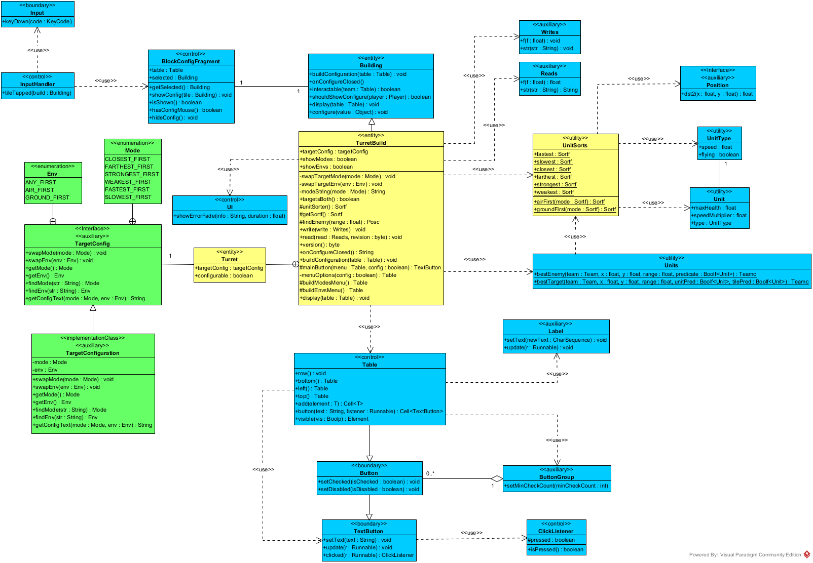

#### Notes
This report was updated after Carolina's review on it, at 04/12/2025 22:15.

---
## Swap Turret's Target Configuration Class Diagram

The class diagram for the swap turret's target configuration new functionality as a whole is shown in this file.



Color code meaning:
- <mark style="background: #32e556ff;"> Green</mark>: Classes that were *created* 
- <mark style="background: #fbff02f0;">Yellow</mark>: Classes that were *modified*
- <mark style="background: #0088ffff;">Blue</mark>:   Classes that were *not modified at all*

This diagram illustrates every class that is directly utilized for this functionality.


### Usage of ``TargetConfig`` and ``TargetConfiguration``
This are the main classes added to the codebase. ``TargetConfig`` represents the target configuration of a turret. For a first approach, the enumerations ``Env`` and ``Mode`` were implemented separatly and independently. Then, because several added logic was similar in both enumerations, it was decided to gather them in a single class, representing the target configurations as a whole. The variables ``env`` and ``mode`` represent the current target configurations mode and environment, respectively.

### Usage of ``UnitSorts``
The usage of the ``UnitSorts`` is given by each possible target mode configuration and each target environment configuration combination with mode. Each ``closest``, ``farthest``, ``strongest``, ``weakest``, ``fastest`` and ``slowest`` ``Sortf`` objects returns a sort of unit enemies by some criteria that relates to the mode naming. The ``closest``, ``farthest``, ``strongest`` and ``weakest`` ``Sortf`` objects were already implemented, so it was followed the same style and way of sorting the enemy units: from smaller cost to bigger. Let ``fartest`` be the example:

````java
farthest = (u, x, y) -> -u.dst2(x, y),
````

This lambda expression receives a ``Unit`` and ``x`` and ``y`` coordinate's position. It calculates the relative position of the unit from the turret and then sorts from farthest to closest by multiplying the values by $-1$. This way, the farthest are the first in the sort and the closest are the last in the sort. The same methodology was used for the other modes, accessing the other variables like ``maxHealth`` and ``speedMultiplier``, along with ``type`` and ``speed`` from ``UnitType``.

To combine the environment and mode target configurations, it was implemented ``airFirst(Sortf mode)`` and ``groundFirst(Sortf mode)``. For that, it was needed to access the ``flying`` variable from the ``UnitType`` class that returns true if the unit is an air unit or false otherwise.

### Usage of ``Units``
To apply the new ways of sorting enemy units, the ``TurretBuild``'s method ``findEnemy()`` was modified. The sort according to the current mode and environment is applied to it, so the methods ``bestEnemy()`` and ``bestTarget()`` from the ``Units`` class were directly affected.

### Usage of ``BlockConfigFragment``
The ``InputHandler`` class gives a great use of the ``BlockConfigFragment`` class. It checks several conditions to see if the configuration of the ``TurretBuild`` will be shown or hidden.
- If the configuration is to be shown, it invokes the ``showConfig()`` method from ``BlockConfigFragment``, that also invokes the ``buildConfiguration()`` method from the ``Building`` class that is over written by ``TurretBuild``.
- If the configuration is to be hidden, it calls the ``hideConfig()`` method from ``BlockConfigFragment``, that also calls the ``onConfigureClosed()`` method from the ``Building`` class that is over written by ``TurretBuild``.

### Usage of ``Table``
To display and build the configurations' menu from the ``TurretBuild`` instance being clicked on, the ``Table`` class is the main object that handles buttons, labels and listeners. Every ``TextButton`` object is created for a ``Table`` object.

The configurations' menu table has two inner tables that are not visible at the same time. This behavior is controlled by two variables that acts as flags: ``showMenus`` and ``showEnvs``. When *opening* one of the menus, if one is ``true``, the other is ``false``.

Both are set to ``false`` on the ``onConfigureClose()`` method, that represents the act of closing the configurations menu of the turret by unselecting it. Each of this tables have a ``ButtonGroup`` object to group the ``TextButton`` objects of each target configuration.

By hovering the mouse cursor over the ``TurretBuild`` instance, its current target configurations are added to the turrets information dialog that is displayed above the building menu. The ``display()`` method was over written to add that information, by creating ``Label`` objects and updating them accordingly.

``TextButton`` and ``Button`` are considered *boundary*, since every button (in this user story context) has a ``Runnable`` object associated that is executed when a button is clicked, by a ``ClickListener`` class. These classes are the ones that handle the input from the player to the system. This topic is deeper explained in the [sequence diagrams' report](./sequence-diagrams.md).

### Usage of ``UI``
The only usage of the ``UI`` class is made when the player tries to select the same current target configuration. For instance, if the player is choosing the *STRONGEST* mode and the it is the current target mode, an error message is displayed: "*Same current target mode!*". The same happens for the target environment configuration. This is defined in the ``Runnable`` object that is associated with each option button creation.
````java
// inside the buildModesMenu() method
TextButton b = commandModes.button(modeString(mode), () -> {
    if(getTargetMode() != mode)
        configure(mode);
    else
        ui.showErrorFade("Same current target mode!", 2f);
}).group(modeGroup).get();

// inside the buildEnvsMenu() method
TextButton b = commandEnvs.button(envString(env), () -> {
    if(getTargetEnv() != env)
        configure(env);
    else
        ui.showErrorFade("Same current target environment!", 2f);
}).group(envGroup).get();
````

### Usage of ``Reads`` and ``Writes``
This classes are used to save and load data from files. Since ``TurretBuild`` instances have new data information (``TargetConfig`` variable), this data needs to be saved somehow. The methods ``read()``, ``write()`` and ``version()`` were modified so that data is saved and loaded between files. For that, the ``mode`` and ``env`` variables were written as strings.

````java
public void write(Writes write) {
  // ...
  TargetConfig.Mode mode = getTargetMode();
  TargetConfig.Env env = getTargetEnv();

  write.str(modeString(mode));
  write.str(envString(env));
}
````

During this implementation, several issues with the serialization of data were discovered. First, custom maps that have built turrets in its initial launch triggered corrputed files. After solving that issue, they still have problems in saving ``TurretBuild`` instances in general. If turrets are placed and the already built ones are not touched, the turrets that were placed are not saved, so when loading the save file, they are not placed anywhere.

Besides that particular case, saving and loading turrets instances and its configurations are working.


##### Notes
<<<<<<< HEAD:SE202526/Milestone3/UserStory3/CLASS-DIAGRAMS.md
For simplicity, some methods from the ``TurretBuild`` class were not mentioned in the diagram, since they are *inner helpers* for other methods. Every new and changed method were specified in [modifications' class diagram](./implementation-documentation.md#Class-diagram-for-modifications).
=======
For simplicity, some methods from the ``TurretBuild`` class were not mentioned in the diagram, since they are *inner helpers* for other methods. Every new and changed method were specified in [modifications' class diagram](./README.md#Class-diagram-for-modifications).
>>>>>>> 3b60ebbbcb063edae5cac9fa5054e47ab85425c1:SE202526/Milestone3/UserStory3/class-diagrams.md
