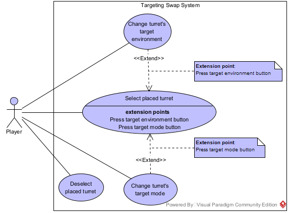

## Use Case Diagram

### Notes
Targeting **Environment** and Targeting **Mode** are two distinguished concepts.
- *Environment* refers to which category of units the turret can attack. A turret attack air units, ground units or both.
- *Mode* defines the *priority rule* used to choose which target to attack first. The turret can prioritize the strongest, weakest, fastest, slowest, closest or farthest.

This document was updated according to Diogo's review on it.

## New Actions
###  Select placed turret
- **Name**: Select placed turret
- **ID**: 1
- **Description**: The player selects a placed turret on the grid.
- **Actors**:
  - *Main*: Player
  - *Secondary*: None
- **Pre-Conditions**: The turret must be built, alive (not destroyed) and belong to the player's team.
- **Main Flow**:
  1. The use case starts when the player clicks on a placed turret.
  2. The system displays the turret's current targeting mode and environment.

  *Extension points*: <mark style="background: #bff79fc9;">Press target mode button</mark>, <mark style="background: #bff79fc9;">Press target environment button</mark>
- **Alternative Flows**
  - None
- **Post-Conditions**: The current targeting mode and environment are updated accordingly.

### Deselect placed turret
- **Name**: Deselect placed turret
- **ID**: 2
- **Description**: The player stops selecting an already selected placed turret.
- **Actors**:
  - *Main*: Player
  - *Secondary*: None
- **Pre-Conditions**: The player must have selected a placed turret.
- **Main Flow**:
  1. The use case starts when the player clicks outside the turret.
  2. The system stops displaying the turret's targeting info. 
- **Alternative Flows**
  - None
- **Post-Conditions**: The turret that was selected stops being selected.

---
## Extension Points

### Change turret's target mode
- **Name**: Change turret's target mode
- **ID**: 3
- **Description**: The player swaps the turret's current targeting mode.
- **Actors**:
  - *Main*: Player
  - *Secondary*: None
- **Pre-Conditions**: The player pressed the turret's target mode button. 
- **Segment 1 Flow**:
  1. The use case starts when the player presses the turret's target mode main button.
  2. The system displays a menu with every possible target mode option.
  3. The player chooses an option.
  4. The system swaps the turret's targeting mode to the option chosen and displays it.
- **Alternative Flows**
  - <mark style="background: #bff79fc9;">Same target mode chosen</mark>
- **Post-Conditions**: The turret's targeting mode is swapped.

### Change turret's target environment
- **Name**: Change turret's target environment
- **ID**: 4
- **Description**: The player swaps the turret's current targeting environment.
- **Actors**:
  - *Main*: Player
  - *Secondary*: None
- **Pre-Conditions**: The player pressed the turret's target environment button. 
- **Segment 2 Flow**:
  1. The use case starts when the player presses the turret's target environment button.
  2. The system displays a menu with every possible target environment option.
  3. The player chooses an option.
  4. The system swaps the turret's targeting environment to the option chosen and displays it.
- **Alternative Flows**
  - <mark style="background: #bff79fc9;">Same target environment chosen</mark>
  - <mark style="background: #bff79fc9;">Can't swap targeting environment</mark>
- **Post-Conditions**: The turret's targeting environment is swapped.

---

## Alternative flows

### Same target mode chosen
- **Name**: Same target mode chosen
- **ID**: 3.1
- **Description**: The system does not change the turret's target mode to the same target mode.
- **Actors**:
  - *Main*: Player
  - *Secondary*: None
- **Pre-Conditions**: The player chose the same target mode as the current one. 
- **Segment 2 Flow**:
  1. The alternative flow begins after step 3 of the segment 1 flow.
  2. The system displays an error message, informing that the chosen option matches the current mode.
- **Alternative Flows**
  - None
- **Post-Conditions**: The turret's target mode stays unmodified (the system does not change it to the same one).

### Same target environment chosen
- **Name**: Same target mode chosen
- **ID**: 4.1
- **Description**: The system does not change the turret's target environment to the same target environment.
- **Actors**:
  - *Main*: Player
  - *Secondary*: None
- **Pre-Conditions**: The player chose the same target environment as the current one.
- **Segment 2 Flow**:
  1. The alternative flow begins after step 3 of the segment 2 flow.
  2. The system displays an error message, informing that the chosen option matches the current environment.
- **Alternative Flows**
  - None
- **Post-Conditions**: The turret's target environment stays unmodified (the system does not change it to the same one).

### Can't swap turret's targeting environment
- **Name**: Can't swap turret's targeting environment
- **ID**: 4.2
- **Description**: The system doesn't allow the player to change the turret's targeting environment.
- **Actors**:
  - *Main*: Player
  - *Secondary*: None
- **Pre-Conditions**: The player pressed the target environment button from a turret that targets only one environment of enemy units (air or ground).
- **Alternative Flow**:
  1. The alternative flow begins after step 1 of the segment 2 flow.
  2. The system doesn't allow the player to press the button.
- **Alternative Flows**
  - None
- **Post-Conditions**: The turret's targeting environment stays fixed on the only environment it targets.