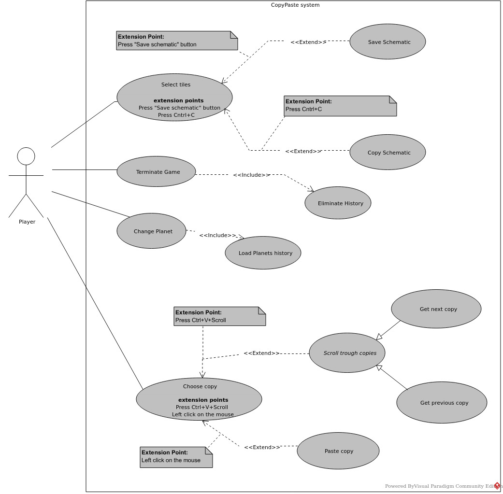

# User story 4
Copy and Paste
## Author(s)
- Carolina Ferreira (67804)
- Manuel Oliveira (68547)

## Reviewer(s)
- Gabriela Silva (67286)
- 

(*Please add the user story reviewer(s) here, one in each line, providing the authors' name and surname, along with their student number. In the reviews presented in this document, add the corresponding reviewers.*)
## User Story

As an EXPERIENCED USER, I want to have access to a traversable history of
copied block selections that I can pick to paste,
so that I don't need to save quick changes as schematics (saved block selections).

### Review
*(Please add your user story review here)*
## Use case diagram

## Use case textual description

[Textual Description](US4%20Use%20Case%20Textual%20Description.md)

### Review
**Author**: Gabriela Silva

**Most important:** Every use case main flow should start with "*The use case starts when...*"!

On **Select Tiles**:
- The extension points should not be only at the end of the use case, but in the middle were they can happen.

On **Choose Copy**:
- Its name (*Change Copy*) does not match its title; it should be *Choose Copy*.
- Main flow is not with sequence numbers but with sequence letters; "inner sequences" are also with sequence letters, which could be confusing. Keep the textual description consistent: display sequence numbers in the outter sequence and letters in the inner.
- Again, the extention points should be in the middle where they can happen, not only at the end.

I think it would be better to write "*Extension Points*" as the title for the extension points use cases, instead of "*Extends*".

On **Paste Copy**:
- As I said, every use case main flow should start with "*The use case starts when...*". Point *ii.* of the main flow has "*Then places the displayed schematic in the game world.*" Do not use "then", I recommend using "*The system/game places the displayed schematic in the game world.*". At least specify a subject that acts in the point, don't just write "then does this".

On **Scroll Through Copies**:
- If this use case is abstract (because in the template it is written with italic), it should be noted in the diagram. That is, have ``{abstract}`` on it or write it as italic as well.

On **Get Next Copy** and **Get Previous Copy**:
- Since this use cases are generalizations of the abstract *Scroll Through Copies*, both should have an additional field "**Specializes**: *Scroll through copies*".
- Me and my colleague modeled the use cases IDs with, for instance, "1.1" for one alternative flow for the use case with ID "1". Here, although *Get Next Copy* and *Get Previous Copy* are generalizations of *Scroll Through Copies*, I think it would be best if they had their own ID, as "EUC4" and "EUC5", to follow your style of identification.
- I don't understand what is "(01.) in the first point (i.) of both main flows.

I understand that in this report there are no alternative flows, because they were modeled as "``ifs``" on the use case's main flow. Despite understanding your intentions, I believe there should be an alternative flow named "No copied schematics".

## Implementation documentation

[Implementation Documentation](US4%20Implementation%20Documentation.md)

#### Review
*(Please add your implementation summary review here)*
### Class diagrams

[US4 Class Diagram](US4%20Class%20Diagrams.md)

### Review
**Author:** Gabriel Falcão (67775) (2/12/25) 16:53

First of all the embed you used, for the class diagrams document is wrong as it directs to a non existent file.

#### Problems found
The use arrow will be talked about below, but you should have an arrow or an attribute in `DesktopInput` that shows it possesses an instance of `CopyHist` as it does not directly depend on the class itself, but the interface; this should also be changed regarding the use arrow.
The same can be said about the `CopyHistClass` have some sort of arrow, aggregation, from it to `Schematics`, and name that arrow *history* as it is the name of the attribute in the class itself.
`KeyBind` is not a nested class of `Binding`, if you want to keep it in, just say that `Binding` is an aggregation of `KeyBinds`, all it has is data.
`KeyBind` is `KeyBind` not `KeyBinds`
`Schematic` is either **<\<interface>>** or **<\<auxiliary>>** I don't believe it can be both.
`DesktopInput` should be classified as a **<\<control>>**.
`UI` should be stereotyped as a **<\<boundary>>**
Maybe use the `Input` in `Core` as another **<\<boundary>>**, this is a personal opinion as I believe it would make the sequence diagram more readable.

In my personal opinion, and Diogo's, static/constants should not be shown.
##### <\<use>>
All of the usage arrow dependencies are flipped, as `Schematic` does not use `CopyHistClass`, `ArrayList` does not use `CopyHistClass`, `CopyHistClass` does not use `DesktopInput`, `Binding` does not use `DesktopInput`, `Planet` does not use `DesktopInput`, `UI` does not use `DesktopInput`.
They are in the correct places but all should be flipped around.
##### Implementation
The arrow used for an interface implementation is dashed and non solid, thus you should change the arrow between `CopyHistClass` and `CopyHist` and the arrow between `ArrayList` and `List`.

#### Author's note
What was said in this review was taken into account and the diagram changed accordingly.

### Sequence diagrams
(*Sequence diagrams and their discussion in natural language.*)
#### Review
*(Please add your sequence diagram review here)*
## Test specifications
(*Test cases specification and pointers to their implementation, where adequate.*)
### Review
*(Please add your test specification review here)*
