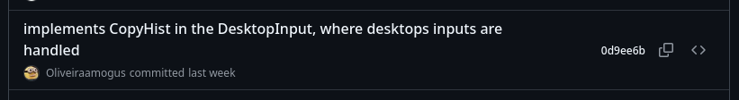
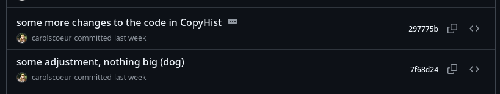
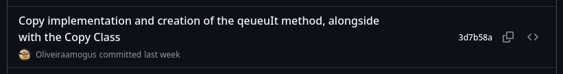
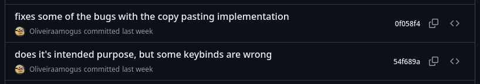
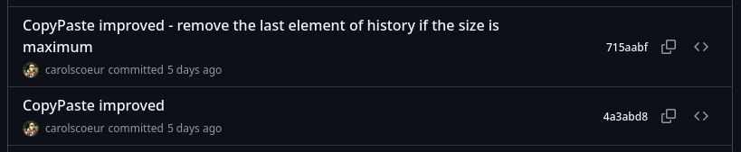

### Tour Report

For the implementation of the US4 we worked on the branch **implementation/userStory4**.

Due to some merges that were necessary it was not possible for us to get clean screenshots of all the commits, but all the commits regarding code and our implementation are represented here.


#### Commits:

From oldest to newest:

17/11/2025


18/11/2025




19/11/2025








20/11/2025




21/11/2025


23/11/2025


26/11/2025


#### Affected classes

**Created:**  
The interface ``CopyHist`` (core/src/mindustry/game/CopyHist.java), and the class ``CopyHistClass`` (core/src/mindustry/game/CopyHistClass.java) that implements it.
Their function is to implement and manage a history of copied schematics.

**Modified:**

##### ``DesktopInput`` (core/src/mindustry/input/DesktopInput.java)  

Given that this is the place in the codebase were the majority of the inputs for desktop use are worked, we had to configure all the actions here.

This is where a CopyHist object is first declared in the code.
````java
    /** History of last selected schematics*/
    private CopyHist copyHist;

````

And where it is first initialized.
````java
    public DesktopInput() {
        Events.on(ResetEvent.class, e -> this.commander.clear());
        // To prevent crashes when the game is initialized
        copyHist = new CopyHistClass();
    }
````

Because it was decided that each planet has its own history, the history is initialized depending on the planet selected: 
````java
    if(state.rules.sector != null && state.rules.sector.planet != null){
        copyHist = state.rules.sector.planet.getHist();
    }
````

This is the code that handles the copying of a schematic to the history, as well as the corresponding messages that appear on screen: 
````java
    /**
     * Copy the selected schematic and insert in the history
     */
    if (Core.input.keyDown(Binding.ctrl) && Core.input.keyTap(Binding.copy)) {
        if (!selectPlans.isEmpty() && lastSchematic != null) {
            copyHist.copy(lastSchematic);
            Vars.ui.showInfoFade("Copied!", 2f);
        } else
            Vars.ui.showInfoFade("Nothing to copy!", 2f);
    }

````

This is the code that handles the pasting of a schematic from the history to the world, and as the browsing between the copied schematics:
````java
    /**
     * Insert a kept schematic on to the world
     */
    if (Core.input.keyDown(Binding.paste) && Core.input.keyDown(Binding.ctrl)) {
        if(!copyHist.isEmpty()) {
            Vars.ui.showInfoFade("Scroll to access other copied schematics!", 7f);
            Schematic current = copyHist.getCurrent();

            if ((int) Core.input.axisTap(Binding.rotate) > 0) {
                current = copyHist.getNext();

            } else if ((int) Core.input.axisTap(Binding.rotate) < 0) {
                current = copyHist.getPrevious();
            }

            useSchematic(current);
            lastSchematic = null;
        } else
            Vars.ui.showInfoFade("Nothing to Paste!", 2f);
    }
````

It should also be noted that this isn't a complete summary of all the code altered in this class.

This is because in order for some binds to work without interfering with pre-existing functions of the game certain conditions had to be altered.

Generally this was done in a similar way to this: 
````java
    if(!Core.input.keyDown(Binding.paste) && (/*resto of condition*/))
        /*Action*/
````

Due to the somewhat insignificant and repetitive nature of this code not all of it will be shown.


##### ``Binding`` (core/src/mindustry/input/Binding.java)

This is the class where new binds are registered.

````java
    paste = KeyBind.add("paste", KeyCode.v),
    ctrl = KeyBind.add("ctrl", KeyCode.controlLeft),
    copy = KeyBind.add("copy", KeyCode.c),
````

##### ``Planet`` (core/src/mindustry/type/Planet.java)

Given that we determined that each planet had its own history this class had to be altered to keep a ``CopyHist`` object.

Which involved declaring the object, populate it and creating a get method for its usage.

````java
    /** History of copies. */
    private CopyHist history;
    
    //...

        // history
        this.history = new CopyHistClass();
        
    //...


    public CopyHist getHist(){
        return this.history;
    }
````

### Implementation summary
With this user story we wanted to make a simpler interface than the Schematics function that already exists in the game.

We intended that by clicking the ctrl+c while selecting blocks built in the game, that selection would be copied and stored informally and without commitment, that is without being stored in a file like a Schematic, to later be used again.

To achieve this we created ``CopyHist`` and ``CopyHistClass`` to store and manage that history, and then modified ``DesktopInput`` and ``Bindings`` to manage the input and output of the selections stored.

In addition to the previously mentioned copying method, at this time it became clear to us that we needed a more elaborate method of browsing through the previously copied selections, and came up with the final solution of using the scroll wheel.

Then we realized thanks to the helpful game knowledge of some team members that some blocks may not be available if a player copies blocks form one planet and tries to paste them in another, because they simply aren't available.

In order to get around this it was defined that each planet is responsible for having its own ``CopyHistClass`` object, and altered the class ``Planet`` accordingly.


