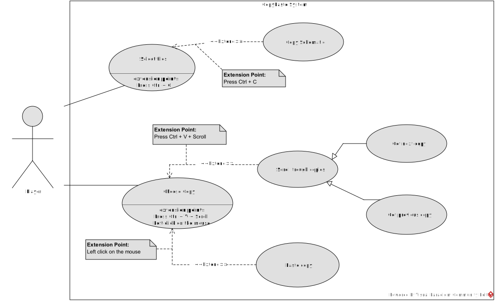

# Copy history
### Note on Schematics
Just for clarification, in the game there is an element called "Schematics" that are player made constructions that are kept in files.
On the other hand, in the codebase for the game, a schematic is a selection of blocks that can be saved to a file, but a schematic in this context is also used for many other purposes.

In our case we used schematics as the main way of keeping a collection of selections that were copied.

For that reason, except for titles, throughout this document we'll be referring to the schematics used in the code as **"schematics"**, with lower case, and schematics that are saved to a file as **"Schematics"**, with higher case.

## Diagram

## Main Functionalities
###  **Select tiles**
- **Name**: Select tiles
- **ID**: UC1
- **Description**: This Player selects the desired tiles.
- **Actors**:
    - *Main*: Player
    - *Secondary*: None
- **Pre-Conditions**: The Player is in a valid game and map.
- **Main Flow**:
    1. The use case starts when the player presses the **select** keybind (default is "f").
    2. The player selects the tiles to turn to a schematic.
    3. If the player presses the keybind to copy a schematic (default is "ctrl + c").
        1. Then the schematic selected is copied to the history of copied schematics.
        2. Extension point: Copy Schematic
    4. The use case ends.

- **Alternative Flows**
    - None
- **Post-Conditions**: The tiles selected are displayed.

###  **Choose Copy**
- **Name**: Choose Copy
- **ID**: UC2
- **Description**: The player chooses what copied schematic they want to build.
- **Actors**:
    - *Main*: Player
    - *Secondary*: None
- **Pre-Conditions**: The player is in a map.
    - **Main Flow**:
    1. The use case starts when the player presses the **select** keybind (default is "f").
    2. The Player presses the keybinds to paste a copied schematic (default is Ctrl + V).
    3. If there are no copied schematics.
        1. Ends the use case.
    4. The game loads and displays the last copied schematic.
    5. If the player presses the keybind to see the previous copied schematic.
        1. Then displays the previous copied schematic.
        2. Extension point: Scroll through copies
    6. If the player presses the keybind to see the next copied schematic.
        1. Then displays the next copied schematic.
        2. Extension point: Scroll through copies
    7. If the player presses the place keybind (left click by default)
        1. Then places the displayed schematic in the game world.
        2. Extension point: Paste Copy

- **Alternative Flows**
    - None
- **Post-Conditions**: The last copied schematic is displayed and ready to be built.

## Extends
## **Copy Schematic**
- **Name**: Copy Schematic
- **ID**: EUC1
- **Description**: This use case adds the functionality of saving a selected schematic to a history of copied schematics.
- **Actors**:
    - *Main*: Player
    - *Secondary*: None
- **Pre-Conditions**: The player has selected a schematic.
- **Main Flow**:
    1. The use case starts when the player presses the keybind to copy a schematic (default is "ctrl + c").
    2. The schematic selected is copied to the history of copied schematics.

- **Alternative Flows**
    1. If there are no copied schematics.
        1. Ends the use case.
- **Post-Conditions**: The schematic is saved to the planet's history.

## **Paste Copy**
- **Name**: Paste Copy
- **ID**: EUC2
- **Description**: This use case adds the functionality of pasting a copied schematic.
- **Actors**:
    - *Main*: Player
    - *Secondary*: None
- **Pre-Conditions**: The player has selected a schematic from the history of copied ones, and said history is not empty.
- **Main Flow**:
    1. The use case starts when the player presses the place keybind (left click by default).
    2. Then places the displayed schematic in the game world.

- **Alternative Flows**
    - None
- **Post-Conditions**: The schematic is placed in the game world.

## *Scroll through copies*
- **Name**: Scroll through copies
- **ID**: EUC3
- **Description**: This use case adds the function of browsing through the saved schematics.
- **Actors**:
    - *Main*: Player
    - *Secondary*: None
- **Pre-Conditions**: The player has selected a schematic.
- **Main Flow**:
    1. The use case starts when the player scrolls through the copies of schematics saved to the history using the input selected.
- **Alternative Flows**
    - None
- **Post-Conditions**: None.

## **Get next copy**
- **Name**: Get next copy
- **ID**: EUC3.1
- **Description**: This use case adds the function of saving a selected schematic to a history of copied schematics.
- **Actors**:
    - *Main*: Player
    - *Secondary*: None
- **Pre-Conditions**: The player has selected a schematic.
- **Main Flow**:
    1. (01.) The use case starts when the player scrolls through the copies of schematics saved to the history using the input selected.
    2. The player presses the keybind to see the next copied schematic.
    3. The game displays the next copied schematic.

- "**Specializes**: *Scroll through copies*"
- **Alternative Flows**
    - None
- **Post-Conditions**: None.

## **Get previous copy**
- **Name**: Get previous copy
- **ID**: EUC3.2
- **Description**: This use case adds the function of saving a selected schematic to a history of copied schematics.
- **Actors**:
    - *Main*: Player
    - *Secondary*: None
- **Pre-Conditions**: The player has selected a schematic.
- **Main Flow**:
    1. (01.) The use case starts when the player scrolls through the copies of schematics saved to the history using the input selected.
    2. The player presses the keybind to see the previous copied schematic.
    3. The game displays the previous copied schematic.

- "**Specializes**: *Scroll through copies*"
- **Alternative Flows**
    - None
- **Post-Conditions**: None.
