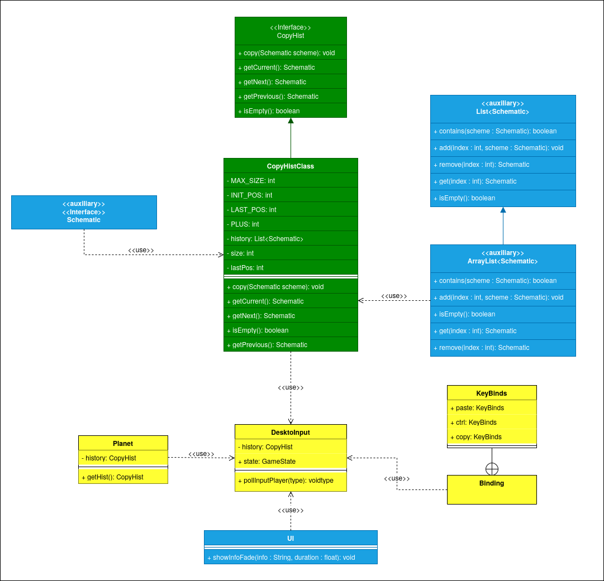

# Diagram

This is the complete diagram of US4. In green are the classes that were created, in yellow are the classes that were altered and in blue the classes that were needed for our implementation.

`CopyHist` and `CopyHistClass` were created to be responsible for keeping track of all the `Schematic` objects kept in the history. Which created the need of using an `ArrayList` object, this is because it was the easiest class to keep in insertion order, that also could be reordered. And this means that the class `Schematic` was also used.

The class `DesktopInput` had to be altered in order to manage the inputs for the copying and pasting, and the same is true for the `Binding` and `KeyBinds` classes. `DesktopInput` was also altered to have its own `CopyHist` object that keeps the history currently being used. That object is taken from the current planet being played, because each `Planet` object has its own history.

`DesktopInput` also uses the `UI` class to show the fading text onscreen as a schematic is copied or pasted.

